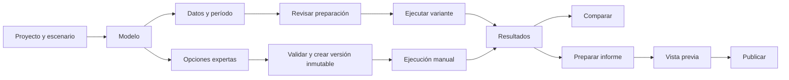

# Experiencia objetivo y reglas de interacción

## Usuarios y superficies

| Persona | Necesidad principal | Entrada que se conserva |
| --- | --- | --- |
| Analista/ingeniero | Preparar modelos y datos, ejecutar, interpretar, configurar entregas | `/react/projects` y rutas internas |
| Administrador | Lo anterior más identidades, capacidades y programación | Raíz interna y `/react/admin/users` |
| Externo con `operate` | Ajustar solo datos autorizados y ejecutar | `/react/console` |
| Externo con `portal_view` | Consultar publicaciones y descargar archivos aprobados | `/react/client` |

Una persona externa puede tener ambas capacidades por proyecto. El backend sigue decidiendo su `landing_path`; el frontend no inventa otro algoritmo de entrada ni un rol «operador». Se conservan las tres raíces hermanas.

## Navegación del analista

Navegación principal propuesta: **Proyectos**, **Catálogo de series** cuando esté habilitado y **Administración** solo para admin. «Estado del sistema» queda disponible en utilidades. El encabezado conserva identidad y salida.

En un proyecto, mostrar primero escenarios y una acción «Crear escenario». Ofrecer navegación secundaria a **Datos**, **Informes**, **Consolas** y, para admin, **Accesos**. «Consolas» puede enlazar inicialmente a sus escenarios: no construir un índice global nuevo sin necesidad comprobada. Borrado del proyecto sigue disponible con confirmación explícita.

En el escenario, mostrar nombre, proyecto, variante seleccionada cuando exista, estado comprobado y acción siguiente. La navegación local organiza **Resumen**, **Modelo**, **Datos**, **Ejecuciones** y **Avanzado**. Conservar las rutas actuales; usar parámetros o anchors para subsecciones. No exigir cambiar de URL para cada campo.

Este esquema orienta; no impone un asistente lineal a toda la plataforma. Se puede volver a cualquier sección. Cada salida respeta cambios pendientes y permisos. El diagrama hidráulico mantiene su propio editor dentro de «Modelo» y su validación/promoción v3.

## Preparar y ejecutar

1. Abrir o crear un escenario. Si no tiene modelo, ofrecer «Crear modelo»; si ya tiene trabajo, «Continuar preparación» abre la sección correspondiente.
2. Editar componentes y parámetros. Mostrar unidades y reglas del dominio. Guardar sigue siendo explícito; «Guardado» solo aparece al recibir aceptación del backend.
3. En «Datos», mostrar una fila por necesidad: componente, señal, fuente y revisión seleccionadas, cobertura, estado y acción. Las necesidades proceden del servidor.
4. Elegir una fuente existente o importar desde esa necesidad. El destino queda precargado y visible, pero no se confirma automáticamente una asociación ni una revisión compartida.
5. Elegir período con inicio inclusivo y fin exclusivo `[inicio, fin)`, zona/offset visibles, duración y cobertura disponible. Mantener entrada ISO experta. No asumir la zona del navegador ni aplicar remuestreo o conversiones implícitas.
6. «Revisar preparación» explica lo que falta o cambió. Permitir saltar al campo, componente o fuente afectados. La revalidación es explícita cuando corresponda.
7. «Ejecutar» muestra en su contexto variante, período y fuentes confirmadas. El servidor vuelve a verificar precondiciones y materializa la versión. No pedir promoción manual adicional en el recorrido por variante.
8. Navegar a la corrida aceptada, incluso si sigue en cola. Mostrar un estado comprensible sin porcentaje de progreso inventado.

### Estados de preparación propuestos

Son estados de presentación derivados de respuestas públicas. No son una nueva máquina de estados persistida ni sustituyen la validación del servidor.

| Condición observada | Mensaje de tarea | Acción principal |
| --- | --- | --- |
| Falta cargar información | «Consultando preparación» | Esperar o reintentar; no ejecutar |
| No hay modelo aplicable | «Falta definir el modelo» | Abrir modelo |
| Hay cambios locales | «Tienes cambios sin guardar» | Guardar en el editor propietario |
| Faltan señales/asociaciones | «Faltan datos para estos componentes» | Ir a necesidades pendientes |
| Rango inválido o sin cobertura | «Revisa el período de ejecución» | Corregir fechas o elegir otra fuente |
| Dependencias desactualizadas | «El modelo o los datos cambiaron» | Revisar cambios y revalidar |
| Preparación comprobada vigente | «Preparado para ejecutar este período» | Ejecutar |
| Ejecución aceptada | «En cola» / «En ejecución» | Ver seguimiento |
| Fallo de consulta | «No pudimos comprobar el estado» | Reintentar consulta |

Si coexisten bloqueos, resumirlos todos y priorizar modelo/cambios locales, datos, rango y validación. Un error de red no equivale a un modelo inválido. Cambiar fuente, revisión, variante o período invalida la presentación de una revisión previa.

## Divulgación progresiva sin pérdida de datos

| Área | Visible al entrar | Disponible bajo demanda |
| --- | --- | --- |
| Modelo | Componentes, límites, estados iniciales y unidades | IDs, schema, solver, JSON y parámetros menos frecuentes |
| Datos | Necesidades, fuentes, período y errores | Contratos, hashes, revisiones, transformaciones, conectores y migración autorizada |
| Escenario | Preparación y actividad reciente | Versiones inmutables, importar JSON y consolas |
| Resultado | Estado, período, KPIs y gráficos aplicables | Tablas completas paginadas, entradas, linaje, logs y artefactos internos |
| Proyecto | Escenarios y actividad pertinente disponible | Configuración del portal, templates y accesos |

Los parámetros obligatorios de cada tecnología nunca quedan escondidos como si fueran opcionales. Un error dentro de una sección cerrada la abre y enfoca el campo. Ocultar o desmontar un panel no borra su contenido. Las vistas simples y expertas editan el mismo documento, sin dos fuentes de verdad.

## Importación y catálogo

El asistente de archivo muestra **Archivo → Hoja y columnas → Revisar datos → Importar**; CSV omite la elección de hoja. Conservar el archivo y las decisiones al volver, y decir cuándo una acción ya creó un recurso de staging. El final informa nombre, destino, cobertura, señales y revisión creada, con enlace para continuar.

El catálogo general conserva búsqueda y todos los filtros. Al entrar desde una necesidad, mostrar el objeto y la señal buscada y consultar compatibilidad al backend. Un filtro no es una autorización. Mantener visible el motivo por el cual no hay fuentes compatibles.

TS-7 conserva sus cuatro pasos protegidos. Cambiar el título según intención, por ejemplo «Usar esta fuente en el modelo» o «Actualizar una fuente compartida». Distinguir explícitamente **asociar al objeto**, **fijar su uso en una variante**, **cambiar la fuente compartida** y **crear una copia local**. No comprimir esas decisiones en un botón genérico «Aplicar».

Los filtros aplicados y el contexto de retorno deben sobrevivir navegación y recarga mediante URL validada. El cursor se invalida al cambiar filtros. No guardar archivos, secretos, borradores ni tokens de prevalidación en la URL o en almacenamiento local.

## Resultados y entrega

La corrida empieza por «Finalizada», «Fallida», «En cola» o «En ejecución», nombre del escenario y período, seguidos del contenido útil disponible. Un fallo muestra una explicación y un enlace a diagnóstico interno. Un resultado desconocido o ausente no se representa como cero.

Comparación: seleccionar dos corridas compatibles del mismo caso, identificar base y alternativa y presentar diferencias con unidades. Si no son comparables, explicar por qué y permitir cambiar selección. Conservar linaje, contexto temporal y acceso al detalle de ambas.

Publicación: **Elegir resultado → Configurar informe → Vista previa → Publicar**. «Guardar borrador» y «Publicar» son acciones distintas. Reusar el preview basado en el payload externo real. Mantener edición y despublicación. No publicar automáticamente al terminar una corrida.

## Consola y administración

La consola muestra qué está listo, qué falta guardar y qué bloquea la ejecución. «Solicitar revisión» se reserva al bloqueo de ingeniería, como ya ocurre; no atribuir al ingeniero un bloqueo temporal de otro operador. Historial, comparación, pegado de tablas, deshacer autorizado y edición con lease siguen disponibles.

El configurador interno ofrece controles para parámetros y resultados sobre `operator_console_config.v1`, conservando JSON experto y todos sus campos soportados. No se agrega un diseñador libre de layouts.

Administración usa etiquetas «Administrador», «Analista», «Usuario externo», «Ver informes» y «Operar consolas». Los valores API siguen siendo los vigentes. La programación mantiene selección explícita de caso/variante/rango y su semántica actual; solo se reorganiza la explicación y ubicación.

## Vocabulario y accesibilidad

| Texto habitual | Texto de interfaz propuesto |
| --- | --- |
| Draft | Modelo en edición; «borrador» donde describa su estado |
| Asset | Componente; batería, renovable, demanda o hidro según tipo |
| Binding | Fuente utilizada / uso en la variante, según operación |
| Stale | Desactualizado, seguido del motivo y acción |
| Run | Ejecución; conservar ID en el detalle interno |
| Lineage | Procedencia de esta ejecución |
| Promote version | Crear versión inmutable, en herramientas expertas |
| Dashboard template | Plantilla de informe |

No reemplazar claves del contrato con estas etiquetas. Conservar «variante» y «versión» diferenciadas; «escenario» sigue siendo el contenedor de trabajo.

Cada cambio debe permitir teclado, foco visible, lectura del estado sin depender del color y errores asociados al campo. Los formularios deben reorganizarse a 320 píxeles CSS sin perder funciones; tablas y diagramas pueden tener desplazamiento propio. Referencia: [W3C, Reflow](https://www.w3.org/WAI/WCAG22/Understanding/reflow.html).

Las barras persistentes no deben ocultar el control enfocado; probar zoom y navegación por teclado. Referencia: [W3C, Focus Not Obscured](https://www.w3.org/WAI/WCAG22/Understanding/focus-not-obscured-minimum.html). Identificar el campo con error y describir el problema en texto, siguiendo [W3C, Error Identification](https://www.w3.org/WAI/WCAG22/Understanding/error-identification.html). Son objetivos de implementación y revisión, no una declaración de conformidad actual.
