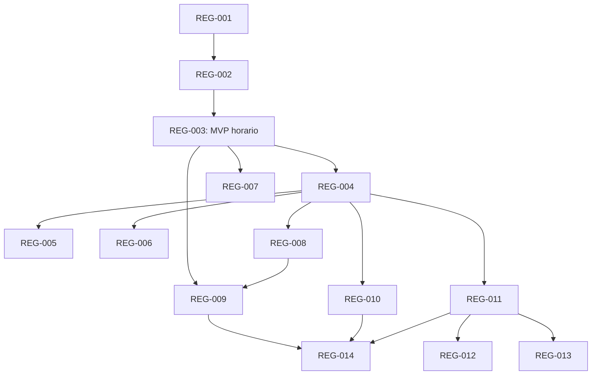

# Registro de implementación: reglas por componente

Fecha de creación: 2026-09-21.
Fuente normativa de este paquete: [plan](../plan.md).
Estado: REG-001 a REG-012 implementados y verificados; siguiente issue por orden: REG-013.

## Vocabulario y reglas de trabajo

- `Todo`: sin implementar.
- `In Progress`: implementación en curso.
- `Blocked`: no puede avanzar por una dependencia o impedimento concreto.
- `In Review`: implementación y comprobaciones disponibles para revisión.
- `Done`: comportamiento aceptado y evidencia registrada.

Todos son `AFK` y llevan triage `ready-for-agent`: las decisiones de alcance están
resueltas por delegación y no requieren un ticket HITL adicional. Eso no permite
iniciar un issue antes de sus bloqueadores. Si aparece una imposibilidad real,
registrar evidencia y ajustar el plan; no debilitar silenciosamente los contratos.
No se requieren fechas ficticias ni estimaciones de horas para ordenar el trabajo.

Cada slice entrega un recorrido verificable que atraviesa las capas necesarias.
Los refactors locales se incluyen en la capacidad que los necesita. No hay tickets
independientes «hacer base de datos», «hacer API» o «hacer frontend». Las pruebas
de aislamiento, permisos, snapshots y capacidades se exigen desde su primer uso.

## Issues y dependencias

| Orden | Issue | Type | Status | Bloqueado por | Historias |
| --- | --- | --- | --- | --- | --- |
| 1 | [REG-001: Guardar y probar Python](REG-001-probar-regla-python.md) | AFK | Done | Ninguno | HU-01 |
| 2 | [REG-002: Aplicar máximo de caudal](REG-002-aplicar-limite-caudal.md) | AFK | Done | REG-001 | HU-01, HU-02, HU-09 |
| 3 | [REG-003: Límites horarios desde series](REG-003-limites-horarios-series.md) | AFK | Done | REG-002 | HU-03, HU-09 |
| 4 | [REG-004: Relacionar objetos hidráulicos](REG-004-relacionar-componentes-hidraulicos.md) | AFK | Done | REG-003 | HU-04 |
| 5 | [REG-005: Rampas y períodos anteriores](REG-005-rampas-y-periodos.md) | AFK | Done | REG-004 | HU-05 |
| 6 | [REG-006: Presupuestos de agua/energía](REG-006-presupuestos-agua-energia.md) | AFK | Done | REG-004 | HU-06 |
| 7 | [REG-007: Publicar serie calculada](REG-007-publicar-serie-calculada.md) | AFK | Done | REG-003 | HU-03, HU-07 |
| 8 | [REG-008: Reutilizar reglas](REG-008-reutilizar-reglas.md) | AFK | Done | REG-004 | HU-08 |
| 9 | [REG-009: Comparar revisiones y recuperar](REG-009-revisiones-y-obsolescencia.md) | AFK | Done | REG-003, REG-008 | HU-09 |
| 10 | [REG-010: Inspeccionar cumplimiento](REG-010-inspeccionar-cumplimiento.md) | AFK | Done | REG-004 | HU-10 |
| 11 | [REG-011: Hidro simple v2](REG-011-hidro-simple.md) | AFK | Done | REG-004 | HU-11 |
| 12 | [REG-012: Baterías](REG-012-baterias.md) | AFK | Done | REG-011 | HU-03, HU-11 |
| 13 | [REG-013: Red y renovables](REG-013-red-y-renovables.md) | AFK | Todo | REG-011 | HU-04, HU-11 |
| 14 | [REG-014: Consolas y programaciones](REG-014-consolas-y-programaciones.md) | AFK | Todo | REG-009, REG-010, REG-011 | HU-09, HU-12 |

El orden numérico es una lectura y una secuencia válida, no una obligación de
serializar ramas sin dependencias. Tras REG-003 puede avanzar REG-007; tras
REG-004 pueden avanzar REG-005, REG-006, REG-008, REG-010 y REG-011.
REG-014 habilita solo capacidades ya instaladas y no espera necesariamente a
baterías o renovables. Los contratos generales del plan aplican a cada issue,
aunque su criterio particular no repita todas las garantías.

## Comprobación de cierre por issue

Registrar junto al issue implementado la demostración y comprobaciones realmente
ejecutadas, con limitaciones del entorno cuando existan. No marcar pruebas previstas
como realizadas. Un cambio de API verifica OpenAPI; uno de persistencia prueba ambos
motores; uno de matemática prueba Julia y el efecto en la solución; uno de ejecución
de código prueba el runtime real. Los datos de ensayo deben estar aislados de los
proyectos reales. No alterar ni cerrar issues previos de TS-6/TS-7 por completar estos.

## Historial

| Fecha | Cambio | Evidencia |
| --- | --- | --- |
| 2026-09-21 | Creado el plan y REG-001 a REG-014 en estado Todo | Opción 3 elegida por el usuario y autorización para adoptar las recomendaciones restantes; revisión de código y contratos existentes. |
| 2026-09-21 | REG-001 implementado con TDD; REG-002 queda disponible | 32 pruebas HTTP/SQLite/PostgreSQL/OCI reales, UI y smoke Chromium; detalles y limitaciones en REG-001. |
| 2026-09-21 | REG-002 implementado con TDD; REG-003 queda disponible | 58 pruebas HTTP/SQLite/PostgreSQL/OCI, 18 comprobaciones Julia, 23 pruebas React y recorrido Chromium real: 40 → 5 → 40 m³/s; detalles en REG-002. |
| 2026-09-22 | REG-003 implementado con TDD; REG-004 y REG-007 quedan disponibles | 102 pruebas Python sobre SQLite/PostgreSQL/OCI y clasificación, 21 comprobaciones Julia, 67 pruebas React y Chromium real: límites horarios, obsolescencia, huecos y cruces. Año de 8784 períodos completo en 4,103 s; detalles en REG-003. |
| 2026-09-22 | REG-004 implementado con TDD; REG-005 es el siguiente por orden | 121 pruebas Python, 29 comprobaciones Julia y 69 pruebas React. Chromium real demuestra 10 MW compartidos, expansión de planta, bloqueo por membresía e historial intacto; también pasan los recorridos REG-001 y REG-003. Detalles en REG-004. |
| 2026-09-22 | REG-005 implementado con TDD; REG-006 es el siguiente por orden | 136 pruebas Python de reglas/catálogo y 53 de corridas/resultados, 39 comprobaciones Julia de reglas y 532 generales, 72 pruebas React. Chromium real compara ambas políticas iniciales con duraciones variables: [4, 5, 1] frente a [6, 5, 1] m³/s; también pasa REG-004 tras corregir una carrera en la publicación de resultados. Detalles en REG-005. |
| 2026-09-22 | REG-006 implementado con TDD; REG-007 es el siguiente por orden | 147 pruebas Python de reglas/catálogo y 53 de corridas/resultados, 50 comprobaciones Julia de reglas y 532 generales, 75 pruebas React. Chromium real verifica 12 MWh, 36.000 m³ diarios y recuperación de 105 MWh / 504.000 m³, con historial intacto. OCI cubre días de 23/25 horas en Santiago/Nueva York, conversiones y rechazo de bordes desalineados. Detalles en REG-006. |
| 2026-09-23 | REG-007 implementado con TDD; REG-008 es el siguiente por orden | 25 pruebas HTTP nuevas SQLite/PostgreSQL/OCI, 172 pruebas distintas de reglas, 73 de persistencia y 77 React aprobadas. Chromium con Julia publica y consume potencia, regenera conservando pins y corridas; detalles y omisiones en REG-007. |
| 2026-09-24 | REG-008 implementado con TDD; REG-009 es el siguiente por orden | 24 pruebas HTTP nuevas SQLite/PostgreSQL/OCI, 63 de regresión de reglas, 34 de variantes, 81 React y 50 comprobaciones Julia aprobadas. Chromium real resuelve instancias independientes a 17 y 13 m³/s; conserva pins e historial al publicar. Biblioteca, comparación, clonación y remapeo explícito; detalles y omisiones en REG-008. |
| 2026-09-24 | REG-009 implementado con TDD; REG-010 es el siguiente por orden | 30 pruebas HTTP nuevas SQLite/PostgreSQL/OCI, 75 de regresión, 144 React y 50 comprobaciones Julia aprobadas. Chromium real conserva, actualiza y restaura pins: 17 → 11 → 17 m³/s sin alterar corridas históricas. Archivo, comparación estructurada, remapeo atómico y conflictos de confirmación; detalles y limitaciones en REG-009. |
| 2026-09-24 | REG-010 implementado con TDD; REG-011 es el siguiente por orden | 36 pruebas HTTP nuevas SQLite/PostgreSQL/OCI, 64 de regresión de reglas, 62 de corridas/resultados/portal/consola/validación, 104 React y 586 comprobaciones Julia aprobadas. Chromium real verifica márgenes/residuos, paginación, historia intacta, ausencia de primal y enlaces de contradicciones; detalles en REG-010. |
| 2026-09-24 | REG-011 implementado con TDD; REG-012 es el siguiente por orden | 26 pruebas nuevas SQLite/PostgreSQL/OCI, 95 de regresión de reglas, 71 de corridas/resultados/catálogo, 130 React y 610 comprobaciones Julia aprobadas. Chromium real aplica límites de 4 y 6 m³/s, conserva balances y evalúa ocho restricciones. Remapeo explícito, coexistencia de editores y bloqueo de motores antiguos; detalles y limitación de formato en REG-011. |
| 2026-09-24 | REG-012 implementado con TDD; REG-013 es el siguiente por orden | 26 pruebas nuevas SQLite/PostgreSQL/OCI, 26 de regresión REG-011, 38 React y 635 comprobaciones Julia aprobadas. Chromium real aplica una reserva horaria en MWh y límites de carga/descarga, conserva eficiencias y energía terminal, y evalúa ocho restricciones cumplidas. SDK reg-012.1 y adaptador battery_system.v1; evidencia, operación y limitación de formato en REG-012. |
