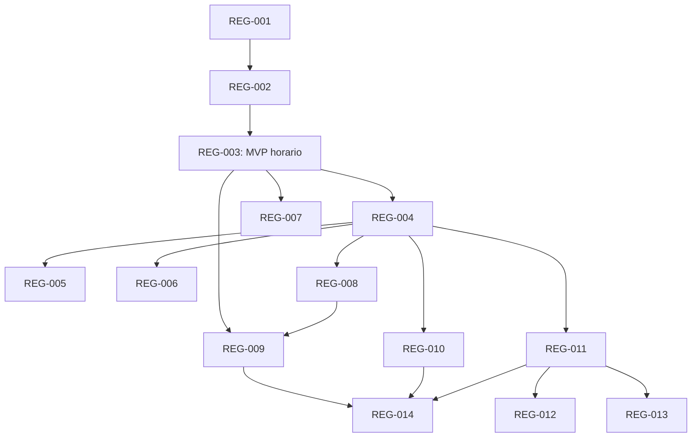

# Registro de implementación: reglas por componente

Fecha de creación: 2026-09-21.
Fuente normativa de este paquete: [plan](../plan.md).
Estado: REG-001 a REG-003 implementados y verificados; siguiente issue por orden: REG-004.

## Vocabulario y reglas de trabajo

- `Todo`: sin implementar.
- `In Progress`: implementación en curso.
- `Blocked`: no puede avanzar por una dependencia o impedimento concreto.
- `In Review`: implementación y comprobaciones disponibles para revisión.
- `Done`: comportamiento aceptado y evidencia registrada.

Todos son `AFK` y llevan triage `ready-for-agent`: las decisiones de alcance están
resueltas por delegación y no requieren un ticket HITL adicional. Eso no permite
iniciar un issue antes de sus bloqueadores. Si aparece una imposibilidad real,
registrar evidencia y ajustar el plan; no debilitar silenciosamente los contratos.
No se requieren fechas ficticias ni estimaciones de horas para ordenar el trabajo.

Cada slice entrega un recorrido verificable que atraviesa las capas necesarias.
Los refactors locales se incluyen en la capacidad que los necesita. No hay tickets
independientes «hacer base de datos», «hacer API» o «hacer frontend». Las pruebas
de aislamiento, permisos, snapshots y capacidades se exigen desde su primer uso.

## Issues y dependencias

| Orden | Issue | Type | Status | Bloqueado por | Historias |
| --- | --- | --- | --- | --- | --- |
| 1 | [REG-001: Guardar y probar Python](REG-001-probar-regla-python.md) | AFK | Done | Ninguno | HU-01 |
| 2 | [REG-002: Aplicar máximo de caudal](REG-002-aplicar-limite-caudal.md) | AFK | Done | REG-001 | HU-01, HU-02, HU-09 |
| 3 | [REG-003: Límites horarios desde series](REG-003-limites-horarios-series.md) | AFK | Done | REG-002 | HU-03, HU-09 |
| 4 | [REG-004: Relacionar objetos hidráulicos](REG-004-relacionar-componentes-hidraulicos.md) | AFK | Todo | REG-003 | HU-04 |
| 5 | [REG-005: Rampas y períodos anteriores](REG-005-rampas-y-periodos.md) | AFK | Todo | REG-004 | HU-05 |
| 6 | [REG-006: Presupuestos de agua/energía](REG-006-presupuestos-agua-energia.md) | AFK | Todo | REG-004 | HU-06 |
| 7 | [REG-007: Publicar serie calculada](REG-007-publicar-serie-calculada.md) | AFK | Todo | REG-003 | HU-03, HU-07 |
| 8 | [REG-008: Reutilizar reglas](REG-008-reutilizar-reglas.md) | AFK | Todo | REG-004 | HU-08 |
| 9 | [REG-009: Comparar revisiones y recuperar](REG-009-revisiones-y-obsolescencia.md) | AFK | Todo | REG-003, REG-008 | HU-09 |
| 10 | [REG-010: Inspeccionar cumplimiento](REG-010-inspeccionar-cumplimiento.md) | AFK | Todo | REG-004 | HU-10 |
| 11 | [REG-011: Hidro simple v2](REG-011-hidro-simple.md) | AFK | Todo | REG-004 | HU-11 |
| 12 | [REG-012: Baterías](REG-012-baterias.md) | AFK | Todo | REG-011 | HU-03, HU-11 |
| 13 | [REG-013: Red y renovables](REG-013-red-y-renovables.md) | AFK | Todo | REG-011 | HU-04, HU-11 |
| 14 | [REG-014: Consolas y programaciones](REG-014-consolas-y-programaciones.md) | AFK | Todo | REG-009, REG-010, REG-011 | HU-09, HU-12 |

El orden numérico es una lectura y una secuencia válida, no una obligación de
serializar ramas sin dependencias. Tras REG-003 puede avanzar REG-007; tras
REG-004 pueden avanzar REG-005, REG-006, REG-008, REG-010 y REG-011.
REG-014 habilita solo capacidades ya instaladas y no espera necesariamente a
baterías o renovables. Los contratos generales del plan aplican a cada issue,
aunque su criterio particular no repita todas las garantías.

## Comprobación de cierre por issue

Registrar junto al issue implementado la demostración y comprobaciones realmente
ejecutadas, con limitaciones del entorno cuando existan. No marcar pruebas previstas
como realizadas. Un cambio de API verifica OpenAPI; uno de persistencia prueba ambos
motores; uno de matemática prueba Julia y el efecto en la solución; uno de ejecución
de código prueba el runtime real. Los datos de ensayo deben estar aislados de los
proyectos reales. No alterar ni cerrar issues previos de TS-6/TS-7 por completar estos.

## Historial

| Fecha | Cambio | Evidencia |
| --- | --- | --- |
| 2026-09-21 | Creado el plan y REG-001 a REG-014 en estado Todo | Opción 3 elegida por el usuario y autorización para adoptar las recomendaciones restantes; revisión de código y contratos existentes. |
| 2026-09-21 | REG-001 implementado con TDD; REG-002 queda disponible | 32 pruebas HTTP/SQLite/PostgreSQL/OCI reales, UI y smoke Chromium; detalles y limitaciones en REG-001. |
| 2026-09-21 | REG-002 implementado con TDD; REG-003 queda disponible | 58 pruebas HTTP/SQLite/PostgreSQL/OCI, 18 comprobaciones Julia, 23 pruebas React y recorrido Chromium real: 40 → 5 → 40 m³/s; detalles en REG-002. |
| 2026-09-22 | REG-003 implementado con TDD; REG-004 y REG-007 quedan disponibles | 102 pruebas Python sobre SQLite/PostgreSQL/OCI y clasificación, 21 comprobaciones Julia, 67 pruebas React y Chromium real: límites horarios, obsolescencia, huecos y cruces. Año de 8784 períodos completo en 4,103 s; detalles en REG-003. |
