# TS-7: Catalogo global de series genericas y series especificas por objeto

Fecha: 2026-08-30
Status: Accepted, cierra el mapa de wayfinder
[Catalogo global y series especificas vinculadas a objetos](../../wayfinder/catalogo-global-series-genericas.md)
Iteracion: TS-7. Los tickets de implementacion usan el prefijo `TS7-0NN`.

## Proposito y como leer este documento

Este es el documento destino del mapa. Consolida once resoluciones ya cerradas
en una especificacion funcional y tecnica lista para convertirse en tickets de
implementacion. **No decide nada nuevo**: cada capitulo enlaza la resolucion que
es su fuente autoritativa, y cuando dos resoluciones se tocan, este documento
declara cual precisa o limita a la otra en lugar de reescribir su historia.

Regla de precedencia para cualquier duda:

1. la resolucion enlazada del ticket es la fuente;
2. la seccion [Precisiones y sustituciones entre resoluciones](#precisiones-y-sustituciones-entre-resoluciones)
   dice cual resolucion gana cuando dos se solapan;
3. este documento no puede ampliar ni relajar ninguna de las dos.

El alcance de TS-7 son **dos caminos complementarios** que comparten las mismas
garantias de revision inmutable, compatibilidad fail-closed y auditoria, pero
que no comparten superficie ni identidad:

| | Camino A: series genericas | Camino B: series especificas |
| --- | --- | --- |
| Descubrimiento | catalogo global signal-first | contexto del objeto propietario |
| Propiedad | proyecto propietario del set | objeto vinculable, inmutable |
| Reutilizacion | asociable a muchos objetos y proyectos | solo su propio objeto |
| Alcance | `project` o `global` promovible | siempre `project` |
| Paso previo al binding | asociacion de catalogo (opcional) | ninguno |
| Aparece en `catalog/inputs` | si | nunca |

## Indice de resoluciones

| # | Resolucion | Aporta a este documento |
| --- | --- | --- |
| 01 | [Modelo relacional canonico para series, tipos y objetos vinculables](../../wayfinder/catalogo-global-series-genericas/01-modelo-relacional-canonico.md) | Identidades, revision atomica, objetos vinculables, DDL base |
| 02 | [Contrato de compatibilidad entre tipos de serie y objetos](../../wayfinder/catalogo-global-series-genericas/02-compatibilidad-tipos-y-objetos.md) | Dimensiones, roles, matriz positiva, evaluador unico, codigos `TS_COMPAT_*` |
| 03 | [Ciclo de vida de asociaciones y bindings versionados](../../wayfinder/catalogo-global-series-genericas/03-ciclo-de-vida-asociaciones-y-bindings.md) | Cardinalidad, staleness, ledgers, concurrencia, materializacion |
| 04 | [Alcance global, permisos y promocion entre proyectos](../../wayfinder/catalogo-global-series-genericas/04-alcance-global-permisos-y-promocion.md) | Matriz de permisos, invariantes de proyecto, promocion y despromocion |
| 05 | [Contrato de consulta y API del catalogo global](../../wayfinder/catalogo-global-series-genericas/05-contrato-consulta-y-api-catalogo-global.md) | Recursos, filtros, cursores, previews, prevalidacion y lotes |
| 06 | [Prototipo del catalogo global y la vinculacion contextual](../../wayfinder/catalogo-global-series-genericas/06-prototipo-catalogo-y-vinculacion.md) | Experiencia aceptada: lectura densa + recorrido protegido |
| 07 | [Migracion y coexistencia con el modelo actual](../../wayfinder/catalogo-global-series-genericas/07-migracion-y-coexistencia.md) | Fases C0-C7, anomalias, aliases, rollback |
| 08 | [Rendimiento, indices e integridad transaccional](../../wayfinder/catalogo-global-series-genericas/08-rendimiento-indices-e-integridad.md) | Proyeccion, indices, locks, staging, umbrales |
| 09 | [Corte de entrega y criterios de aceptacion](../../wayfinder/catalogo-global-series-genericas/09-corte-y-criterios-de-aceptacion.md) | MVP, historias, matriz de aceptacion, rollback |
| 11 | [Modelo y ciclo de vida de series especificas por objeto](../../wayfinder/catalogo-global-series-genericas/11-modelo-series-especificas-por-objeto.md) | `series_kind`, propiedad por FK, binding directo |
| 12 | [API y carga de archivos desde series asociadas a objetos](../../wayfinder/catalogo-global-series-genericas/12-api-y-archivos-series-especificas.md) | Rutas object-scoped, ingesta JSON/CSV/XLSX, fuente compartida |

Activo de experiencia:
[Tres variantes del catalogo global y la vinculacion contextual](../../wayfinder/prototypes/catalogo-global-series-genericas/README.md).

## 1. Vocabulario

Las siguientes dimensiones son independientes y **nunca se codifican unas dentro
de otras** (01):

| Dimension | Fuente canonica | Ejemplo |
| --- | --- | --- |
| Identidad de la senal | `time_series_signals.series_key` | `load_l1` |
| Tipo semantico | `time_series_semantic_types.semantic_key` | `load_demand` |
| Clase de datos | `time_series_data_classes.data_class_key` | `real`, `forecast` |
| Unidad | `measurement_units.unit_key` | `mw`, `usd_per_mwh` |
| Dimension fisica | `measurement_dimensions.dimension_key` | `power`, `flow` |
| Rol funcional | `time_series_binding_roles.role_key` | `grid_import_price` |
| Origen | `time_series_sources` desde la revision | CSV, API, manual |
| Visibilidad | `time_series_sets.visibility_scope` | `project`, `global` |
| Propiedad | `time_series_sets.series_kind` | `catalog`, `object_specific` |
| Objeto | `linkable_objects.id` | carga, nodo hidraulico, `global:system` |

Terminos:

- **Set**: version seleccionable de un paquete de series. Es la frontera atomica
  de revision (01).
- **Senal**: identidad estable y buscable dentro de un set. Es la unidad que se
  descubre, asocia y vincula (01, 05).
- **Revision**: fotografia completa, inmutable y sellada del contenido del set.
  El contenido vigente se selecciona con `current_revision_id` (01).
- **Asociacion de catalogo**: declara que una senal generica es candidata para un
  objeto y rol. Sigue la identidad vigente; no fija revision (03).
- **Binding ejecutable**: selecciona para una variante una senal, objeto, rol y
  una revision sellada exacta con su hash. Nunca sigue `current_revision_id`
  en silencio (03).
- **Objeto vinculable**: fila de `linkable_objects`, union cerrada con una FK
  tipada y real por subtipo (01).
- **Serie especifica**: set `object_specific` con una sola senal, propiedad
  inmutable de un objeto (11).

En la interfaz, `binding` no se muestra como palabra primaria: las dos acciones
visibles son **Asociar fuente al objeto** y **Usar revision en una variante**
(06).

## 2. Modelo relacional canonico

Fuente: 01, precisada por 02, 03, 04, 07, 08, 11 y 12. El DDL de este capitulo
es el punto fijo consolidado de todas esas resoluciones; los `ALTER` originales
quedan en cada ticket como historia.

Tipos conceptuales: en PostgreSQL JSON es `JSONB`, los timestamps son
`TIMESTAMPTZ` y los IDs son `BIGINT`; en SQLite JSON y timestamps son `TEXT`
normalizado y el ID es `INTEGER PRIMARY KEY` (08).

### 2.1 Diagrama de entidades

```mermaid
erDiagram
    PROJECTS ||--o{ TIME_SERIES_SETS : owns
    LINKABLE_OBJECTS ||--o{ TIME_SERIES_SETS : owns_object_specific

    TIME_SERIES_SETS ||--o{ TIME_SERIES_SIGNALS : contains_identity
    TIME_SERIES_SETS ||--o{ TIME_SERIES_SET_REVISIONS : revises_atomically
    TIME_SERIES_SETS }o--o| TIME_SERIES_SET_REVISIONS : current_revision

    TIME_SERIES_SET_REVISIONS ||--o{ TIME_SERIES_REVISION_SIGNALS : snapshots
    TIME_SERIES_SIGNALS ||--o{ TIME_SERIES_REVISION_SIGNALS : appears_as
    TIME_SERIES_SEMANTIC_TYPES ||--o{ TIME_SERIES_REVISION_SIGNALS : classifies
    MEASUREMENT_UNITS ||--o{ TIME_SERIES_REVISION_SIGNALS : measures
    TIME_SERIES_DATA_CLASSES ||--o{ TIME_SERIES_REVISION_SIGNALS : describes
    TIME_SERIES_SET_REVISIONS ||--o{ TIME_SERIES_PERIODS : owns
    TIME_SERIES_REVISION_SIGNALS ||--o{ TIME_SERIES_VALUES : has
    TIME_SERIES_PERIODS ||--o{ TIME_SERIES_VALUES : indexes
    TIME_SERIES_SOURCES o|--o{ TIME_SERIES_SET_REVISIONS : originates
    TIME_SERIES_SET_REVISIONS ||--o{ TIME_SERIES_REVISION_LINEAGE : derives

    MEASUREMENT_DIMENSIONS ||--o{ MEASUREMENT_UNITS : scales
    MEASUREMENT_DIMENSIONS ||--o{ TIME_SERIES_SEMANTIC_TYPES : constrains
    MEASUREMENT_DIMENSIONS ||--o{ TIME_SERIES_BINDING_ROLES : constrains
    TIME_SERIES_SEMANTIC_TYPES ||--o{ TIME_SERIES_ROLE_COMPATIBILITIES : allows
    TIME_SERIES_BINDING_ROLES ||--o{ TIME_SERIES_ROLE_COMPATIBILITIES : allows
    LINKABLE_OBJECT_TYPES ||--o{ TIME_SERIES_ROLE_COMPATIBILITIES : allows

    PROJECTS ||--o{ GLOBAL_SIGNAL_SLOTS : owns
    PROJECTS ||--o{ COMPONENTS : owns
    GLOBAL_SIGNAL_SLOTS ||--|| LINKABLE_OBJECTS : registers
    COMPONENTS ||--|| LINKABLE_OBJECTS : registers
    HYDRAULIC_SYSTEMS ||--|| LINKABLE_OBJECTS : registers
    HYDRAULIC_NODES ||--|| LINKABLE_OBJECTS : registers
    HYDRAULIC_REACHES ||--|| LINKABLE_OBJECTS : registers
    HYDRAULIC_PLANTS ||--|| LINKABLE_OBJECTS : registers
    HYDRAULIC_UNITS ||--|| LINKABLE_OBJECTS : registers
    LINKABLE_OBJECT_TYPES ||--o{ LINKABLE_OBJECTS : types

    TIME_SERIES_SIGNALS ||--o{ TIME_SERIES_CATALOG_ASSOCIATIONS : catalog_only
    LINKABLE_OBJECTS ||--o{ TIME_SERIES_CATALOG_ASSOCIATIONS : receives

    CASE_INPUT_VARIANTS ||--o{ CASE_TIME_SERIES_BINDINGS : configures
    LINKABLE_OBJECTS ||--o{ CASE_TIME_SERIES_BINDINGS : targets
    TIME_SERIES_SIGNALS ||--o{ CASE_TIME_SERIES_BINDINGS : selects
    TIME_SERIES_SET_REVISIONS ||--o{ CASE_TIME_SERIES_BINDINGS : freezes
    TIME_SERIES_BINDING_ROLES ||--o{ CASE_TIME_SERIES_BINDINGS : fulfills

    TIME_SERIES_CATALOG_ASSOCIATIONS ||--o{ TIME_SERIES_LINK_EVENTS : audits
    CASE_TIME_SERIES_BINDINGS ||--o{ TIME_SERIES_LINK_EVENTS : audits
    TIME_SERIES_CATALOG_ASSOCIATIONS ||--o{ TIME_SERIES_LINK_VALIDATIONS : evidences
    CASE_TIME_SERIES_BINDINGS ||--o{ TIME_SERIES_LINK_VALIDATIONS : evidences
    TIME_SERIES_SETS ||--o{ TIME_SERIES_SCOPE_EVENTS : audits
    TIME_SERIES_SIGNALS ||--o| TIME_SERIES_CATALOG_ENTRIES : projects
```



La rama `catalog_only` existe exclusivamente cuando el set de la senal tiene
`series_kind = 'catalog'`. Para `object_specific`, la propiedad sale del set y
el binding vuelve al mismo `linkable_object` sin atravesar esa rama (11).

Una fila del catalogo global nace de
`time_series_sets.current_revision_id -> time_series_revision_signals` y
corresponde a **una senal**, no a un set completo (01, 05).

### 2.2 Catalogos de clasificacion

```sql
CREATE TABLE measurement_dimensions (
    id                  BIGINT PRIMARY KEY,
    dimension_key       TEXT NOT NULL UNIQUE,
    display_name        TEXT NOT NULL,
    value_kind          TEXT NOT NULL DEFAULT 'numeric',
    status              TEXT NOT NULL CHECK (status IN ('active', 'archived'))
);

CREATE TABLE measurement_units (
    id                  BIGINT PRIMARY KEY,
    unit_key            TEXT NOT NULL UNIQUE,
    symbol              TEXT NOT NULL,
    dimension_id        BIGINT NOT NULL REFERENCES measurement_dimensions(id),
    physical_dimension  TEXT NULL,            -- transitoria, se depreca (02)
    status              TEXT NOT NULL CHECK (status IN ('active', 'archived')),
    UNIQUE (id, dimension_id)
);

CREATE TABLE time_series_data_classes (
    id                  BIGINT PRIMARY KEY,
    data_class_key      TEXT NOT NULL UNIQUE,
    display_name        TEXT NOT NULL,
    status              TEXT NOT NULL CHECK (status IN ('active', 'archived'))
);

CREATE TABLE time_series_semantic_types (
    id                    BIGINT PRIMARY KEY,
    semantic_key          TEXT NOT NULL UNIQUE,
    display_name          TEXT NOT NULL,
    description           TEXT NOT NULL DEFAULT '',
    dimension_id          BIGINT NOT NULL REFERENCES measurement_dimensions(id),
    canonical_unit_id     BIGINT NOT NULL,
    value_kind            TEXT NOT NULL DEFAULT 'numeric',
    default_aggregation   TEXT NOT NULL,
    validation_rules_json JSON NOT NULL DEFAULT '{}',
    is_system             BOOLEAN NOT NULL DEFAULT FALSE,
    status                TEXT NOT NULL CHECK (status IN ('active', 'archived')),
    created_at            TIMESTAMP NOT NULL,
    updated_at            TIMESTAMP NOT NULL,
    created_by            TEXT NOT NULL,
    updated_by            TEXT NOT NULL,
    FOREIGN KEY (canonical_unit_id, dimension_id)
        REFERENCES measurement_units(id, dimension_id)
);

CREATE TABLE time_series_binding_roles (
    id                     BIGINT PRIMARY KEY,
    role_key               TEXT NOT NULL UNIQUE,
    display_name           TEXT NOT NULL,
    dimension_id           BIGINT NOT NULL REFERENCES measurement_dimensions(id),
    canonical_unit_id      BIGINT NOT NULL,
    association_allowed    BOOLEAN NOT NULL DEFAULT TRUE,
    execution_allowed      BOOLEAN NOT NULL DEFAULT TRUE,
    execution_contract_key TEXT NULL,
    is_system              BOOLEAN NOT NULL DEFAULT TRUE,
    status                 TEXT NOT NULL CHECK (status IN ('active', 'archived')),
    FOREIGN KEY (canonical_unit_id, dimension_id)
        REFERENCES measurement_units(id, dimension_id)
);

CREATE TABLE linkable_object_types (
    id                  BIGINT PRIMARY KEY,
    object_type_key     TEXT NOT NULL UNIQUE,
    object_kind         TEXT NOT NULL,
    display_name        TEXT NOT NULL,
    is_system           BOOLEAN NOT NULL DEFAULT TRUE,
    status              TEXT NOT NULL CHECK (status IN ('active', 'archived'))
);

CREATE TABLE time_series_role_compatibilities (
    id                  BIGINT PRIMARY KEY,
    semantic_type_id    BIGINT NOT NULL REFERENCES time_series_semantic_types(id),
    binding_role_id     BIGINT NOT NULL REFERENCES time_series_binding_roles(id),
    object_type_id      BIGINT NOT NULL REFERENCES linkable_object_types(id),
    association_allowed BOOLEAN NOT NULL DEFAULT TRUE,
    execution_allowed   BOOLEAN NOT NULL DEFAULT FALSE,
    rule_version        INTEGER NOT NULL DEFAULT 1 CHECK (rule_version > 0),
    status              TEXT NOT NULL CHECK (status IN ('active', 'archived')),
    supersedes_rule_id  BIGINT NULL REFERENCES time_series_role_compatibilities(id),
    created_at          TIMESTAMP NOT NULL,
    created_by          TEXT NOT NULL,
    archived_at         TIMESTAMP NULL,
    archived_by         TEXT NULL
);

CREATE UNIQUE INDEX one_active_compatibility_rule
    ON time_series_role_compatibilities(
        semantic_type_id, binding_role_id, object_type_id
    )
    WHERE status = 'active';
```

`time_series_binding_roles` **no tiene** `semantic_type_id`: 02 lo retira del
modelo de 01 y lo reemplaza por la matriz explicita. Los tipos canonicos y los
roles ejecutables son `is_system = TRUE`: se archivan solo sin uso, y su clave,
dimension y unidad no se editan en sitio (01, 02).

Ninguna fila de estos catalogos contiene formulas ni codigo ejecutable (02).

### 2.3 Set, senal, revision, periodos y valores

```sql
CREATE TABLE time_series_sets (
    id                        BIGINT PRIMARY KEY,
    owner_project_id          BIGINT NOT NULL REFERENCES projects(id),
    name                      TEXT NOT NULL,
    version_number            INTEGER NOT NULL CHECK (version_number > 0),
    version_label             TEXT NOT NULL,
    visibility_scope          TEXT NOT NULL DEFAULT 'project'
                              CHECK (visibility_scope IN ('project', 'global')),
    scope_revision            INTEGER NOT NULL DEFAULT 0,          -- 04
    series_kind               TEXT NOT NULL DEFAULT 'catalog'      -- 11
                              CHECK (series_kind IN ('catalog', 'object_specific')),
    owner_linkable_object_id  BIGINT NULL,                          -- 11
    object_series_key         TEXT NULL,                            -- 11
    object_specific_signal_id BIGINT NULL,                          -- 08
    current_revision_id       BIGINT NULL,
    status                    TEXT NOT NULL DEFAULT 'draft'
                              CHECK (status IN ('draft', 'validated', 'archived')),
    description               TEXT NOT NULL DEFAULT '',
    data_kind                 TEXT NULL,   -- cache de compatibilidad (07)
    timezone                  TEXT NULL,   -- cache de compatibilidad (07)
    content_hash              TEXT NULL,   -- cache de compatibilidad (07)
    archived_at               TIMESTAMP NULL,
    archived_by               TEXT NULL,
    archived_reason_code      TEXT NULL,
    archived_reason_text      TEXT NULL,
    created_at                TIMESTAMP NOT NULL,
    updated_at                TIMESTAMP NOT NULL,
    created_by                TEXT NOT NULL,
    updated_by                TEXT NOT NULL,
    CONSTRAINT time_series_set_kind_ck CHECK (
      (series_kind = 'catalog'
        AND owner_linkable_object_id IS NULL
        AND object_series_key IS NULL
        AND object_specific_signal_id IS NULL)
      OR
      (series_kind = 'object_specific'
        AND owner_linkable_object_id IS NOT NULL
        AND object_series_key IS NOT NULL
        AND object_specific_signal_id IS NOT NULL
        AND visibility_scope = 'project'
        AND version_number = 1
        AND version_label = 'object'
        AND name = object_series_key)
    ),
    CONSTRAINT time_series_set_kind_identity_uk UNIQUE (id, series_kind),
    CONSTRAINT time_series_set_owner_identity_uk UNIQUE (id, owner_linkable_object_id),
    CONSTRAINT time_series_set_project_identity_uk UNIQUE (id, owner_project_id),
    CONSTRAINT time_series_set_owner_project_fk
        FOREIGN KEY (owner_linkable_object_id, owner_project_id)
        REFERENCES linkable_objects(id, project_id) ON DELETE RESTRICT
);

-- Se instalan despues de crear las tablas referenciadas:
--   FOREIGN KEY (current_revision_id, id)
--       REFERENCES time_series_set_revisions(id, time_series_set_id)
--   FOREIGN KEY (object_specific_signal_id, id, object_series_key)
--       REFERENCES time_series_signals(id, time_series_set_id, series_key)
--       DEFERRABLE INITIALLY DEFERRED

CREATE UNIQUE INDEX catalog_set_version_number_uk
    ON time_series_sets(owner_project_id, name, version_number)
    WHERE series_kind = 'catalog';

CREATE UNIQUE INDEX catalog_set_version_label_uk
    ON time_series_sets(owner_project_id, name, version_label)
    WHERE series_kind = 'catalog';

CREATE UNIQUE INDEX object_specific_series_key_uk
    ON time_series_sets(owner_linkable_object_id, object_series_key)
    WHERE series_kind = 'object_specific';
```

Las dos unicidades de 01 por `owner_project_id + name + version` se convierten
en indices parciales para `catalog`, de modo que dos objetos del mismo proyecto
pueden usar la misma clave local sin colisionar (11).

```sql
CREATE TABLE time_series_signals (
    id                  BIGINT PRIMARY KEY,
    time_series_set_id  BIGINT NOT NULL REFERENCES time_series_sets(id),
    series_kind         TEXT NOT NULL,        -- propagado desde el set (08)
    series_key          TEXT NOT NULL,
    display_name        TEXT NOT NULL,
    description         TEXT NOT NULL DEFAULT '',
    status              TEXT NOT NULL DEFAULT 'active'
                        CHECK (status IN ('active', 'archived')),
    created_at          TIMESTAMP NOT NULL,
    created_by          TEXT NOT NULL,
    archived_at         TIMESTAMP NULL,
    archived_by         TEXT NULL,
    UNIQUE (time_series_set_id, series_key),
    UNIQUE (id, time_series_set_id),
    UNIQUE (id, time_series_set_id, series_key),
    FOREIGN KEY (time_series_set_id, series_kind)
        REFERENCES time_series_sets(id, series_kind)
);

CREATE UNIQUE INDEX object_specific_single_signal_uk
    ON time_series_signals(time_series_set_id)
    WHERE series_kind = 'object_specific';

CREATE TABLE time_series_set_revisions (
    id                      BIGINT PRIMARY KEY,
    time_series_set_id      BIGINT NOT NULL REFERENCES time_series_sets(id),
    revision_number         INTEGER NOT NULL CHECK (revision_number > 0),
    supersedes_revision_id  BIGINT NULL REFERENCES time_series_set_revisions(id),
    time_series_source_id   BIGINT NULL REFERENCES time_series_sources(id),
    data_class_id           BIGINT NOT NULL REFERENCES time_series_data_classes(id),
    timezone                TEXT NOT NULL,
    timestamp_convention    TEXT NOT NULL DEFAULT 'period_start',
    content_hash            TEXT NULL,
    legacy_content_hash     TEXT NULL,                    -- 07
    state                   TEXT NOT NULL DEFAULT 'building'
                            CHECK (state IN ('building', 'sealed',
                                             'legacy_unmaterialized')),
    validation_payload_json JSON NOT NULL DEFAULT '{}',
    change_summary          TEXT NOT NULL DEFAULT '',
    metadata_json           JSON NOT NULL DEFAULT '{}',
    created_at              TIMESTAMP NOT NULL,
    created_by              TEXT NOT NULL,
    CONSTRAINT revision_hash_state_ck CHECK (
      (state = 'sealed' AND content_hash IS NOT NULL)
      OR (state <> 'sealed' AND content_hash IS NULL)
    ),
    UNIQUE (time_series_set_id, revision_number),
    UNIQUE (id, time_series_set_id),
    UNIQUE (id, time_series_set_id, content_hash)
);

CREATE TABLE time_series_revision_signals (
    set_revision_id     BIGINT NOT NULL,
    signal_id           BIGINT NOT NULL,
    time_series_set_id  BIGINT NOT NULL,
    semantic_type_id    BIGINT NOT NULL REFERENCES time_series_semantic_types(id),
    unit_id             BIGINT NOT NULL REFERENCES measurement_units(id),
    data_class_id       BIGINT NOT NULL REFERENCES time_series_data_classes(id),
    signal_role         TEXT NOT NULL
                        CHECK (signal_role IN ('input', 'output', 'metadata')),
    aggregation         TEXT NOT NULL,
    ordinal             INTEGER NOT NULL,
    metadata_json       JSON NOT NULL DEFAULT '{}',
    PRIMARY KEY (set_revision_id, signal_id),
    FOREIGN KEY (set_revision_id, time_series_set_id)
        REFERENCES time_series_set_revisions(id, time_series_set_id),
    FOREIGN KEY (signal_id, time_series_set_id)
        REFERENCES time_series_signals(id, time_series_set_id),
    UNIQUE (set_revision_id, ordinal)
);

CREATE TABLE time_series_periods (
    id                  BIGINT PRIMARY KEY,
    set_revision_id     BIGINT NOT NULL REFERENCES time_series_set_revisions(id),
    period_index        INTEGER NOT NULL,
    timestamp_start     TIMESTAMP NOT NULL,
    timestamp_end       TIMESTAMP NOT NULL,
    duration_hours      DOUBLE PRECISION NOT NULL CHECK (duration_hours > 0),
    CHECK (timestamp_start < timestamp_end),
    UNIQUE (set_revision_id, period_index),
    UNIQUE (set_revision_id, timestamp_start),
    UNIQUE (id, set_revision_id)
);

CREATE TABLE time_series_values (
    set_revision_id       BIGINT NOT NULL,
    signal_id             BIGINT NOT NULL,
    time_series_period_id BIGINT NOT NULL,
    value_numeric         DOUBLE PRECISION NOT NULL,
    quality_flag          TEXT NULL,
    source_row_number     INTEGER NULL,
    metadata_json         JSON NOT NULL DEFAULT '{}',
    PRIMARY KEY (set_revision_id, signal_id, time_series_period_id),
    FOREIGN KEY (set_revision_id, signal_id)
        REFERENCES time_series_revision_signals(set_revision_id, signal_id),
    FOREIGN KEY (time_series_period_id, set_revision_id)
        REFERENCES time_series_periods(id, set_revision_id)
);
```

`time_series_values` no lleva `time_series_set_id`: la pertenencia queda
garantizada por las FK compuestas hacia la revision (01).

### 2.4 Registro cerrado de objetos vinculables

```sql
CREATE TABLE components (
    id                  BIGINT PRIMARY KEY,
    project_id          BIGINT NOT NULL REFERENCES projects(id),
    component_key       TEXT NOT NULL,
    component_type      TEXT NOT NULL
                        CHECK (component_type IN
                          ('bus', 'grid', 'load', 'renewable', 'battery', 'hydro')),
    display_name        TEXT NOT NULL,
    external_reference  TEXT NULL,
    is_active           BOOLEAN NOT NULL DEFAULT TRUE,
    metadata_json       JSON NOT NULL DEFAULT '{}',
    created_at          TIMESTAMP NOT NULL,
    updated_at          TIMESTAMP NOT NULL,
    UNIQUE (project_id, component_key)
);

CREATE TABLE global_signal_slots (
    id                  BIGINT PRIMARY KEY,
    project_id          BIGINT NOT NULL REFERENCES projects(id),
    slot_key            TEXT NOT NULL,
    display_name        TEXT NOT NULL,
    UNIQUE (project_id, slot_key)
);

CREATE TABLE linkable_objects (
    id                  BIGINT PRIMARY KEY,
    project_id          BIGINT NOT NULL REFERENCES projects(id),
    object_kind         TEXT NOT NULL CHECK (object_kind IN (
                          'global', 'component', 'hydraulic_system',
                          'hydraulic_node', 'hydraulic_reach',
                          'hydraulic_plant', 'hydraulic_unit')),
    object_type_id      BIGINT NOT NULL REFERENCES linkable_object_types(id),
    global_slot_id      BIGINT NULL UNIQUE REFERENCES global_signal_slots(id),
    component_id        BIGINT NULL UNIQUE REFERENCES components(id),
    hydraulic_system_id BIGINT NULL UNIQUE REFERENCES hydraulic_systems(id),
    hydraulic_node_id   BIGINT NULL UNIQUE REFERENCES hydraulic_nodes(id),
    hydraulic_reach_id  BIGINT NULL UNIQUE REFERENCES hydraulic_reaches(id),
    hydraulic_plant_id  BIGINT NULL UNIQUE REFERENCES hydraulic_plants(id),
    hydraulic_unit_id   BIGINT NULL UNIQUE REFERENCES hydraulic_units(id),
    status              TEXT NOT NULL DEFAULT 'active'
                        CHECK (status IN ('active', 'archived')),
    created_at          TIMESTAMP NOT NULL,
    created_by          TEXT NOT NULL,
    CONSTRAINT linkable_objects_id_project_uk UNIQUE (id, project_id),
    CONSTRAINT linkable_objects_exactly_one_subtype_ck CHECK (
      -- exactamente una FK tipada no nula, coherente con object_kind;
      -- la forma extendida esta en la resolucion 01
      1 = (CASE WHEN global_slot_id      IS NOT NULL THEN 1 ELSE 0 END)
        + (CASE WHEN component_id        IS NOT NULL THEN 1 ELSE 0 END)
        + (CASE WHEN hydraulic_system_id IS NOT NULL THEN 1 ELSE 0 END)
        + (CASE WHEN hydraulic_node_id   IS NOT NULL THEN 1 ELSE 0 END)
        + (CASE WHEN hydraulic_reach_id  IS NOT NULL THEN 1 ELSE 0 END)
        + (CASE WHEN hydraulic_plant_id  IS NOT NULL THEN 1 ELSE 0 END)
        + (CASE WHEN hydraulic_unit_id   IS NOT NULL THEN 1 ELSE 0 END)
    )
);
```

> El `CHECK` por rama que ata cada `object_kind` a su FK y anula las demas se
> escribe completo en 01. Aqui se resume; la implementacion usa la forma
> extendida de esa resolucion, no esta abreviacion.

Reglas del registro (01, 02, 07):

- El alta del padre y del subtipo es transaccional, y el `project_id` del padre
  debe coincidir con el del objeto real.
- El borrado fisico se restringe si el objeto tiene asociaciones, bindings,
  series propias o historia; el retiro se expresa con `status = 'archived'`.
- `global_signal_slots` incluye una fila `slot_key = 'system'` por proyecto:
  es el destino de precio y demas senales sin activo fisico. No convierte al
  proyecto en objeto vinculable.
- Tipos registrados en la primera entrega: `global:system`; `component:grid`,
  `component:load`, `component:renewable`, `component:battery`,
  `component:hydro`; `hydraulic_system`, `hydraulic_node`, `hydraulic_reach`,
  `hydraulic_plant`, `hydraulic_unit`.
- `component:bus` puede existir como componente topologico, pero **no** se
  registra como vinculable en esta entrega.
- Proyecto, usuario, corrida, publicacion y consola no son ramas de
  `linkable_objects`.
- El backend deriva y verifica `object_type_id` desde la FK tipada; el cliente
  nunca lo declara.

### 2.5 Asociaciones y bindings

```sql
CREATE TABLE time_series_catalog_associations (
    id                        BIGINT PRIMARY KEY,
    signal_id                 BIGINT NOT NULL,
    time_series_set_id        BIGINT NOT NULL,
    series_kind               TEXT NOT NULL DEFAULT 'catalog'
                              CHECK (series_kind = 'catalog'),   -- 08
    linkable_object_id        BIGINT NOT NULL REFERENCES linkable_objects(id),
    binding_role_id           BIGINT NOT NULL
                              REFERENCES time_series_binding_roles(id),
    compatibility_rule_id     BIGINT NOT NULL
                              REFERENCES time_series_role_compatibilities(id),
    supersedes_association_id BIGINT NULL
                              REFERENCES time_series_catalog_associations(id),
    lifecycle_revision        INTEGER NOT NULL DEFAULT 1,
    status                    TEXT NOT NULL DEFAULT 'active'
                              CHECK (status IN ('active', 'archived')),
    created_at                TIMESTAMP NOT NULL,
    created_by                TEXT NOT NULL,
    archived_at               TIMESTAMP NULL,
    archived_by               TEXT NULL,
    archived_reason_code      TEXT NULL,
    archived_reason_text      TEXT NULL,
    metadata_json             JSON NOT NULL DEFAULT '{}',
    FOREIGN KEY (signal_id, time_series_set_id)
        REFERENCES time_series_signals(id, time_series_set_id),
    FOREIGN KEY (time_series_set_id, series_kind)
        REFERENCES time_series_sets(id, series_kind)
);

CREATE UNIQUE INDEX one_active_catalog_association
    ON time_series_catalog_associations(
        signal_id, linkable_object_id, binding_role_id
    )
    WHERE status = 'active';

CREATE TABLE case_time_series_bindings (
    id                        BIGINT PRIMARY KEY,
    case_input_variant_id     BIGINT NOT NULL REFERENCES case_input_variants(id),
    linkable_object_id        BIGINT NOT NULL REFERENCES linkable_objects(id),
    binding_role_id           BIGINT NOT NULL
                              REFERENCES time_series_binding_roles(id),
    signal_id                 BIGINT NOT NULL,
    time_series_set_id        BIGINT NOT NULL,                        -- 11
    set_revision_id           BIGINT NOT NULL,
    bound_content_hash        TEXT NOT NULL,
    source_kind               TEXT NOT NULL                            -- 11
                              CHECK (source_kind IN ('catalog', 'object_specific')),
    source_owner_linkable_object_id BIGINT NULL,                      -- 11
    catalog_association_id    BIGINT NULL
                              REFERENCES time_series_catalog_associations(id),
    compatibility_rule_id     BIGINT NOT NULL
                              REFERENCES time_series_role_compatibilities(id),
    required                  BOOLEAN NOT NULL DEFAULT TRUE,  -- derivado por backend
    status                    TEXT NOT NULL DEFAULT 'active'
                              CHECK (status IN ('active', 'superseded', 'removed')),
    supersedes_binding_id     BIGINT NULL REFERENCES case_time_series_bindings(id),
    lifecycle_revision        INTEGER NOT NULL DEFAULT 1,
    change_reason_code        TEXT NOT NULL,
    change_reason_text        TEXT NULL,
    validated_at              TIMESTAMP NULL,
    superseded_at             TIMESTAMP NULL,
    superseded_by             TEXT NULL,
    removed_at                TIMESTAMP NULL,
    removed_by                TEXT NULL,
    created_at                TIMESTAMP NOT NULL,
    updated_at                TIMESTAMP NOT NULL,
    created_by                TEXT NOT NULL,
    updated_by                TEXT NOT NULL,
    metadata_json             JSON NOT NULL DEFAULT '{}',
    CONSTRAINT binding_signal_set_fk
        FOREIGN KEY (signal_id, time_series_set_id)
        REFERENCES time_series_signals(id, time_series_set_id),
    CONSTRAINT binding_revision_set_fk
        FOREIGN KEY (set_revision_id, time_series_set_id)
        REFERENCES time_series_set_revisions(id, time_series_set_id),
    CONSTRAINT binding_revision_signal_fk
        FOREIGN KEY (set_revision_id, signal_id)
        REFERENCES time_series_revision_signals(set_revision_id, signal_id),
    CONSTRAINT binding_revision_hash_fk                                -- 08
        FOREIGN KEY (set_revision_id, time_series_set_id, bound_content_hash)
        REFERENCES time_series_set_revisions(id, time_series_set_id, content_hash),
    CONSTRAINT binding_source_kind_fk
        FOREIGN KEY (time_series_set_id, source_kind)
        REFERENCES time_series_sets(id, series_kind),
    CONSTRAINT binding_source_owner_fk
        FOREIGN KEY (time_series_set_id, source_owner_linkable_object_id)
        REFERENCES time_series_sets(id, owner_linkable_object_id),
    CONSTRAINT binding_source_path_ck CHECK (
      (source_kind = 'catalog'
        AND source_owner_linkable_object_id IS NULL)
      OR
      (source_kind = 'object_specific'
        AND source_owner_linkable_object_id IS NOT NULL
        AND source_owner_linkable_object_id = linkable_object_id
        AND catalog_association_id IS NULL)
    )
);

CREATE UNIQUE INDEX one_effective_binding_per_role
    ON case_time_series_bindings(
        case_input_variant_id, linkable_object_id, binding_role_id
    )
    WHERE status = 'active';

ALTER TABLE case_input_variants
    ADD COLUMN bindings_revision INTEGER NOT NULL DEFAULT 0;
```

`binding_revision_hash_fk` hace que un hash incorrecto **no llegue a commit**
(08). El hash duplicado es evidencia de integridad, no identidad: la revision
queda fijada por FK (01).

`required` no es una opcion del cliente: se deriva del rol y de la topologia
vigente (03).

### 2.6 Ledgers y linaje

Todos aceptan solo `INSERT`; triggers identicos en resultado para ambos motores
rechazan `UPDATE` y `DELETE` (03, 08).

```sql
CREATE TABLE time_series_link_validations (
    id                             BIGINT PRIMARY KEY,
    catalog_association_id         BIGINT NULL
        REFERENCES time_series_catalog_associations(id),
    binding_id                     BIGINT NULL
        REFERENCES case_time_series_bindings(id),
    subject_lifecycle_revision     INTEGER NOT NULL,
    validation_mode                TEXT NOT NULL CHECK (validation_mode IN (
                                       'association_current',
                                       'binding_current',
                                       'binding_pinned')),
    validated_set_revision_id      BIGINT NOT NULL
        REFERENCES time_series_set_revisions(id),
    observed_current_revision_id   BIGINT NOT NULL
        REFERENCES time_series_set_revisions(id),
    compatibility_rule_id          BIGINT NOT NULL
        REFERENCES time_series_role_compatibilities(id),
    compatibility_fingerprint      TEXT NOT NULL,
    object_scope_fingerprint       TEXT NOT NULL,
    variant_dependency_fingerprint TEXT NULL,
    validated_range_json           JSON NULL,
    validated_at                   TIMESTAMP NOT NULL,
    validated_by                   TEXT NOT NULL,
    reason_code                    TEXT NOT NULL,
    reason_text                    TEXT NULL,
    CHECK (
      (catalog_association_id IS NOT NULL AND binding_id IS NULL)
      OR
      (catalog_association_id IS NULL AND binding_id IS NOT NULL)
    )
);

CREATE TABLE time_series_link_events (
    id                      BIGINT PRIMARY KEY,
    batch_id                TEXT NULL,
    catalog_association_id  BIGINT NULL
        REFERENCES time_series_catalog_associations(id),
    binding_id              BIGINT NULL
        REFERENCES case_time_series_bindings(id),
    event_type              TEXT NOT NULL,
    actor_user_id           BIGINT NULL REFERENCES users(id),
    actor_identity_snapshot TEXT NOT NULL,
    actor_role_snapshot     TEXT NOT NULL,
    reason_code             TEXT NOT NULL,
    reason_text             TEXT NULL,
    before_json             JSON NOT NULL DEFAULT '{}',
    after_json              JSON NOT NULL DEFAULT '{}',
    request_id              TEXT NOT NULL,
    occurred_at             TIMESTAMP NOT NULL,
    CHECK (
      (catalog_association_id IS NOT NULL AND binding_id IS NULL)
      OR
      (catalog_association_id IS NULL AND binding_id IS NOT NULL)
    )
);

CREATE TABLE time_series_scope_events (
    id                       BIGINT PRIMARY KEY,
    time_series_set_id       BIGINT NOT NULL REFERENCES time_series_sets(id),
    event_type               TEXT NOT NULL CHECK (event_type IN (
                                 'created_project',
                                 'promoted_global',
                                 'demoted_project')),
    from_scope               TEXT NULL CHECK (
                                 from_scope IS NULL OR
                                 from_scope IN ('project', 'global')),
    to_scope                 TEXT NOT NULL CHECK (to_scope IN ('project', 'global')),
    scope_revision           INTEGER NOT NULL,
    owner_project_id         BIGINT NOT NULL REFERENCES projects(id),
    observed_set_revision_id BIGINT NULL
        REFERENCES time_series_set_revisions(id),
    observed_content_hash    TEXT NULL,
    actor_user_id            BIGINT NOT NULL REFERENCES users(id),
    actor_identity_snapshot  TEXT NOT NULL,
    actor_role_snapshot      TEXT NOT NULL,
    reason_code              TEXT NOT NULL,
    reason_text              TEXT NOT NULL,
    impact_json              JSON NOT NULL DEFAULT '{}',
    request_id               TEXT NOT NULL,
    idempotency_key          TEXT NOT NULL,
    occurred_at              TIMESTAMP NOT NULL,
    UNIQUE (time_series_set_id, scope_revision),
    UNIQUE (actor_user_id, idempotency_key)
);

CREATE TABLE time_series_revision_lineage (
    derived_set_revision_id BIGINT NOT NULL,
    derived_signal_id       BIGINT NOT NULL,
    source_set_revision_id  BIGINT NOT NULL,
    source_signal_id        BIGINT NOT NULL,
    lineage_kind            TEXT NOT NULL CHECK (lineage_kind IN (
                              'object_specific_catalog_copy',   -- 11
                              'catalog_object_specific_copy',   -- 12
                              'allowlisted_transformation')),
    source_content_hash     TEXT NOT NULL,
    source_owner_linkable_object_id BIGINT NULL REFERENCES linkable_objects(id),
    target_owner_linkable_object_id BIGINT NULL REFERENCES linkable_objects(id),
    transformation_id       BIGINT NULL REFERENCES time_series_transformations(id),
    created_at              TIMESTAMP NOT NULL,
    created_by              TEXT NOT NULL,
    reason_code             TEXT NOT NULL,
    reason_text             TEXT NULL,
    PRIMARY KEY (
      derived_set_revision_id, derived_signal_id,
      source_set_revision_id, source_signal_id
    ),
    FOREIGN KEY (derived_set_revision_id, derived_signal_id)
      REFERENCES time_series_revision_signals(set_revision_id, signal_id),
    FOREIGN KEY (source_set_revision_id, source_signal_id)
      REFERENCES time_series_revision_signals(set_revision_id, signal_id)
);
```

`object_specific_catalog_copy` exige propietario fuente (11);
`catalog_object_specific_copy` exige revision/senal fuente de catalogo y objeto
propietario destino (12). Ninguna de las dos comparte identidad con su fuente.

### 2.7 Protocolo atomico de revision

Toda creacion o edicion de contenido sigue una sola transaccion (01, 08):

1. crear la revision `building` con el siguiente `revision_number` bajo el lock
   del set;
2. reutilizar por `series_key` las identidades existentes; crear identidades
   nuevas para claves nuevas; nunca reciclar una identidad archivada;
3. insertar la fotografia en `time_series_revision_signals`,
   `time_series_periods` y `time_series_values` por bulk `INSERT ... SELECT`;
4. validar integridad, tipos, unidad, horizonte, `value_count = signal_count *
   period_count`, cobertura ordenada y periodos no solapados; calcular el hash
   canonico en streaming sobre el orden `ordinal, period_index`;
5. sellar (`sealed`) y mover `current_revision_id` en la misma transaccion;
6. registrar fuente, linaje, evento y recibo; actualizar la proyeccion y subir
   la generacion una sola vez; completar la respuesta idempotente.

Triggers `BEFORE UPDATE OR DELETE` rechazan cualquier cambio a una revision
`sealed` y a sus hijos. Una correccion es copy-on-write. Solo una revision
sellada puede ser vigente.

Editar un valor, reclasificar una senal, cambiar una unidad, agregar o retirar
una senal, o reemplazar el archivo **crea una revision completa nueva del set**:
la frontera atomica no cambia (01).

Una senal que desaparece de una revision permanece como identidad historica,
no aparece en la vista vigente, sus asociaciones se muestran incompatibles y
sus bindings quedan stale. Nunca se redirige a otra senal del mismo tipo (01).

## 3. Contrato de compatibilidad

Fuente: 02, con la extension de propiedad de 11.

### 3.1 Regla base

La compatibilidad es un contrato **persistente, positivo y fail-closed** entre
cuatro identidades independientes: tipo semantico, rol funcional, tipo exacto de
objeto y uso solicitado (`association` o `execution`).

Coincidir en nombre, dimension o unidad **nunca** concede compatibilidad. Debe
existir una regla activa que autorice exactamente la tupla
`(semantic_type, role, object_type)` para el uso pedido. La ausencia de regla
jamas se degrada a advertencia.

Cada tipo semantico tiene una sola dimension y una sola unidad canonica. Una
senal sellada debe usar exactamente esa unidad. **No hay conversion implicita**:
otra unidad se convierte en la importacion o mediante una transformacion
versionada cuya salida se materializa en una revision sellada.

### 3.2 Matriz inicial

| Tipo semantico | Rol | Tipo de objeto | Unidad | Asociar | Ejecutar |
| --- | --- | --- | --- | --- | --- |
| `energy_price` | `grid_import_price` | `global:system` | `USD/MWh` | si | si |
| `energy_price` | `grid_export_price` | `global:system` | `USD/MWh` | si | si |
| `grid_import_price` | `grid_import_price` | `global:system` | `USD/MWh` | si | si |
| `grid_export_price` | `grid_export_price` | `global:system` | `USD/MWh` | si | si |
| `load_demand` | `load_demand` | `component:load` | `MW` | si | si |
| `renewable_available_power` | `renewable_available_power` | `component:renewable` | `MW` | si | si |
| `hydro_inflow` | `hydro_inflow` | `component:hydro` | `m3/s` | si | si |
| `natural_inflow` | `natural_inflow` | `hydraulic_node` | `m3/s` | si | si |
| `minimum_flow` | `minimum_flow` | `hydraulic_reach` | `m3/s` | si | si |

`price_usd_per_mwh` migra a `energy_price` y llena ambos roles de precio con dos
bindings a la misma senal. Esto reemplaza la familia debil de tres strings de
`app/required_signals.py` y conserva el precio simetrico legacy.

Que un objeto sea vinculable no implica que tenga regla: `component:battery`,
`hydraulic_plant` y `hydraulic_unit` quedan registrados sin aceptar ninguna de
las ocho senales iniciales.

Toda senal global se asocia y vincula al objeto real `global:system` del
proyecto. No se acepta `NULL`, el proyecto como objeto implicito ni un ID
ficticio. Ser visible en el catalogo global no convierte una senal en
funcionalmente global.

### 3.3 Tipos canonicos y personalizados

- Canonico (`is_system = TRUE`): clave, dimension, unidad, `value_kind` y reglas
  protegidas. Solo se editan nombre y descripcion.
- Personalizado: exige clave, descripcion, dimension, unidad canonica,
  agregacion, `value_kind` y reglas completas. Solo `admin` lo crea o archiva.
- Crear el tipo no lo habilita para ningun objeto o rol: cada compatibilidad se
  aprueba con una regla separada y auditada.
- Un tipo personalizado puede cumplir un rol ejecutable existente si dimension y
  unidad coinciden y el administrador habilita `execution_allowed`. El rol, no
  el nombre del tipo, determina el campo del payload Julia.
- Un rol ejecutable nuevo requiere una entrega de producto; un rol creado por
  `admin` desde la UI solo puede ser de asociacion (`execution_allowed = false`).
- No se permiten formulas ni codigo en un tipo o una regla.

### 3.4 Transformaciones multi-entrada

No existe un binding ejecutable que calcule sobre varias senales en vivo. Una
transformacion multi-entrada se declara en el registro allowlisted con puertos
nombrados, cardinalidad, tipos, dimensiones, unidades, alineacion temporal y
tipo/unidad de salida. Su ejecucion materializa un set/revision derivado sellado
con linaje hacia cada revision de entrada, sus parametros y la version de
implementacion. Solo la senal de salida se asocia o vincula.

`combine_signals` actual solo combina senales distintas sobre una grilla comun;
no convierte por si mismo varias entradas en una senal apta para un rol.

### 3.5 Evaluador unico y orden de validacion

```text
evaluate_compatibility(
  signal_id, revision_id, linkable_object_id, binding_role_id,
  usage = association | execution, actor_context
) -> CompatibilityDecision
```

Lo usan candidatos, prevalidacion individual o masiva, guardado de asociaciones
y bindings, validacion de variante y lanzamiento de corrida. La UI consume sus
descriptores; **no mantiene otra matriz en TypeScript**.

Orden determinista:

1. existencia, estado activo y revision sellada de senal, tipo, rol y objeto;
2. **igualdad de propietario cuando la fuente es `object_specific`** (11):
   `source_owner_linkable_object_id = linkable_object_id`, si no
   `TS_COMPAT_OBJECT_OWNER_MISMATCH`;
3. proposito de la senal (`input`);
4. permiso del rol para el uso solicitado;
5. existencia de la regla positiva para tipo, rol y tipo exacto de objeto;
6. igualdad de dimension y unidad entre senal, tipo y rol;
7. alcance, proyecto y autorizacion del actor;
8. coincidencia de la asociacion de procedencia, si fue indicada;
9. cardinalidad y completitud de la variante.

Una serie especifica no exige `association_allowed`; exige `execution_allowed`
(11). Un objeto ajeno del mismo tipo y proyecto nunca es candidato valido.

La prevalidacion devuelve todos los errores ordenados, con el primero como error
primario. El guardado vuelve a evaluar dentro de la transaccion y compara la
huella del contrato para evitar carreras. Una operacion masiva es atomica.

### 3.6 Codigos estables

Los textos son localizables; el contrato estable es `code` + `context`:

```json
{
  "code": "TS_COMPAT_OBJECT_TYPE_NOT_ALLOWED",
  "message_key": "timeseries.compatibility.object_type_not_allowed",
  "message": "La serie no admite este tipo de objeto para el rol seleccionado.",
  "field": "linkable_object_id",
  "context": {
    "semantic_type_key": "load_demand",
    "role_key": "load_demand",
    "object_type_key": "component:battery",
    "usage": "execution"
  }
}
```

| Codigo | Condicion |
| --- | --- |
| `TS_COMPAT_SIGNAL_UNAVAILABLE` | Senal ausente, archivada, sin revision aplicable o no sellada. |
| `TS_COMPAT_SEMANTIC_TYPE_INACTIVE` | Tipo semantico archivado o no disponible. |
| `TS_COMPAT_ROLE_INACTIVE` | Rol archivado o no disponible. |
| `TS_COMPAT_OBJECT_UNAVAILABLE` | Objeto ausente, archivado o no vinculable. |
| `TS_COMPAT_OBJECT_OWNER_MISMATCH` | Serie especifica cuyo propietario no es el objeto destino. |
| `TS_COMPAT_SIGNAL_PURPOSE_NOT_INPUT` | La senal es output/metadata. |
| `TS_COMPAT_ROLE_USAGE_NOT_ALLOWED` | El rol no admite el uso solicitado. |
| `TS_COMPAT_SEMANTIC_TYPE_NOT_ALLOWED` | El tipo no tiene regla para el rol. |
| `TS_COMPAT_OBJECT_TYPE_NOT_ALLOWED` | No hay regla para el tipo exacto de objeto. |
| `TS_COMPAT_DIMENSION_MISMATCH` | Dimensiones de senal, tipo y rol no coinciden. |
| `TS_COMPAT_UNIT_MISMATCH` | La unidad no es exactamente la canonica. |
| `TS_COMPAT_SCOPE_NOT_ACCESSIBLE` | Fuente no visible o no utilizable por el actor. |
| `TS_COMPAT_PROJECT_CONTEXT_MISMATCH` | Objeto, caso o slot fuera del contexto de proyecto. |
| `TS_COMPAT_ASSOCIATION_MISMATCH` | La asociacion indicada no coincide o esta archivada. |
| `TS_COMPAT_CONTRACT_CHANGED` | La regla o huella usada ya no es vigente. |
| `TS_COMPAT_TRANSFORMATION_REQUIRED` | La entrada necesita conversion o derivacion explicita. |
| `TS_COMPAT_TRANSFORM_PORT_MISSING` | Falta una entrada requerida de una transformacion. |
| `TS_COMPAT_TRANSFORM_PORT_CARDINALITY` | Un puerto recibe menos o mas entradas que las permitidas. |
| `TS_COMPAT_TRANSFORM_INPUT_NOT_ALLOWED` | Una entrada no cumple el contrato de su puerto. |
| `TS_COMPAT_TRANSFORM_HORIZON_MISMATCH` | Las entradas no cumplen la alineacion declarada. |
| `TS_COMPAT_TRANSFORM_OUTPUT_NOT_BINDABLE` | La salida materializada no cumple el rol destino. |

La UI muestra la misma razon para deshabilitar una opcion que el backend
devolveria al intentar guardarla; el backend sigue siendo autoritativo.

## 4. Ciclo de vida de asociaciones y bindings

Fuente: 03, complementada por 11 para la ruta object-scoped.

### 4.1 Cardinalidad efectiva

```text
asociacion activa unica:  signal_id + linkable_object_id + binding_role_id
binding activo unico:     case_input_variant_id + linkable_object_id + binding_role_id
```

Un objeto puede tener muchas senales candidatas para el mismo rol; agregar otra
candidata no reemplaza las anteriores. La misma senal puede llenar varios roles
(precio simetrico). Las transformaciones no rompen esta cardinalidad: primero
materializan una salida sellada y solo esa recibe el binding ordinario.

Un objeto puede poseer muchas series especificas, incluso varias compatibles con
el mismo rol; son alternativas locales, no asociaciones (11).

### 4.2 Asociacion de catalogo

**Crear**: se toma la revision vigente sellada, se ejecuta el evaluador con
`usage = association` dentro de la transaccion, se inserta la fila activa con
senal, objeto, rol y regla usada, y se agregan validacion `association_current`
y evento `created`. Repetir la misma terna activa es un no-op idempotente.

**Reemplazar**: accion explicita, distinta de agregar. Recibe la asociacion
anterior esperada, muestra la comparacion y, tras confirmar, archiva la anterior
e inserta la nueva con `supersedes_association_id` en la misma transaccion. No
existe `UPDATE signal_id` ni `UPDATE role_id`.

**Archivar**: registra actor, fecha y motivo y la retira de las candidatas. No
borra ni modifica bindings que la usaron como procedencia; un binding activo que
la referencia queda stale. Una asociacion archivada **no se reactiva**: recrear
la terna inserta una fila nueva encadenada por `supersedes_association_id`.

**Vigencia**: la asociacion sigue la revision vigente, asi que un cambio solo de
valores no la vuelve stale si su fingerprint de compatibilidad no cambia. Ese
fingerprint cubre proposito, tipo, unidad, dimension, clase, rol, tipo de
objeto, alcance y version de regla; excluye los puntos de la serie.

Estados expuestos: `active_valid`, `active_stale`, `active_incompatible`,
`archived`. Una asociacion incompatible no origina bindings nuevos y nunca se
sustituye por otra senal del mismo tipo.

Las series `object_specific` **no tienen** ciclo de asociacion, y nunca se imita
con una fila artificial (11).

### 4.3 Binding ejecutable

**Crear**: por defecto fija la revision vigente sellada al confirmar. El backend
verifica variante, objeto, rol, senal, revision, alcance y actor; comprueba que
`bound_content_hash` sea exactamente el hash de la revision; aplica el evaluador
con `usage = execution`; verifica la asociacion de procedencia si fue indicada;
inserta el binding y su validacion `binding_current`; incrementa
`bindings_revision` e invalida la validacion ejecutable previa de la variante; y
registra el evento.

Un binding directo sin asociacion previa es valido. Elegir de entrada una
revision no vigente es una fijacion explicita: flujo `binding_pinned` con
comparacion y motivo obligatorio.

**Reemplazar**: la UI y la API presentan comparacion de senal, revision/hash,
objeto, rol, alcance, cobertura y compatibilidad. Tras confirmar, una sola
transaccion bloquea la fila activa esperada, inserta el nuevo binding con
`supersedes_binding_id`, marca el anterior `superseded` con actor/fecha/motivo,
incrementa la revision agregada, invalida la validacion ejecutable y agrega
validaciones y eventos. La restriccion parcial impide que ambos queden activos.

**Retirar / restaurar / clonar**: retirar exige motivo e invalida la variante;
una necesidad requerida queda incompleta. "Deshacer" no reactiva la fila: crea
un binding nuevo que supersede al retirado y repite todas las validaciones.
Clonar una variante copia las selecciones como bindings nuevos, conserva las
mismas revisiones exactas solo si siguen validas, empieza con validacion
pendiente y no hereda aprobaciones de staleness.

### 4.4 Estados derivados y staleness

| Estado | Significado | Puede ejecutar |
| --- | --- | --- |
| `unvalidated` | No hay validacion exitosa para su `lifecycle_revision`. | no |
| `valid_current` | Fija la revision vigente y todos los fingerprints coinciden. | si |
| `valid_pinned` | Fija una revision anterior aceptada explicitamente. | si |
| `stale` | Cambio una dependencia desde la ultima validacion. | no |
| `invalid` | La seleccion ya no puede cumplir el contrato actual. | no |
| `inactive` | El binding esta `superseded` o `removed`. | no |

`stale` e `invalid` son **derivados**: ningun cliente puede escribirlos para
saltarse la validacion. La derivacion es fail-closed:

- revision no sellada, hash distinto, senal ausente de la revision, o senal,
  tipo, rol, objeto o set archivados: `invalid`;
- sin regla activa para la tupla actual, o dimension/unidad distinta:
  `invalid`; una regla historica no da grandfathering;
- cambio de regla/fingerprint, alcance, estado del objeto en el caso,
  topologia, parametros, asociacion de procedencia o dependencia derivada:
  `stale` hasta revalidar; si la revalidacion falla, `invalid`;
- `binding_current`: si `current_revision_id` deja de ser el
  `observed_current_revision_id` de la validacion, queda `stale`, aunque el
  contenido nuevo parezca equivalente;
- `binding_pinned`: la revision fijada puede diferir de la vigente, pero la
  vigente observada al aceptar el pin debe seguir siendolo; una revision nueva
  lo deja `stale` otra vez;
- los permisos se comprueban en cada operacion y corrida: una validacion previa
  nunca concede acceso permanente.

El estado de la variante compone sus bindings, la completitud de roles
requeridos y las dependencias de topologia/parametros. Toda alta, reemplazo o
retiro incrementa `bindings_revision` y vuelve obsoleta la validacion previa. La
validacion de un link al crearlo no sustituye la validacion completa de la
variante.

**Resolver staleness** exige eleccion explicita, nunca actualizacion automatica:

1. **Actualizar a vigente** (recomendada y predeterminada): crea un binding
   nuevo hacia la revision actual y supersede al anterior.
2. **Conservar revision fijada**: reevalua la revision anterior contra contrato,
   objeto, alcance y dependencias actuales; si pasa, agrega validacion
   `binding_pinned` con motivo obligatorio y habilita `valid_pinned`. No
   modifica el binding ni la revision.

Una revision anterior incompatible, corrupta, no sellada, ausente o afectada por
un contrato archivado **no puede fijarse**. La validacion puede comprobar un
rango por anticipado y dejarlo como evidencia, pero la corrida siempre repite
cobertura, resolucion y alineacion del rango solicitado.

### 4.5 Archivado y borrado seguro

- Series, sets, tipos, roles, reglas y objetos que participaron alguna vez en una
  revision sellada, asociacion, binding, validacion, evento o snapshot **se
  archivan**; no se borran fisicamente ni se reutilizan sus claves.
- Archivar no hace cascade: asociaciones quedan incompatibles, bindings
  bloqueados y los snapshots historicos siguen legibles con su contenido
  congelado.
- Asociaciones, bindings, validaciones y eventos no tienen operacion de borrado
  publico.
- Solo pueden purgarse filas tecnicas `building` que nunca se sellaron, nunca
  fueron visibles y no tienen referencias ni eventos.
- Toda FK que alcance historia usa `RESTRICT`, nunca `CASCADE`.

Archivar una serie especifica es terminal para esa identidad: conserva revision
vigente, hashes, valores y eventos, pero bloquea nuevas cargas, bindings y
corridas; una sustituta usa otra clave e identidad. Archivar el objeto **no hace
cascade**: produce el estado efectivo `owner_archived`, sus series quedan como
historia dentro del objeto archivado, no aceptan mutaciones ni bindings, y los
bindings activos pasan a `invalid`. Reactivar el objeto no devuelve validez
ejecutable en silencio (11).

### 4.6 Auditoria

Eventos minimos de vinculo: `created`, `replaced`, `superseded`, `removed`,
`archived`, `recreated`, `revalidated_current`, `revalidated_pinned`, `cloned`.
Eventos minimos de alcance: `created_project`, `promoted_global`,
`demoted_project`. Eventos minimos de series especificas e ingesta:
`object_series_defined`, `object_series_metadata_changed`,
`object_series_archived`, `revision_published`, `shared_revision_published`,
`catalog_object_specific_copy_created`.

Cada evento guarda actor estable, rol observado, instante, request, motivo,
sujeto y referencias antes/despues. Los eventos de un lote comparten `batch_id`
y cada fila conserva ademas su propio evento, para que la historia sea
consultable sin interpretar un payload agregado. `reason_code` es obligatorio;
`revalidated_pinned`, `removed`, `archived` y `other` exigen texto no vacio. Los
procesos automaticos usan una identidad de servicio explicita, nunca un usuario
ficticio.

Los intentos fallidos de autorizacion, compatibilidad, precondicion o
concurrencia se registran en el log operativo y de seguridad con el mismo
`request_id`, pero **no** crean un evento de dominio que parezca una mutacion
exitosa.

### 4.7 Concurrencia, idempotencia y lotes

- Toda mutacion de bindings recibe `expected_bindings_revision`; reemplazar o
  retirar recibe ademas el ID y `lifecycle_revision` de la fila observada.
- Toda mutacion de asociaciones recibe la fila/version observada o una
  precondicion de ausencia al crear.
- La prevalidacion devuelve un token opaco que cubre solicitud canonica,
  sujetos, revisiones, fingerprints y actor. **No reserva ni bloquea datos.**
- El guardado vuelve a autorizar y evaluar dentro de la transaccion; si cambio
  cualquier precondicion responde conflicto y no escribe nada. Nunca aplica la
  solicitud sobre el estado nuevo por conveniencia.
- Las mutaciones aceptan clave de idempotencia acotada por actor, proyecto y
  tipo de operacion. Mismo payload devuelve el mismo resultado; otro payload es
  conflicto.

Un lote tiene dos fases: **prevalidar** hasta 200 operaciones, con decisiones y
errores ordenados, y **confirmar** exactamente ese conjunto con token,
revisiones esperadas, motivo e idempotencia. El guardado es all-or-nothing: si
falla permiso, compatibilidad, confirmacion, cardinalidad, staleness o
concurrencia en una fila, no cambia ninguna. **No hay modo parcial en esta
entrega.** Una respuesta fallida conserva los errores por fila pero no deja
eventos de exito ni revisiones parcialmente incrementadas.

Codigos: `TS_LINK_CONFLICT`, `TS_LINK_PRECONDITION_CHANGED`,
`TS_LINK_CONFIRMATION_REQUIRED`, `TS_LINK_BATCH_REJECTED`.

### 4.8 Materializacion de una corrida

Materializar y crear la corrida es una unidad de trabajo autoritativa (03, 08):

1. recargar la variante y sus bindings activos bajo vista transaccional
   consistente y verificar el token/revision esperado; bloquear primero la
   variante y luego, en orden de ID, los sets implicados;
2. repetir autorizacion, compatibilidad, estados derivados, completitud,
   topologia/parametros y cobertura/alineacion del rango. `valid_pinned` es
   valido; `unvalidated`, `stale` o `invalid` bloquean;
3. leer valores exclusivamente de cada `set_revision_id` fijado y verificar de
   nuevo `bound_content_hash`. **Nunca resolver por `current_revision_id`** en
   este paso;
4. mapear roles a los campos del payload Julia y materializar el
   `system_case_json` autocontenido;
5. crear, o reutilizar solo por igualdad byte-a-byte del payload canonico y del
   fingerprint completo de linaje, un `scenario_version` inmutable;
6. crear el `run` que apunta a ese snapshot en la misma unidad de trabajo. Julia
   comienza despues del commit y lee solo el snapshot.

`scenario_versions.generation_metadata_json` conserva como minimo: variante y
`bindings_revision`; rango solicitado; IDs y hashes de topologia y parametros;
por entrada `binding_id`, objeto, rol, senal, set, revision, `content_hash`,
`source_kind` y propietario observado; regla/version/fingerprint de
compatibilidad y validacion usada; modo `current` o `pinned` con la revision
vigente observada y el motivo del pin; actor y request.

Una revision, asociacion, binding o regla que cambie despues del commit puede
bloquear corridas futuras, pero **nunca altera** una corrida o
`scenario_version` ya materializado. Una carrera detectada antes del commit
aborta toda la unidad de trabajo.

## 5. Alcance, permisos y promocion

Fuente: 04, con la limitacion de 11 para series especificas.

### 5.1 Semantica del alcance

- Todo set conserva para siempre su `owner_project_id`, incluso siendo `global`.
- Promover cambia la misma fila de `project` a `global`: no copia el set, no crea
  senales y no transfiere revisiones, asociaciones ni historia.
- Un set `project` solo se asocia y vincula a objetos, variantes y slots del
  proyecto propietario.
- Un set `global` se asocia y vincula a objetos de cualquier proyecto, siempre
  que objeto y variante destino pertenezcan al mismo proyecto.
- `global` no significa funcionalmente global: una senal de precio se sigue
  vinculando al `global:system` real del proyecto de destino.
- Una serie `object_specific` **siempre** es `project`, su proyecto deriva del
  propietario y no participa en promocion ni despromocion (11).

El catalogo es global como superficie interna de descubrimiento: `admin` y
`analyst` ven metadata de todos los proyectos, con propietario y alcance
explicitos. En esta entrega, `project` es una frontera de **reutilizacion**, no
de confidencialidad entre usuarios internos; esto conserva la matriz aceptada en
TS-5 y evita inventar una tabla de membresias que la aplicacion no tiene.

El rol legacy `client` ya no existe en runtime: fue migrado a `external`, con
capacidades `portal_view` y `operate` por proyecto. Ninguna concede acceso al
catalogo, valores, asociaciones, bindings ni descriptores de compatibilidad.

### 5.2 Matriz de permisos

| Accion | `analyst` | `admin` | `external` |
| --- | --- | --- | --- |
| Descubrir metadata `project` y `global` | todos los proyectos | todos los proyectos | nunca |
| Leer revision, valores y fuente de entrada | todos los proyectos | todos los proyectos | nunca |
| Crear set `project`, cargar o sellar revision | si | si | nunca |
| Editar metadata o archivar set `project` | si | si | nunca |
| Editar metadata, publicar revision o archivar set `global` | no | si | nunca |
| Promover `project -> global` | no | si | nunca |
| Despromover `global -> project` | no | si | nunca |
| Crear/reemplazar/retirar/revalidar asociaciones y bindings | si, dentro de las reglas de alcance | si, dentro de las reglas de alcance | nunca |
| Administrar tipos, roles y reglas de compatibilidad | no | si | nunca |
| Borrar historia de sets, revisiones, asociaciones o bindings | nunca | nunca por API publica | nunca |

Series especificas (11):

| Accion sobre una serie especifica | `analyst` | `admin` | `external` |
| --- | --- | --- | --- |
| Listar metadata desde el objeto | proyecto autorizado | proyecto autorizado | nunca |
| Leer revision, preview o valores | proyecto autorizado | proyecto autorizado | nunca |
| Crear definicion y cargar valores | proyecto autorizado | proyecto autorizado | nunca |
| Publicar nueva revision | proyecto autorizado | proyecto autorizado | nunca |
| Archivar | proyecto autorizado | proyecto autorizado | nunca |
| Promover o reasignar | nunca | nunca | nunca |

Un `analyst` que necesite modificar una serie global debe derivar una copia
nueva de alcance `project` con linaje a la revision de origen. Esa copia tiene
identidad nueva y no cambia consumidores existentes. Solo `admin` publica una
nueva revision sobre la identidad global compartida.

Gates: `require_internal` protege toda la superficie del catalogo y admite solo
`admin` y `analyst` activos; `require_admin` protege tipos, reglas, promocion,
despromocion y mutaciones de sets globales; `external` se rechaza **antes** de
resolver IDs o ejecutar consultas, y sus capacidades no se consultan como
alternativa. Un usuario `external` puede consumir un resultado curado, pero
nunca recibe fuente, valores, nombres, IDs, conteos, filtros ni bindings
internos usados para producirlo.

Si en el futuro se incorporan membresias internas por proyecto, se agregan como
otro predicado del autorizador comun; no cambian la semantica de
`visibility_scope` ni conceden grandfathering a validaciones anteriores.

### 5.3 Invariantes de proyecto

Cada operacion de asociacion, binding, prevalidacion, revalidacion y
materializacion comprueba en backend, dentro de su transaccion:

```text
target_project_id = linkable_object.project_id
target_project_id = case_input_variant.project_id        # para bindings

source_scope = project => source.owner_project_id = target_project_id
source_scope = global  => cualquier target_project_id interno
```

No se confia en IDs enviados por la UI, pares textuales de entidad, asociaciones
anteriores ni resultados de una prevalidacion. Una asociacion valida no concede
permiso permanente para crear un binding: el guardado vuelve a autorizar fuente,
objeto, variante y actor.

Consecuencias: una serie `project` puede aparecer en la busqueda interna pero se
rechaza como candidata de otro proyecto con `TS_COMPAT_SCOPE_NOT_ACCESSIBLE`;
objeto y variante de proyectos distintos responden
`TS_COMPAT_PROJECT_CONTEXT_MISMATCH` aunque la fuente sea global; una serie
global no cambia el propietario del objeto ni crea asociaciones implicitas;
consultar por ID, descargar una fuente o leer valores usa el mismo gate que la
lista; y los read models, exportaciones y caches se segmentan por contexto de
autorizacion y alcance.

La comprobacion autoritativa se concentra en una politica de dominio unica:

```text
authorize_time_series_action(
  actor, action, source_set?, target_project_id?, linkable_object?, variant?
) -> allowed | stable_reason_code
```

La invocan lista, detalle, candidatos, prevalidacion, mutaciones,
materializacion y lanzamiento de corridas. La UI solo representa el resultado.

### 5.4 Promocion y despromocion

**Promocion** es una publicacion administrativa explicita, nunca consecuencia
automatica del uso. Antes de confirmar, el backend devuelve una vista de impacto
con set, propietario, revision/hash vigente y asociaciones/bindings activos
afectados. Exige `admin` activo y CSRF; set activo `project` con revision
vigente sellada; senales, tipos y unidades vigentes sin revision `building` que
se intente publicar; `expected_scope_revision`, revision/hash observados y token
vigentes; confirmacion, `reason_code`, motivo no vacio e idempotency key.

En una transaccion: bloquear la fila, repetir precondiciones, cambiar
`visibility_scope`, incrementar `scope_revision` e insertar el evento. `id`,
`owner_project_id`, `current_revision_id`, senales y revisiones no cambian.

El alcance forma parte de `object_scope_fingerprint`, asi que despues de
promover las asociaciones quedan `active_stale` y los bindings `stale` hasta
revalidarse; ninguna revision fijada, asociacion o binding se actualiza en
silencio. Promover **amplia candidatos futuros**; no repara, copia ni crea
asociaciones en otros proyectos.

**Despromocion** vuelve el mismo set global a `project` bajo su
`owner_project_id`. Es una revocacion de reutilizacion, no una transferencia. El
backend presenta y exige confirmar el impacto separado en destino propietario,
destino de otros proyectos, y variantes/corridas que quedaran bloqueadas. Un uso
activo en otro proyecto no puede impedir indefinidamente la revocacion.
Confirmada con motivo obligatorio, desde el commit:

- asociaciones y bindings del proyecto propietario: `active_stale` / `stale`,
  revalidables;
- asociaciones de otros proyectos: `active_incompatible`, no candidatas y sin
  originar bindings nuevos;
- bindings activos de otros proyectos: `invalid` con
  `TS_COMPAT_SCOPE_NOT_ACCESSIBLE`, bloquean validacion, materializacion y
  corridas nuevas;
- nada se archiva, elimina, retargetea ni copia automaticamente.

La historia sigue legible para usuarios internos autorizados. `scenario_version`
y corridas ya materializados conservan su snapshot y no se invalidan
retroactivamente. Una operacion que aun no alcanzo el commit vuelve a autorizar
y falla si la despromocion ya ocurrio.

El mismo principio fail-closed rige al archivar un set, desactivar un usuario
interno o retirar en el futuro una membresia: el permiso se evalua en cada
solicitud y corrida.

Codigos: `TS_SCOPE_ADMIN_REQUIRED`, `TS_SCOPE_CONFIRMATION_REQUIRED`,
`TS_SCOPE_PRECONDITION_CHANGED`, `TS_SCOPE_ALREADY_EFFECTIVE`,
`TS_SCOPE_INVALID_STATE`. No se revela la existencia de recursos a `external`.

## 6. Camino A: API del catalogo global de series genericas

Fuente: 05. El namespace canonico es `/api/time-series/catalog`.

### 6.1 Superficie de recursos

La API es **signal-first** y mantiene tres recursos separados que comparten
convenciones de filtros, cursores, cobertura, errores y capacidades, pero **no**
una lista polimorfica ni un cursor unico:

- `inputs`: senales canonicas individuales; unica seccion que permite asociar o
  vincular;
- `results`: descriptores y previews de resultados, read-only;
- `legacy`: adaptador de series antiguas y su estado de migracion, sin vinculos
  nuevos.

Esto evita que una identidad de resultado o legacy se confunda con
`time_series_signals.id`.

| Metodo y ruta | Proposito |
| --- | --- |
| `GET /inputs` | Buscar senales de entrada visibles en todos los proyectos. |
| `GET /inputs/{signal_id}` | Detalle de la identidad estable y su revision vigente. |
| `GET /inputs/{signal_id}/revisions` | Historia paginada de revisiones. |
| `GET /inputs/{signal_id}/preview` | Preview acotado de una revision exacta. |
| `GET /inputs/{signal_id}/object-candidates` | Objetos compatibles para un rol y uso. |
| `GET /results`, `/results/{id}`, `/results/{id}/preview` | Resultados read-only. |
| `GET /legacy`, `/legacy/{ref}`, `/legacy/{ref}/preview` | Adaptador legacy. |
| `GET /descriptors` | Catalogos paginados para filtros y selectores. |
| `GET /sets/{set_id}` | Detalle administrativo del set que agrupa senales. |
| `GET /associations`, `/associations/{id}`, `/associations/{id}/events` | Asociaciones y su historia. |
| `POST /association-prevalidations` | Prevalidar un lote sin escribir. |
| `POST /association-batches` | Confirmar atomicamente el lote prevalido. |
| `POST /sets/{set_id}/scope-prevalidations` | Impacto de promocion o despromocion. |
| `POST /sets/{set_id}/scope-changes` | Confirmar el cambio de alcance administrativo. |

Los bindings conservan el contexto de escenario y variante, para no aceptar un
`variant_id` aislado como contexto confiable:

| Metodo y ruta | Proposito |
| --- | --- |
| `GET /api/scenarios/{scenario_id}/case-variants/{variant_id}/time-series-bindings` | Lista efectiva e historica. |
| `GET .../time-series-bindings/{binding_id}` | Detalle, estado derivado y ETag. |
| `GET .../time-series-bindings/{binding_id}/events` | Historia append-only paginada. |
| `POST .../time-series-binding-prevalidations` | Prevalidar un lote de cambios. |
| `POST .../time-series-binding-batches` | Confirmar el lote all-or-nothing. |

Los endpoints de escritura de archivos, revisiones y transformaciones siguen
siendo recursos de set/proyecto; no se convierten en acciones de la fila de
catalogo.

### 6.2 Contrato comun de colecciones

```json
{
  "items": [],
  "page": { "limit": 50, "has_more": false, "next_cursor": null },
  "summary": { "total_count": 0 },
  "facets": null,
  "meta": { "section": "inputs", "catalog_generation": 1842, "request_id": "req_..." }
}
```

Paginacion **keyset**, sin `offset` ni numero de pagina: `limit` 50 por defecto
(1..200); cursor opaco y firmado, ligado a actor/clase de autorizacion, seccion,
filtros normalizados, orden, limite y ultima clave; todo orden agrega el ID
estable como desempate; cada seccion tiene una `catalog_generation` monotona.

La navegacion es estable o falla explicitamente, nunca mezcla en silencio dos
fotografias: `TS_QUERY_SNAPSHOT_CHANGED` si cambio la generacion,
`TS_QUERY_CURSOR_EXPIRED` a los 15 minutos, `TS_QUERY_CURSOR_MISMATCH` si
cambian filtros, orden, seccion o actor.

En filtros repetibles hay OR dentro de la dimension y AND entre dimensiones.
Fechas RFC 3339 con offset, normalizadas a UTC por el servidor. Las claves de
catalogo son exactas, case-sensitive, y no aceptan nombres visibles.

`facets` solo se calcula con `include=facets` y se aplica al conjunto filtrado
completo, no solo a la pagina. `summary` y facets son exactos para la generacion
indicada y **nunca** recorren `time_series_values`.

### 6.3 Busqueda de entradas

Filtros combinables de `GET /inputs`: `q` (hasta 200 caracteres sobre nombre,
`series_key`, nombre/version de set, proyecto propietario y fuente visible),
`semantic_type_key`, `data_class_key`, `unit_key`, `owner_project_id`,
`visibility_scope`, `set_status`, `signal_status`, `source_kind`,
`covers_from`/`covers_to` (se envian juntos y exigen cobertura completa del
intervalo), `resolution_seconds_min`/`_max`, `regularity`,
`association_object_id`, `association_role_key`, `association_state`,
`scenario_id`+`variant_id` y `binding_state`.

Los archivados no aparecen salvo filtro explicito de estado.

Contexto de candidato para abrir el catalogo desde un objeto o selector:

```text
context_linkable_object_id
context_binding_role_key
context_usage = association | execution
context_scenario_id, context_variant_id   # ambos requeridos para execution
compatibility = all | allowed | denied
```

El backend deriva y comprueba el proyecto del objeto y de la variante; nunca
confia en un `project_id` duplicado enviado por la UI. Cada fila incluye
entonces una `compatibility_decision` del evaluador unico. `compatibility=all`
permite mostrar opciones deshabilitadas con la misma razon que usara el
guardado; `allowed` es el modo de selector rapido. Sin contexto, la lista global
no finge que una senal sea compatible con todos los objetos.

Ordenes permitidos: `relevance` (solo con `q`), `updated_at`, `display_name`,
`owner_project_name`, `semantic_type`, `coverage_start`, `coverage_end`,
`nominal_resolution_seconds`, `association_count`, `binding_count`, con `-` para
descendente. Por defecto `-relevance,-updated_at` con texto y
`-updated_at,display_name` sin texto; `signal_id` es siempre el desempate final.

### 6.4 Proyeccion de una fila de entrada

Una fila corresponde a una **senal**, no a un set, e incluye solamente:
`entry_kind = input` y `signal_id`; identidad (`series_key`, `display_name`,
descripcion corta, estado); set (ID, nombre, version, estado, propietario,
`visibility_scope`); clasificacion (tipo semantico, clase, unidad, dimension,
proposito); revision vigente (ID, numero, sellado y fecha; el hash completo
queda en detalle); `coverage_summary` con inicio, fin, zona fuente, cantidad de
periodos, resolucion nominal/minima/maxima y regularidad; `origin_summary` sin
credenciales, rutas ni payload; `link_summary` con conteos por estado y banderas
`has_stale`/`has_invalid`, nunca la lista completa de objetos o variantes;
`compatibility_decision` solo cuando se envio contexto; `capabilities` del actor
(`view_detail`, `preview`, `associate`, `bind`, `edit_set`, `publish_revision`);
`resource_version` y links.

`capabilities` mejora la interfaz pero **no concede permiso**: cada accion vuelve
a autorizar.

### 6.5 Detalle, revisiones y preview

`GET /inputs/{signal_id}` agrega el contrato completo de tipo/unidad, metadata
curada del set, revision/hash vigente, fuente y linaje resumidos, resumen de
validaciones, capacidades y URLs paginadas hacia asociaciones y revisiones. No
embebe puntos, eventos, bindings ni asociaciones completos. Devuelve ETag fuerte
que incorpora identidad, revision vigente, `scope_revision`, estado de ciclo de
vida, version de contrato observada **y la clase de autorizacion**, por lo que
no se reutiliza entre actores distintos.

`GET /inputs/{signal_id}/revisions` lista metadata inmutable con el contrato
comun de cursor y no contiene valores.

```text
GET /inputs/{signal_id}/preview
  ?revision_id=<id>&from=<RFC3339>&to=<RFC3339>
  &sampling=minmax|uniform|none&max_points=<1..2000>
```

`revision_id`, `from` y `to` son obligatorios. `max_points` vale 500 por defecto
y nunca supera 2000. `minmax` es el muestreo predeterminado y conserva extremos
por bucket; `uniform` entrega una muestra uniforme; `none` solo funciona si el
rango cabe, de lo contrario `TS_PREVIEW_TOO_LARGE`.

La respuesta cita revision y hash, rango pedido/efectivo, estrategia, puntos
fuente y devueltos, unidad y una lista
`{timestamp_start, timestamp_end, value, quality_flag}`. No tiene cursor y no
sirve para descargar la serie completa. Su ETag incluye hash de contenido y
query normalizada. El endpoint revalida pertenencia, sellado, integridad y
autorizacion.

### 6.6 Resultados y legacy

`results` usa un `result_series_id` estable del indice de resultados; agrega
filtros por proyecto, escenario, corrida, estado de corrida, tipo de resultado y
fechas de produccion; y expone capacidades **exclusivamente de lectura**. Nunca
anuncia `associate` ni `bind`: si una transformacion allowlisted lo convierte en
entrada, se crean set/revision/senal nuevos con linaje y la identidad de
resultado no cruza al binding. No expone el artifact completo ni
`scenario_version.system_case_json`.

`legacy` usa un `legacy_entry_ref` opaco y estable emitido por el adaptador, con
`migration_state = unmigrated | migrated | diverged | unavailable` y capacidades
`view_detail`, `preview` y, si corresponde, `migrate`; nunca `associate` ni
`bind`. Una vez migrada, todo vinculo navega hacia la senal canonica.

Los tres previews comparten forma y limites. **No existe** busqueda ni
paginacion que mezcle `inputs`, `results` y `legacy` en una sola respuesta.

### 6.7 Descriptores y candidatos de objeto

`GET /descriptors` requiere `kind` y pagina independientemente:

```text
kind = semantic_type | data_class | unit | binding_role | object_type | source_kind
```

Acepta `q`, `status`, cursor y contexto de uso. Devuelve claves, nombres,
estado, dimension/unidad y capacidades administrativas, pero **no descarga la
matriz completa de compatibilidad** para que la UI la reimplemente.

`GET /inputs/{signal_id}/object-candidates` exige `target_project_id`,
`binding_role_key`, `usage`, y `context_scenario_id` + `context_variant_id` para
`execution`. Admite `q`, `object_type_key`, `include_denied`, orden y cursor.
Cada item trae el resumen del `linkable_object` real y una
`CompatibilityDecision` con `allowed`, regla/fingerprint observados, error
primario y todos los errores ordenados. Por defecto retorna solo permitidos. No
devuelve pares textuales `entity_type/id`.

El flujo inverso, iniciado desde un objeto, usa `GET /inputs` con el contexto de
candidato. Ambos caminos consumen el mismo evaluador y las mismas razones.

### 6.8 Prevalidacion y lotes

**No hay `PATCH` que cambie senal, objeto o rol, ni `DELETE` publico.** Todas
las acciones usan el lote de dos fases, incluso con una sola fila.

`POST /association-prevalidations` recibe hasta 200 operaciones discriminadas:

- `add`: senal, objeto, rol y precondicion de ausencia;
- `replace`: asociacion y `lifecycle_revision` observadas mas la nueva terna;
- `archive`: asociacion/revision observadas y motivo;
- `revalidate`: asociacion/revision observadas.

Cada una lleva un `client_operation_id` unico. La respuesta es 200 aun con
errores e incluye: solicitud normalizada y su hash; por fila
`accepted | rejected | confirmation_required`, decisiones de compatibilidad,
todos los errores, estado observado y comparacion antes/despues; `can_commit`,
`requires_confirmation` y expiracion a cinco minutos; `prevalidation_token`
ligado a actor y contexto; y `commit_etag` que cubre filas, ausencias,
revisiones vigentes, fingerprints, alcance y reglas observadas. **Prevalidar no
inserta eventos, no reserva filas y no cambia estados.**

`POST /association-batches` repite la solicitud canonica con token, confirmacion
y motivos, y exige `If-Match: <commit_etag>` e `Idempotency-Key`. En una unica
transaccion reautoriza, reevalua y comprueba todas las precondiciones; luego
crea/transiciona asociaciones, validaciones y eventos con un `batch_id`.
Cualquier fallo anula todo el lote.

El contrato equivalente de variante agrega `expected_bindings_revision` y admite
`create`, `replace`, `remove`, `restore`, `revalidate_current` y
`revalidate_pinned`. La seleccion de revision es siempre explicita:

```json
{
  "signal_id": 901,
  "revision": { "mode": "current", "revision_id": 281, "content_hash": "sha256:..." },
  "catalog_association_id": null
}
```

`mode=current` exige que ID/hash sigan siendo los vigentes al commit;
`mode=pinned` exige una revision exacta anterior, comparacion visible y motivo.
**El backend no interpreta la ausencia de revision como "la que sea vigente al
guardar".**

La prevalidacion devuelve por fila cobertura/resolucion, estado y hash
antes/despues, compatibilidad, cardinalidad y efecto sobre la completitud de la
variante. El commit usa el mismo token, ETag, idempotencia y atomicidad;
incrementa `bindings_revision` una sola vez por lote e invalida la validacion
ejecutable previa. `TS_LINK_BATCH_REJECTED` devuelve errores ordenados por
`client_operation_id`, sin eventos de exito ni incrementos parciales.

### 6.9 ETags, errores y cache

- Detalles, asociaciones, bindings y sets devuelven ETag fuerte basado en sus
  revisiones/fingerprints; `If-None-Match` puede responder 304.
- El ETag de una prevalidacion representa el conjunto completo observado, no
  solo el JSON de respuesta.
- Falta de `If-Match`, token o `Idempotency-Key` en un commit: **428**.
- Cambio entre prevalidacion y commit: **412**, sin recalcular una accion
  conveniente sobre el estado nuevo.
- La idempotency key se acota por actor, contexto y tipo de operacion y se
  conserva al menos 24 horas.
- Metadata: `Cache-Control: private, must-revalidate`, con variacion por
  sesion/autorizacion. Previews y mutaciones: `private, no-store`. Ninguna
  respuesta interna es cacheable de forma publica.
- Restricciones unicas y locks son la ultima defensa; no sustituyen token, ETag
  ni revisiones esperadas.

```json
{
  "error": {
    "code": "TS_LINK_PRECONDITION_CHANGED",
    "message_key": "timeseries.link.precondition_changed",
    "message": "El catalogo cambio desde la prevalidacion.",
    "field": null,
    "context": {},
    "details": []
  },
  "request_id": "req_..."
}
```

| HTTP | Uso |
| --- | --- |
| 200 | Consulta, prevalidacion valida o rechazada, replay idempotente. |
| 201 | Lote o cambio de alcance creado por primera vez. |
| 304 | ETag de lectura aun vigente. |
| 400 | Query, cursor o payload sintacticamente incoherente. |
| 401 | Sesion interna ausente o expirada. |
| 403 | Frontera interna o accion no autorizada; para `external` es generico. |
| 404 | Recurso inexistente para un actor interno ya autorizado. |
| 409 | Unicidad/cardinalidad, confirmacion faltante o idempotency key reutilizada con otro payload. |
| 410 | Cursor o token de prevalidacion expirado. |
| 412 | ETag, revision, hash, alcance o fingerprint cambiaron. |
| 422 | Lote confirmado que no cumple compatibilidad o reglas de dominio. |
| 428 | Falta token, `If-Match` o `Idempotency-Key` requerido. |

Codigos de transporte: `TS_QUERY_INVALID`, `TS_QUERY_CURSOR_MISMATCH`,
`TS_QUERY_CURSOR_EXPIRED`, `TS_QUERY_SNAPSHOT_CHANGED`, `TS_PREVIEW_TOO_LARGE`,
`TS_PRECONDITION_REQUIRED`, `TS_IDEMPOTENCY_CONFLICT`,
`TS_LINK_PREVALIDATION_EXPIRED`.

### 6.10 Autorizacion, no enumeracion y administracion

`require_internal` se ejecuta **antes** de resolver IDs, cursores o filtros.
`external` recibe el forbidden comun y nunca conoce existencia, conteos,
descriptores, hashes, IDs ni razones de compatibilidad. Las mutaciones exigen
CSRF ademas de rol y politica de dominio. Consultar por ID, preview, fuente o
eventos no omite el mismo gate aplicado a la lista.

Los descriptores administrativos usan `/api/admin/time-series`: tipos
personalizados (crear, editar solo metadata descriptiva, reemplazar contrato,
archivar); reglas de compatibilidad (crear, reemplazar, archivar, nunca
reescribir una regla usada); roles ejecutables de sistema read-only para la UI.
Un rol personalizado creado por `admin` solo puede ser de asociacion. Estas
mutaciones usan ETag, idempotencia, ledger y el mismo error envelope.

### 6.11 Datos indexados, calculados y excluidos

Se calculan al sellar una revision: cobertura, cantidad de periodos y valores;
resolucion nominal/minima/maxima y regularidad; tipo, clase, unidad, dimension,
proposito, zona y fuente resumida; hash, estado y linaje identificador.

Se mantienen incrementalmente o por proyeccion reconstruible: texto normalizado
de busqueda y campos de orden/facetas; conteos de asociaciones y bindings por
estado; ultima mutacion, propietario, alcance y generacion; claves para filtrar
por objeto, rol y variante.

Se calculan en consulta, sobre metadata e indices y solo para una pagina o
contexto acotado: autorizacion y `capabilities`; estado derivado vigente y
staleness; `CompatibilityDecision` contextual; resumen y facetas de la query.

**Nunca cruzan el limite de una lista**: puntos o muestras de valores;
filas/bytes del archivo fuente, rutas internas, URLs firmadas, tokens o
credenciales de conectores; `metadata_json` arbitrario y payloads completos de
validacion o transformacion; listas completas de objetos, asociaciones,
bindings, eventos o revisiones; artifacts de resultados, payload Julia o
`system_case_json`; historia detallada, fingerprints completos o motivos
sensibles. Detalle y preview solo amplian lo que su contrato enumera.

## 7. Camino B: series especificas por objeto

Fuente: 11 (modelo y ciclo de vida) y 12 (API y archivos).

### 7.1 Modelo y propiedad

Una serie especifica **reutiliza la raiz canonica** de sets, senales,
revisiones, periodos y valores. No hay una segunda jerarquia de contenido ni una
asociacion de catalogo ficticia.

- `time_series_sets.series_kind` distingue `catalog` de `object_specific`.
- Un set `object_specific` tiene `owner_linkable_object_id` obligatorio,
  inmutable y del mismo `owner_project_id`.
- Cada set `object_specific` contiene **exactamente una** identidad de senal, de
  modo que actualizar una serie propia no revisa accidentalmente otras del mismo
  objeto por compartir la frontera atomica del set.
- La definicion nace y se administra desde el objeto: no aparece en el catalogo
  global, no admite asociaciones y no cambia de alcance.
- Un objeto puede poseer cero o muchas series especificas, incluso varias
  compatibles con el mismo rol.
- Un binding especifico usa la misma identidad de senal y fija la misma revision
  sellada y `content_hash` que uno de catalogo, pero el objeto destino debe ser
  exactamente el propietario y `catalog_association_id` debe ser `NULL`.
- Actualizar valores es copy-on-write: crea y sella una revision completa nueva.

La alternativa de una raiz `object_time_series_*` separada se rechazo porque
duplicaria identidades y ciclos de revision o forzaria referencias polimorficas
debiles desde bindings y snapshots.

`object_series_key` es una clave tecnica inmutable, en minusculas, con forma
`[a-z][a-z0-9_]*`, unica durante toda la vida del objeto incluso despues de
archivar la serie. El `series_key` de su unica senal es igual a
`object_series_key`. Para un set especifico, `version_number = 1` y
`version_label = 'object'` son compatibilidad estructural, no una segunda
dimension de versionado visible.

Cambiar `object_series_key`, propietario, tipo semantico, unidad o
`series_kind` **no edita la identidad**: se crea otra definicion y, si
corresponde, una revision derivada con linaje. Cambiar nombre visible o
descripcion no crea otra serie. **No existe API para reasignar propietario.**

### 7.2 Estado inicial y aptitud para binding

Crear una definicion desde un objeto es una unica transaccion que verifica que
el objeto y su `linkable_object` esten activos; inserta el set
`object_specific` con `status = 'draft'` y `current_revision_id = NULL`; inserta
su unica identidad de senal activa; abre la revision 1 `building` registrando
tipo semantico, clase, unidad, agregacion y proposito `input` aunque no existan
puntos; y registra actor, request e idempotency key. No inserta periodos ni
valores.

Una revision `building` no es seleccionable y su `content_hash` es `NULL` hasta
sellar (11 precisa la DDL de 01).

La serie queda apta para binding solo cuando **todos** estos predicados son
verdaderos:

- set, senal, propietario, tipo, unidad y rol estan activos;
- existe `current_revision_id` y pertenece al set;
- la revision esta `sealed`, tiene hash canonico y contiene exactamente la senal
  declarada;
- existen periodos y un valor valido por periodo;
- la revision cumple contrato, cobertura, resolucion y validaciones de datos;
- `evaluate_compatibility(..., usage = execution)` acepta tipo, unidad, rol y
  tipo de objeto;
- objeto, variante y `owner_project_id` pertenecen al mismo proyecto.

Sellar la primera revision cambia el set a `validated` y establece
`current_revision_id` en la misma transaccion.

| Estado persistido | Disponibilidad API | Seleccionable |
| --- | --- | --- |
| `draft`, sin revision vigente | `awaiting_data` | no |
| `validated`, revision vigente sellada y compatible | `ready` | si |
| `archived` | `archived` | no |
| propietario archivado | `owner_archived` | no |

### 7.3 Separacion estructural de lectura

```sql
CREATE VIEW catalog_time_series_signals AS
SELECT sig.*
FROM time_series_signals sig
JOIN time_series_sets s ON s.id = sig.time_series_set_id
WHERE s.series_kind = 'catalog';

CREATE VIEW object_specific_time_series_signals AS
SELECT sig.*, s.owner_linkable_object_id, s.object_series_key
FROM time_series_signals sig
JOIN time_series_sets s ON s.id = sig.time_series_set_id
WHERE s.series_kind = 'object_specific';
```

El read model de `/api/time-series/catalog/inputs` consume exclusivamente la
primera vista. Buscar una senal especifica por su ID en las rutas globales
responde como recurso inexistente, y **no existe filtro que permita
incluirla**. La segunda vista solo se expone por el contexto del objeto
propietario.

### 7.4 Superficie de recursos del objeto

La raiz canonica nace del objeto normalizado, no de sus tablas de subtipo ni de
pares textuales:

```text
OBJECT_ROOT = /api/projects/{project_id}/linkable-objects/{linkable_object_id}/time-series
```

El backend resuelve el `linkable_object`, comprueba su FK tipada y exige que su
`project_id` coincida con el de la ruta antes de resolver cualquier serie. **No
acepta `entity_type`, `entity_id`, propietario ni proyecto repetidos en el
payload como fuente de autoridad.**

| Metodo y ruta | Proposito |
| --- | --- |
| `GET OBJECT_ROOT` | Lista contextual paginada de asociaciones genericas y series especificas, sin puntos. |
| `POST OBJECT_ROOT/object-series` | Crear solo la definicion, en estado sin datos. |
| `GET OBJECT_ROOT/object-series/{signal_id}` | Detalle de una serie cuyo propietario es exactamente el objeto de la ruta. |
| `PATCH OBJECT_ROOT/object-series/{signal_id}` | Cambiar solo nombre visible, descripcion y metadata curada, con `If-Match`. |
| `POST OBJECT_ROOT/object-series/{signal_id}/archive` | Archivar la identidad con motivo. |
| `GET OBJECT_ROOT/object-series/{signal_id}/revisions` | Historia paginada de metadata. |
| `GET OBJECT_ROOT/object-series/{signal_id}/preview` | Preview acotado de una revision exacta. |
| `GET OBJECT_ROOT/catalog-associations/{association_id}` | Vista contextual de una asociacion generica. |
| `POST OBJECT_ROOT/catalog-associations/{association_id}/object-series-derivation-prevalidations` | Comparar la fuente compartida con una copia local propuesta. |
| `POST OBJECT_ROOT/catalog-associations/{association_id}/object-series-derivations` | Crear por copia una identidad especifica sin modificar la fuente. |

`GET OBJECT_ROOT` comparte cursores, limites y forma de coleccion con el
catalogo global. Acepta `kind=all|catalog|object_specific`, tipo semantico,
clase, rol compatible, estado y texto. Cada fila lleva un discriminador
obligatorio `source_kind` y contiene identidad, clasificacion, revision vigente,
cobertura, resolucion, estado de binding para el objeto, capacidades y links;
nunca valores ni una coleccion ilimitada de consumidores. **La union es solo un
read model**: las mutaciones usan subrecursos distintos y tipados.

Dos bases de mutacion, para que un cliente no pueda transformar accidentalmente
una carga local en una revision compartida:

```text
OBJECT_TARGET = OBJECT_ROOT/object-series/{signal_id}
SHARED_TARGET = OBJECT_ROOT/catalog-associations/{association_id}/shared-series
```

Ambas ofrecen el mismo flujo de ingreso:

| Metodo y ruta relativa al target | Proposito |
| --- | --- |
| `POST /revision-ingestions/points` | Preparar y validar un lote JSON. |
| `POST /revision-ingestions/files` | Subir CSV/XLSX a staging; responde con un trabajo de validacion. |
| `GET /revision-ingestions/{ingestion_id}` | Estado, resumen, errores, impacto y capacidades. |
| `PUT /revision-ingestions/{ingestion_id}/mapping` | Fijar o corregir el mapeo y revalidar. |
| `GET /revision-ingestions/{ingestion_id}/preview` | Muestra normalizada acotada; no es descarga. |
| `DELETE /revision-ingestions/{ingestion_id}` | Cancelar y retirar staging si aun no se publica. |
| `POST /revision-ingestions/{ingestion_id}/publications` | Confirmar el contenido validado y sellar la revision. |

El ID del ingreso es opaco y queda ligado a actor, target, proyecto, revision
base, hash, canal y payload normalizado. Conocerlo no omite la autorizacion.

`SHARED_TARGET` exige una asociacion activa que coincida en senal, rol y objeto,
porque representa explicitamente la accion iniciada desde este objeto. Una
integracion administrativa que no parte de un objeto usa el recurso canonico de
revisiones del set; **no simula un `association_id`**.

### 7.5 Definicion de una serie especifica

```json
{
  "object_series_key": "natural_inflow_forecast",
  "display_name": "Afluente previsto",
  "description": "Pronostico horario del nodo",
  "intended_binding_role_key": "natural_inflow",
  "semantic_type_key": "natural_inflow",
  "unit_key": "m3_per_s",
  "data_class_key": "forecast",
  "timezone": "America/Santiago",
  "temporal_contract": {
    "regularity": "regular",
    "nominal_resolution_seconds": 3600,
    "timestamp_convention": "period_start"
  },
  "source_expectation": { "kind": "api", "display_name": "Pronostico interno" },
  "metadata": {
    "tags": ["operacion", "diario"],
    "external_reference": "forecast:nodo-7"
  }
}
```

`intended_binding_role_key` es obligatorio para validar que tipo, unidad y
objeto forman una combinacion util desde el inicio. Se guarda como **intencion
de creacion y auditoria**, no como el unico rol de la identidad: la
compatibilidad ejecutable se sigue derivando de la matriz positiva y puede
admitir mas de un rol.

`semantic_type_key`, `unit_key`, propietario y `object_series_key` son
inmutables. Nombre visible, descripcion y metadata curada son editables sin
crear una revision de valores. La metadata acepta solo claves declaradas, hasta
16 KiB serializados, veinte tags de sesenta caracteres, y **ningun** secreto,
credencial, ruta local o fragmento ejecutable.

`data_class_key`, timezone y contrato temporal se fotografian en cada revision.
Una carga posterior puede proponer un cambio compatible y la vista de impacto
debe mostrarlo. Un cambio de tipo semantico o unidad **nunca** entra disfrazado
como carga.

`source_expectation` es ayuda de interfaz y politica, no procedencia ejecutable.
El servidor calcula checksum, actor y fecha; nunca acepta `stored_path`,
`created_by` ni checksum suministrados como verdad.

La creacion exige `Idempotency-Key` pero no `If-Match`. Respuesta `201` con
ETag:

```json
{
  "object_series": {
    "source_kind": "object_specific",
    "signal_id": 901,
    "set_id": 440,
    "owner": { "project_id": 12, "linkable_object_id": 77, "object_kind": "hydraulic_node" },
    "object_series_key": "natural_inflow_forecast",
    "set_status": "draft",
    "availability": "awaiting_data",
    "current_revision": null,
    "building_revision": { "revision_id": 1201, "revision_number": 1 },
    "binding_ready": false,
    "compatible_role_keys": ["natural_inflow"],
    "resource_version": 1
  }
}
```

**Conveniencia atomica para integraciones** (definicion + primera carga en una
transaccion, conservando la precondicion de objeto existente):

```text
POST OBJECT_ROOT/object-series-creation-ingestions/points
POST OBJECT_ROOT/object-series-creation-ingestions/files
GET  OBJECT_ROOT/object-series-creation-ingestions/{ingestion_id}
PUT  OBJECT_ROOT/object-series-creation-ingestions/{ingestion_id}/mapping
POST OBJECT_ROOT/object-series-creation-ingestions/{ingestion_id}/publications
```

El ingreso temporal contiene definicion y primera carga pero no crea filas de
dominio. Al publicar, una sola transaccion revalida el objeto, reserva la clave
local, crea set/senal/revision, inserta contenido, sella y mueve el puntero. Un
fallo no deja una definicion vacia.

### 7.6 Ingesta por puntos (API)

Un ingreso JSON usa la misma forma para una serie especifica y una fuente
generica. En la especifica, `values` contiene exactamente su unica
`object_series_key`; en una generica contiene **todas** las senales activas del
set.

```json
{
  "mode": "replace_full",
  "expected_base": null,
  "revision_contract": {
    "data_class_key": "forecast",
    "timezone": "America/Santiago",
    "regularity": "regular",
    "nominal_resolution_seconds": 3600
  },
  "source": {
    "kind": "api",
    "display_name": "Pronostico interno",
    "external_reference": "issue:2026-08-30T12:00Z"
  },
  "points": [
    {
      "timestamp_start": "2026-08-31T00:00:00-04:00",
      "duration_seconds": 3600,
      "values": {
        "natural_inflow_forecast": { "value": 18.4, "quality_flag": "forecast" }
      }
    }
  ]
}
```

Reglas del canal API:

- `timestamp_start` es RFC 3339 con offset obligatorio; se normaliza a UTC y se
  conserva la timezone IANA de presentacion en la revision;
- cada punto envia exactamente uno entre `timestamp_end` y `duration_seconds`;
- los puntos llegan estrictamente ordenados, no se reordenan en silencio y no
  pueden duplicarse ni solaparse;
- cada periodo contiene exactamente una celda por senal activa del target; no
  hay nulos, `NaN`, infinitos ni strings numericos ambiguos;
- `quality_flag` es opcional y debe pertenecer al catalogo permitido;
- la validacion semantica aplica rango, signo, cobertura, regularidad y unidad;
  el valor siempre se expresa en la unidad canonica, sin conversion implicita;
- la peticion declara la revision base exacta `{revision_id, content_hash}`; en
  la primera carga es `null`;
- `replace_full` define la fotografia completa; `append_tail` exige una revision
  base vigente y agrega solo periodos posteriores a su cobertura;
- en una serie regular, el primer periodo de `append_tail` comienza exactamente
  al final vigente; en una irregular puede comenzar despues, si el tipo permite
  el hueco;
- la primera carga solo admite `replace_full`.

**No se permiten varios lotes que construyan parcialmente una misma revision
canonica.** Un payload que exceda el limite del canal debe usar archivo.

Una validacion sin errores responde `201` y **aun no publica**:

```json
{
  "ingestion": {
    "ingestion_id": "tsi_01J...",
    "channel": "api_points",
    "state": "ready_to_publish",
    "mode": "replace_full",
    "target": { "source_kind": "object_specific", "signal_id": 901, "set_id": 440 },
    "base": null,
    "normalized": {
      "period_count": 2,
      "value_count": 2,
      "coverage_start": "2026-08-31T04:00:00Z",
      "coverage_end": "2026-08-31T06:00:00Z",
      "content_hash": "sha256:..."
    },
    "validation": { "valid": true, "error_count": 0, "errors": [], "errors_truncated": false },
    "impact": { "bindings_current": 0, "bindings_pinned": 0, "will_become_stale": 0 },
    "requires_confirmation": false,
    "validation_token": "tsv_...",
    "expires_at": "2026-08-31T03:00:00Z"
  }
}
```

### 7.7 Ingesta por archivo

Formatos del primer corte, heredados del importador existente:

- CSV delimitado por coma, con encabezado, UTF-8 o UTF-8 con BOM;
- XLSX sin macros, formulas, celdas combinadas ni tablas de Excel, con hoja
  seleccionada explicitamente si el libro tiene mas de una.

**No** se admiten XLS, ODS, JSONL, ZIP ni URLs remotas. Los encabezados son no
vacios y unicos. El archivo se guarda bajo un ID generado dentro de staging y el
wire contract **nunca** recibe ni devuelve una ruta local. El checksum SHA-256
se calcula mientras se sube.

`POST .../revision-ingestions/files` es `multipart/form-data` con `file` y,
opcionalmente, partes JSON `mapping` y `publication`. Sin mapeo el trabajo queda
`awaiting_mapping` y devuelve hojas, columnas, primeras filas y sugerencias no
vinculantes.

```json
{
  "mode": "replace_full",
  "expected_base": null,
  "sheet_name": "Afluentes",
  "revision_contract": {
    "data_class_key": "forecast",
    "timezone": "America/Santiago",
    "regularity": "regular",
    "nominal_resolution_seconds": 3600
  },
  "columns": {
    "timestamp_start": "timestamp",
    "timestamp_end": null,
    "duration_hours": "duration_hours",
    "signals": [
      { "series_key": "natural_inflow_forecast", "value": "value_m3s", "quality_flag": "quality" }
    ]
  },
  "source": {
    "kind": "xlsx",
    "display_name": "Pronostico del proveedor",
    "external_reference": "forecast-2026-08-30"
  }
}
```

Se exige exactamente una columna de fin o duracion. Las fechas con offset se
normalizan directamente; una fecha local sin offset se interpreta solo con la
timezone IANA declarada, y una hora inexistente o ambigua por DST **se rechaza**.

El preview devuelve hasta 200 filas normalizadas distribuidas entre inicio,
errores y final; nunca evalua formulas ni devuelve celdas ocultas fuera del
mapeo. La validacion recorre todo el archivo, acumula conteos por codigo y
devuelve como maximo 200 errores localizados, con `errors_truncated`. **Una sola
fila invalida impide publicar el archivo completo.**

```text
uploaded -> queued -> validating -> awaiting_mapping | invalid |
ready_to_publish -> publishing -> published
                          \-> failed
uploaded|queued|awaiting_mapping|invalid|ready_to_publish -> cancelled|expired
```

Un ingreso invalido puede recibir otro mapeo sin volver a subir el archivo. El
contenido binario es inmutable; cambiar el archivo crea otro ingreso. Staging y
reportes expiran a las 24 horas; un token listo para publicar dura cinco minutos
y se puede regenerar sin reupload.

### 7.8 Publicacion, hash e inmutabilidad

```http
POST OBJECT_TARGET/revision-ingestions/{ingestion_id}/publications
If-Match: "ts-object-series-901-v1"
Idempotency-Key: publish-natural-inflow-20260830-01
```

```json
{
  "validation_token": "tsv_...",
  "confirm": true,
  "reason_code": "forecast_refresh",
  "reason_text": "Carga operativa para el horizonte del 31 de agosto"
}
```

Para una primera carga local `confirm` puede ser `false` si el ingreso no
reporta impacto ni advertencias. Para una revision compartida **siempre** es
`true` y ambos motivos son obligatorios.

Dentro de una transaccion, la publicacion reautoriza, bloquea el set, comprueba
target, objeto, revision/hash base, ETag, contrato, token, checksum y cuotas,
asigna el siguiente `revision_number`, inserta la fotografia completa,
calcula/verifica el hash canonico, sella y mueve `current_revision_id`. En la
primera carga separada completa y sella la revision 1 `building` ya creada. **No
se expone un intervalo en que una revision incompleta sea vigente.**

El `content_hash` se calcula sobre contrato ejecutable normalizado, membresia de
senales, clasificacion, periodos, valores y quality flags. Excluye nombre de
archivo, actor, request, comentarios y rutas de storage; el checksum del archivo
o payload se conserva por separado en la fuente. `append_tail` produce el hash
de la fotografia completa resultante, no solo del delta.

Si hash y contrato coinciden con la revision vigente, responde `200` con
`outcome = unchanged`: no crea revision, no mueve el puntero, no vuelve stale
ningun binding y no incrementa la generacion. En otro caso `201`:

```json
{
  "publication": {
    "outcome": "new_revision",
    "set_id": 440,
    "signal_ids": [901],
    "revision_id": 1201,
    "revision_number": 1,
    "state": "sealed",
    "content_hash": "sha256:...",
    "source": { "kind": "api", "checksum": "sha256:..." },
    "availability": "ready",
    "binding_ready": true,
    "staleness": { "bindings_current": 0, "bindings_pinned": 0, "now_stale": 0 },
    "resource_version": 2
  }
}
```

Falta de precondiciones: `428`. Cambio observado: `412`, sin recalcular la
accion sobre el estado nuevo. La idempotency key se acota por actor, target y
operacion durante al menos 24 horas; otro payload responde `409
TS_INGEST_IDEMPOTENCY_CONFLICT`.

### 7.9 Revision de una generica compartida desde el objeto

`SHARED_TARGET` identifica la asociacion y devuelve set, todas sus senales,
alcance, propietario y consumidores. **Abrir el flujo no concede permiso para
publicar**: para un set `project`, `analyst` o `admin` publican bajo las reglas
del proyecto propietario; para un set `global`, solo `admin`; `external` se
rechaza antes de resolver IDs; y una asociacion archivada, incompatible o ajena
al objeto de la ruta no habilita el flujo.

Toda revision generica sigue siendo **atomica por set**: si el set contiene
varias senales, la carga debe entregar contrato y valores completos de todas las
senales activas. El contexto de una asociacion individual no autoriza una
revision parcial.

El ingreso compartido siempre devuelve `requires_confirmation = true` y una
vista de impacto ligada al token y ETag:

```json
{
  "impact": {
    "source": {
      "set_id": 80,
      "visibility_scope": "global",
      "current_revision_id": 281,
      "current_content_hash": "sha256:old"
    },
    "associations": { "total": 14, "other_objects": 13 },
    "bindings": {
      "total_active": 9, "current": 7, "pinned": 2,
      "projects_affected": 4, "variants_affected": 8
    },
    "effect": {
      "bindings_will_become_stale": 9,
      "associations_will_require_revalidation": 0
    },
    "listed_consumers": [
      { "linkable_object_id": 77, "project_id": 12, "relation": "current" }
    ],
    "consumers_truncated": true
  },
  "recommendation": "derive_object_specific",
  "requires_confirmation": true
}
```

Una actualizacion solo de contenido mantiene las asociaciones `active_valid` si
su fingerprint no cambia, pero vuelve stale todos los bindings `current` y
`pinned` que observaron la revision anterior. Si cambia clase, resolucion,
cobertura u otra parte del contrato, la prevalidacion calcula ademas las
asociaciones que quedarian stale o incompatibles.

**Derivar es obligatorio** cuando el actor no puede editar la fuente, cuando el
payload no cubre todas las senales de un set multisenal, o cuando la definicion
nueva cambia tipo semantico o unidad. Se recomienda, sin imponerlo, cuando hay
consumidores ajenos al objeto y la intencion es local.

La derivacion usa dos fases y fija revision/hash fuente. El commit crea un set
`object_specific`, su senal y una primera revision sellada copiando solamente
los periodos y valores de la senal identificada por la asociacion, incluso si la
revision fuente pertenece a un set multisenal. **No modifica la asociacion ni
reemplaza bindings.** Registra linaje `catalog_object_specific_copy` y devuelve
el request sugerido para el flujo ordinario de bindings.

### 7.10 Lectura, bindings posteriores y limites

`GET OBJECT_TARGET`, su historia y su preview solo responden si la serie
pertenece exactamente al objeto de la ruta; un `signal_id` de otro objeto o de
catalogo responde `404` incluso para un usuario interno. El preview conserva el
contrato del catalogo global (revision y rango obligatorios, `max_points` 500 /
2000). **No se agrega un `GET /values` ilimitado**; la exportacion completa
queda fuera del primer corte.

Publicar una revision **nunca** mueve un binding en silencio: un binding que
seguia la vigente queda `stale`, y un binding fijado tambien queda `stale`
porque cambio la revision vigente observada al aceptar el pin. Hasta resolverlo,
validacion de variante, materializacion y corridas fallan cerradas. Publicacion
y reemplazo de bindings son transacciones separadas; la UI puede encadenar
ambas prevalidaciones pero no inventar una mutacion compuesta en el cliente.

Limites por defecto del primer corte, configurables hacia abajo por despliegue y
anunciados en capacidades:

| Limite | Valor por defecto |
| --- | --- |
| JSON directo | 10 MiB, 10.000 periodos y 100.000 celdas |
| CSV | 100 MiB |
| XLSX comprimido | 25 MiB; maximo 100 MiB descomprimido y ratio 100:1 |
| Revision por archivo | 1.000.000 periodos, 5.000.000 celdas y 200 columnas |
| Trabajos activos | 3 por actor y proyecto |
| Staging acumulado | 2 GiB por proyecto |
| Errores detallados | 200, mas conteos completos por codigo |
| Preview de ingreso | 200 filas normalizadas |

Exceder el tamano del request responde `413`; exceder filas/celdas detectadas
durante el parseo deja el trabajo `invalid`. CSV y XLSX se validan siempre de
forma asincrona y la subida responde `202`. JSON dentro de sus limites se valida
sincronicamente (`201 ready_to_publish` o `422`). La publicacion de hasta
100.000 celdas puede cerrar en la solicitud; sobre ese umbral responde
`202 publishing`. En ambos casos **solo existe revision si la transaccion
termina**.

### 7.11 Matriz comun de validaciones y errores

Todos los canales producen el mismo `application/problem+json`. La ubicacion
conserva `record_index` canonico y agrega `json_pointer` para API o
`sheet`/`source_row_number`/`column` para archivo:

```json
{
  "type": "https://errors.example/time-series/ingestion-validation",
  "title": "Time-series ingestion is invalid",
  "status": 422,
  "code": "TS_INGEST_VALIDATION_FAILED",
  "detail": "2 records require correction",
  "request_id": "req_...",
  "errors": [
    {
      "code": "TS_INGEST_VALUE_INVALID",
      "message": "value must be finite",
      "location": {
        "record_index": 17,
        "sheet": "Afluentes",
        "source_row_number": 19,
        "column": "value_m3s"
      }
    }
  ],
  "error_counts": { "TS_INGEST_VALUE_INVALID": 2 },
  "errors_truncated": false
}
```

| Validacion | Codigo estable | HTTP/estado |
| --- | --- | --- |
| Actor no interno o accion no autorizada | `TS_INGEST_FORBIDDEN` | 403 antes de resolver IDs |
| Objeto/serie no existe bajo la raiz real | `TS_OBJECT_SERIES_NOT_FOUND` | 404 |
| Objeto y proyecto no coinciden | `TS_COMPAT_PROJECT_CONTEXT_MISMATCH` | 404/422 |
| Serie especifica de otro objeto | `TS_COMPAT_OBJECT_OWNER_MISMATCH` | 404 en lookup; 422 en prevalidacion |
| Clave local ya usada, incluso archivada | `TS_OBJECT_SERIES_KEY_CONFLICT` | 409 |
| Formato o media type no admitido | `TS_INGEST_FORMAT_UNSUPPORTED` | 415 |
| Request o archivo supera bytes | `TS_INGEST_PAYLOAD_TOO_LARGE` | 413 |
| Supera filas, celdas o columnas | `TS_INGEST_QUOTA_EXCEEDED` | 422 / trabajo `invalid` |
| Mapeo ausente, duplicado o incompleto | `TS_INGEST_MAPPING_INVALID` | 422 / `awaiting_mapping` |
| Timestamp vacio o no parseable | `TS_INGEST_TIMESTAMP_INVALID` | 422 |
| Hora local DST ambigua o inexistente | `TS_INGEST_TIMESTAMP_AMBIGUOUS` | 422 (archivo) |
| Orden, duplicado o solapamiento | `TS_INGEST_PERIOD_CONFLICT` | 422 |
| Duracion no positiva o incoherente | `TS_INGEST_DURATION_INVALID` | 422 |
| Valor ausente, no numerico o no finito | `TS_INGEST_VALUE_INVALID` | 422 |
| Regla semantica de rango/signo falla | `TS_INGEST_VALUE_DOMAIN_VIOLATION` | 422 |
| Faltan senales del set atomico | `TS_INGEST_SIGNAL_SET_INCOMPLETE` | 422 |
| Append solapa, deja hueco prohibido o base incorrecta | `TS_INGEST_APPEND_CONFLICT` | 422/412 |
| Cobertura/resolucion fuera de contrato | `TS_INGEST_TEMPORAL_CONTRACT_INVALID` | 422 |
| Falta token, ETag o idempotencia | `TS_INGEST_PRECONDITION_REQUIRED` | 428 |
| Cambio de target/base/impacto desde validar | `TS_INGEST_PRECONDITION_CHANGED` | 412 |
| Clave idempotente reutilizada con otro payload | `TS_INGEST_IDEMPOTENCY_CONFLICT` | 409 |
| Publicacion compartida sin confirmacion | `TS_SHARED_REVISION_CONFIRMATION_REQUIRED` | 409 |
| Set global intentado por no-admin | `TS_SHARED_REVISION_ADMIN_REQUIRED` | 403 |
| Trabajo vencido o cancelado | `TS_INGEST_SESSION_UNAVAILABLE` | 410 |

Los codigos `TS_COMPAT_*` pueden aparecer dentro del arreglo comun. Un lote
puede tener muchos errores, pero **nunca exitos parciales** ni eventos de
revision exitosa.

### 7.12 Copia hacia el catalogo

**No existe conversion ni promocion `object_specific -> catalog` en el primer
corte.** Cambiar `series_kind`, quitar el propietario o publicar directamente la
misma identidad alteraria el significado de bindings existentes y queda
prohibido incluso para `admin`.

Una incorporacion futura sera siempre una **derivacion por copia**: crear un set
`catalog` nuevo de alcance `project`; crear identidades de senal y una revision
sellada nuevas; copiar o transformar desde una revision fuente verificando el
hash; registrar linaje `object_specific_catalog_copy`; no copiar asociaciones ni
bindings; y solo despues usar el flujo administrativo de promocion a `global`.
El contrato de linaje queda fijado aunque la accion no se exponga.

## 8. Experiencia aceptada

Fuente: 06. La implementacion **no debe copiar literalmente** ninguna de las
tres variantes del prototipo; debe construir una superficie de catalogo de
lectura, un resumen contextual por objeto y **un solo patron protegido de
mutacion**.

### 8.1 Reparto de funciones

- **C, Recorrido protegido**, gobierna toda mutacion: crear una serie
  especifica, asociar una generica, crear o reemplazar un binding, cargar
  valores, publicar una revision y ejecutar operaciones masivas.
- **A, Catalogo en capas**, es la superficie de lectura para descubrir y
  comparar entradas genericas. Su tabla, filtros e inspector son el selector al
  que entra C cuando el usuario elige reutilizar una fuente.
- **B, Mesa de vinculacion**, no es una tercera superficie principal: su
  contexto objeto -> necesidad -> fuente se incorpora al resumen del objeto y a
  los pasos de seleccion y revision de C.

C **no** se muestra para navegar sin modificar. Explorar el catalogo,
inspeccionar procedencia, revisar consumidores y consultar historia son acciones
directas; en cuanto aparece intencion de cambiar estado, la UI abre el recorrido
protegido con contexto, pasos, prevalidacion y confirmacion.

### 8.2 Dos puntos de entrada simetricos

```text
catalogo -> senal generica -> objeto/rol compatible -> revision -> confirmar

objeto -> rol/necesidad -> generica compatible o especifica
       -> revision/datos -> confirmar
```

El camino desde el objeto es el recomendado para completar una necesidad; el
catalogo lo es cuando la intencion inicial es descubrir o reutilizar. Ambos
convergen en la misma prevalidacion y revision final; **ninguno posee una
mutacion abreviada**.

### 8.3 Estructura del recorrido protegido

1. **Origen y alcance**: objeto, rol funcional y eleccion explicita entre fuente
   generica reutilizable o serie especifica del objeto.
2. **Definicion o seleccion**: contrato compatible, identidad, propietario,
   alcance y candidato. Los incompatibles pueden explicarse, pero no elegirse.
3. **Datos o revision ejecutable**: archivo/API y preview para cargas, o
   revision/hash para asociaciones y bindings.
4. **Impacto y confirmacion**: cambios exactos, permisos, consumidores,
   staleness, atomicidad e historia antes de guardar.

El rail conserva siempre el objeto y el alcance visibles. Volver a un paso
anterior no pierde el borrador; cambiar objeto, fuente, revision o archivo
invalida la prevalidacion posterior y obliga a recalcularla.

### 8.4 Lenguaje visible

La UI no depende de que el usuario conozca la palabra `binding`. Presenta dos
acciones diferentes y secuenciales:

- **Asociar fuente al objeto**: la fuente queda disponible para esa necesidad y
  sigue la identidad vigente de la senal generica.
- **Usar revision en una variante**: fija revision/hash para ejecutar un caso.
  En ayuda secundaria puede mostrarse `binding de ejecucion`.

Las tarjetas y la revision final muestran ambos estados por separado: `asociada
al objeto` y `usada en <variante> con <revision/hash>`. Asociar nunca activa una
variante y publicar una revision nunca mueve un binding en silencio. Un
reemplazo compara fuente, revision, hash, cobertura y resolucion, exige motivo y
conserva el binding anterior como historia.

### 8.5 Serie especifica desde el objeto

```text
objeto existente -> definicion local -> archivo o API -> preview completo
-> publicar revision -> prevalidar binding por separado
```

El propietario inmutable y la etiqueta `Solo este objeto` permanecen visibles en
todos los pasos. La revision final declara que la serie no aparecera en el
catalogo global y que no modifica otras fuentes u objetos. Guardar solo la
definicion es valido; la serie no queda seleccionable hasta tener una revision
sellada y compatible. Cambiar de archivo o payload no reasigna la identidad.

### 8.6 Actualizacion de una generica compartida

La advertencia visible es necesaria pero no suficiente. El comportamiento
aceptado es:

1. mostrar alcance, propietario, revision vigente, cantidad de asociaciones,
   otros objetos, proyectos y bindings que quedaran stale;
2. listar una muestra de consumidores con acceso a la lista completa;
3. ofrecer **primero** `Crear especifica para este objeto` cuando la intencion
   declarada es local;
4. rotular la alternativa compartida como **`Publicar para todos`**, nunca como
   `Guardar` ni `Actualizar`;
5. exigir permiso, motivo, checkbox de comprension y una revision final que
   repita el impacto antes de habilitar la publicacion;
6. revalidar ETag, token e impacto al confirmar; cualquier cambio desde el
   preview bloquea la accion y exige una confirmacion nueva.

Derivar una especifica conserva linaje y no reemplaza asociaciones ni bindings
automaticamente. Publicar para todos crea una revision comun y deja **visibles**
los estados stale que resulten; no los resuelve en la misma accion.

### 8.7 Operaciones masivas y estados comunes

Las operaciones masivas usan la densidad de A dentro de C: seleccion,
prevalidacion tabular y resumen antes/despues. El guardado es atomico; una fila
incompatible bloquea el lote completo, conserva las selecciones y ofrece un
reporte descargable. **No hay exitos parciales implicitos.**

| Estado | Comportamiento aceptado |
| --- | --- |
| Vacio | Explica filtros; desde un objeto ofrece crear una especifica, pero el catalogo no la publica. |
| Cargando | Conserva contexto y comunica que valida permisos y compatibilidad. |
| Error | Conserva filtros o borrador, muestra `request_id` y confirma que no hubo mutacion. |
| Sin permiso | No revela identificadores, conteos ni existencia fuera del alcance. |
| Incompatible | Bloquea seleccion y muestra razon legible mas codigo estable. |
| Stale | Bloquea ejecucion y ofrece comparar revision vigente, revalidar pin o reemplazar. |
| Archivado | Permite lectura e historia, pero no nuevas asociaciones, bindings ni revisiones. |

Resultados y legacy siguen en superficies separadas: un resultado es read-only y
solo entra como input mediante transformacion versionada; legacy se muestra por
adaptador y todo vinculo nuevo termina en el modelo generico.

## 9. Rendimiento, indices e integridad

Fuente: 08.

### 9.1 Jerarquia de motores

- **PostgreSQL** es el motor productivo y la referencia para concurrencia,
  busqueda, cargas grandes y presupuestos de latencia.
- **SQLite** conserva la misma semantica de dominio, errores, FKs, unicidad,
  inmutabilidad e idempotencia para pruebas aisladas y uso local de un solo
  proceso. **No promete** los mismos volumenes, concurrencia ni SLO.

Todo flujo de varias sentencias usa una transaccion explicita; el autocommit se
admite solo para lecturas independientes y DDL idempotente. Ninguna publicacion,
lote, materializacion o mutacion de alcance depende de una secuencia autocommit.

SQLite en archivo se configura con `PRAGMA foreign_keys = ON`,
`journal_mode = WAL`, `synchronous = NORMAL`, `busy_timeout = 5000` y
`recursive_triggers = ON`. El servicio **rechaza** una configuracion SQLite con
mas de un proceso web o mas de un worker de publicacion; sus escrituras usan
`BEGIN IMMEDIATE` y un timeout se traduce al conflicto operativo estable.

| Necesidad | PostgreSQL | SQLite |
| --- | --- | --- |
| Bloqueo de agregados | `SELECT ... FOR UPDATE` / `FOR KEY SHARE` | `BEGIN IMMEDIATE`, escritor unico |
| JSON | `JSONB` | `TEXT` con `json_valid` |
| Timestamps | `TIMESTAMPTZ` UTC | RFC 3339 UTC en `TEXT` |
| Booleanos | `BOOLEAN` | entero con `CHECK (value IN (0,1))` |
| Busqueda | `tsvector` + GIN | FTS5; fallback `LIKE` para fixtures pequenas |
| IDs | `BIGINT`/identity | `INTEGER PRIMARY KEY` |
| Unicidad activa | indice parcial | indice parcial |
| FKs diferibles | `DEFERRABLE INITIALLY DEFERRED` | igual para FKs |

### 9.2 Presupuestos

Fixture minima de rendimiento en PostgreSQL: 100.000 entradas de catalogo,
1.000.000 de asociaciones, 1.000.000 de bindings activos/historicos y
100.000.000 de celdas, con un set compartido de muchos consumidores, proyectos
mezclados, series archivadas y datos sesgados.

| Operacion | Presupuesto p95 |
| --- | --- |
| Pagina de catalogo de 50 filas, sin facets | 300 ms |
| Pagina con `total_count` y facets exactos | 1 s |
| Lista contextual o detalle por objeto | 300 ms |
| Preview de 500 puntos | 500 ms |
| Preview maximo de 2.000 puntos | 1 s |
| Prevalidacion de 200 asociaciones o bindings | 2 s |
| Commit de un lote de 200, sin espera de lock | 2 s |
| Publicacion sincrona de hasta 100.000 celdas | 5 s |

Cada consulta critica guarda un `EXPLAIN (ANALYZE, BUFFERS)` de referencia en
PostgreSQL; SQLite usa `EXPLAIN QUERY PLAN` para impedir full scans accidentales
sobre periodos y valores.

### 9.3 Proyeccion transaccional del catalogo

`time_series_catalog_entries` contiene una fila por identidad de senal visible
en `/inputs`, con solo campos indexables de lista:

```text
signal_id, time_series_set_id, series_kind = 'catalog',
owner_project_id, owner_project_name_sort,
visibility_scope, set_status, signal_status,
series_key, display_name, display_name_sort, search_text_normalized,
semantic_type_id/key, data_class_id/key, unit_id/key,
source_kind, current_revision_id, revision_number,
coverage_start/end, period_count, value_count,
nominal/min/max_resolution_seconds, regularity,
updated_at, association_count, binding_count, projection_revision
```

No contiene puntos, metadata libre, permisos de un actor ni compatibilidad
calculada. Los conteos por estado, `has_stale`, `has_invalid`, capacidades y
compatibilidad se calculan para los IDs de la pagina. Asi publicar una revision
compartida **no reescribe un millon de bindings** solo para marcar un cache.

La frontera contra fugas se impone en BBDD: la proyeccion lleva
`CHECK (series_kind = 'catalog')` y una FK compuesta
`(time_series_set_id, series_kind) -> time_series_sets(id, series_kind)`.
Insertar por error una serie `object_specific` falla antes de que la ruta global
pueda verla.

```sql
CREATE TABLE time_series_catalog_generations (
    section    TEXT PRIMARY KEY,
    generation BIGINT NOT NULL CHECK (generation >= 0),
    updated_at TIMESTAMP NOT NULL
);
```

Una transaccion que pueda cambiar membresia, orden, resumen, facets,
autorizacion o representacion actualiza primero la proyeccion y sube la
generacion **una sola vez** al final. Un no-op por contenido identico o un replay
idempotente no la incrementa. La proyeccion se actualiza **sincronicamente** por
el mismo servicio y la misma transaccion que cambia la fuente; un job de
reconciliacion detecta divergencia pero no se usa una cola asincrona para
obtener correccion normal. La reconstruccion completa usa tabla sombra,
comparacion de conteos y hashes, y swap controlado.

### 9.4 Forma de las consultas

Todo string usado para filtrar u ordenar tiene una columna de sort normalizada
en la aplicacion: Unicode normalizado, minusculas, acentos plegados y colacion
binaria estable. **No se depende de la colacion por defecto del servidor.**

Cada orden se traduce a una tupla total que termina en `signal_id`. Los nulos se
ordenan con una bandera explicita `(value IS NULL, value)`, que forma parte del
indice y del cursor. El keyset se expresa como escalera de comparaciones,
no usa `OFFSET` ni asume igualdad de tratamiento de nulos entre motores.

La busqueda normaliza `q` en tokens y conserva identificadores tecnicos como
terminos buscables. Coincidencia exacta de `series_key`, nombre exacto y
prefijos reciben buckets deterministas antes de la relevancia del motor. El
score numerico no se expone y toda igualdad termina en `updated_at, signal_id`.

`total_count` y facets se calculan sobre la proyeccion filtrada en la misma
transaccion read-only que la pagina. Un cache privado puede usar
`actor_class + query_hash + generation`, pero **nunca mezcla generaciones ni
convierte un conteo aproximado en exacto**.

Los filtros de relacion usan `EXISTS`/`NOT EXISTS` contra indices de
asociaciones, bindings y validaciones; no multiplican filas con un join seguido
de `DISTINCT`. `CompatibilityDecision` se evalua solo para la pagina.

### 9.5 Indices obligatorios

```text
time_series_catalog_entries:
  (updated_at DESC, display_name_sort, signal_id)
  (display_name_sort, signal_id)
  (owner_project_name_sort, signal_id)
  (semantic_type_key, signal_id)
  (coverage_start, signal_id)
  (coverage_end, signal_id)
  (nominal_resolution_seconds, signal_id)
  (association_count, signal_id)
  (binding_count, signal_id)
  (visibility_scope, owner_project_id, set_status, signal_status,
   updated_at DESC, signal_id)
  GIN(search_vector) en PostgreSQL / FTS5(search_text_normalized) en SQLite

linkable_objects:
  UNIQUE (id, project_id)
  (project_id, object_kind, status, id)

time_series_sets:
  UNIQUE (id, series_kind)
  (owner_project_id, series_kind, status, updated_at DESC, id)
  (owner_linkable_object_id, status, updated_at DESC, id)
  UNIQUE parcial (owner_linkable_object_id, object_series_key)
    WHERE series_kind = 'object_specific'

time_series_set_revisions:
  UNIQUE (time_series_set_id, revision_number)
  UNIQUE (id, time_series_set_id)
  UNIQUE (id, time_series_set_id, content_hash)
  (time_series_set_id, state, revision_number DESC, id DESC)

time_series_revision_signals:
  PRIMARY KEY (set_revision_id, signal_id)
  UNIQUE (set_revision_id, ordinal)
  (signal_id, set_revision_id)

time_series_periods:
  UNIQUE (set_revision_id, period_index)
  UNIQUE (set_revision_id, timestamp_start)
  UNIQUE (id, set_revision_id)
  (set_revision_id, timestamp_start, id)

time_series_values:
  PRIMARY KEY (set_revision_id, signal_id, time_series_period_id)
  (set_revision_id, time_series_period_id, signal_id)

time_series_catalog_associations:
  UNIQUE parcial (signal_id, linkable_object_id, binding_role_id)
    WHERE status = 'active'
  (linkable_object_id, status, binding_role_id, signal_id, id)
  (signal_id, status, binding_role_id, linkable_object_id, id)

case_time_series_bindings:
  UNIQUE parcial (case_input_variant_id, linkable_object_id, binding_role_id)
    WHERE status = 'active'
  (case_input_variant_id, status, signal_id, id)
  (signal_id, status, set_revision_id, case_input_variant_id, id)
  (time_series_set_id, status, set_revision_id, id)
  (linkable_object_id, status, binding_role_id, case_input_variant_id, id)

time_series_link_validations:
  (catalog_association_id, subject_lifecycle_revision, validated_at DESC, id DESC)
  (binding_id, subject_lifecycle_revision, validated_at DESC, id DESC)

time_series_link_events:
  (catalog_association_id, occurred_at DESC, id DESC)
  (binding_id, occurred_at DESC, id DESC)
  (batch_id, id)
```

La PK de valores sirve el preview de una senal exacta; el segundo indice sirve
materializacion y validacion por periodo de un set multisenal. **Ninguna lista
de catalogo toca estas tablas.**

La lista contextual por objeto es un `UNION ALL` de dos brazos acotados:
asociaciones `catalog` del objeto y sets `object_specific` cuyo propietario es
ese objeto. Los brazos conservan su discriminador, no se solapan, y el keyset se
aplica a la union final. **Nunca se obtiene una serie local buscando por ID en
la proyeccion global.**

### 9.6 Integridad estructural portable

- Todas las FK historicas usan `RESTRICT`; solo staging y filas tecnicas no
  publicadas admiten cascada de limpieza.
- El binding duplica set/revision/hash para tener la FK compuesta
  `(set_revision_id, time_series_set_id, bound_content_hash)`: un hash incorrecto
  no llega a commit.
- Las asociaciones duplican `time_series_set_id` y el discriminador constante
  `series_kind = 'catalog'`, de modo que sus FK compuestas **impiden** crear una
  asociacion para una serie especifica.
- El proyecto se propaga solo donde permite una FK compuesta real
  (`(linkable_object_id, project_id)`, `(set_id, owner_project_id)`). No se usa
  un par textual ni un trigger que adivine pertenencia.
- Los `CHECK` cierran estados, motivos obligatorios, exclusividad de sujetos en
  ledgers, timestamps y numeros positivos. La aplicacion produce errores
  amigables, pero **la BBDD es la ultima defensa**.

El invariante "exactamente una senal por set `object_specific`" se implementa de
forma portable con estructura, en vez de un constraint trigger que SQLite no
posee:

1. `time_series_signals` propaga `series_kind` con FK compuesta hacia el set;
2. un indice parcial unico sobre `time_series_signals(time_series_set_id)` cuando
   `series_kind = 'object_specific'` impone como maximo una;
3. `time_series_sets.object_specific_signal_id` es obligatorio solo para
   `object_specific`;
4. una FK diferible
   `(object_specific_signal_id, id, object_series_key) -> time_series_signals(id,
   time_series_set_id, series_key)` impone al commit que exista esa unica senal,
   pertenezca al set y tenga la misma clave.

El servicio reserva primero el ID de la senal (secuencia nativa en PostgreSQL;
asignador monotono bajo `BEGIN IMMEDIATE` en SQLite), de modo que el set guarde
desde su `INSERT` un puntero no nulo. Propietario, `series_kind`, clave tecnica y
puntero quedan bloqueados contra cambios despues de crear la identidad.

Triggers `BEFORE UPDATE OR DELETE` rechazan cualquier cambio a una revision
`sealed` y a sus hijos. La transicion unica `building -> sealed` verifica, antes
de mover el puntero vigente: coherencia revision/set; al menos una senal y un
periodo; `value_count = signal_count * period_count`; cobertura ordenada,
periodos no solapados y contrato temporal; y hash canonico no nulo e igual al
calculado sobre la fotografia completa. El hash se calcula en streaming en la
aplicacion; **nunca se usa una comprobacion posterior para hacer visible primero
una revision dudosa**.

Los ledgers aceptan solo `INSERT`; triggers identicos en resultado para ambos
motores rechazan `UPDATE` y `DELETE`.

### 9.7 Staging, publicacion e idempotencia durable

CSV/XLSX se parsea y valida **fuera** de una transaccion canonica. Los binarios
quedan en staging bajo un ID generado; metadata, lease y resumen viven en
`time_series_ingestions`; periodos y valores normalizados viven en tablas de
staging indexadas por `ingestion_id`. PostgreSQL puede usar `COPY`; SQLite usa
`executemany` en chunks. **Ningun dato staged es seleccionable por bindings.**

`replace_full` cuesta `O(periodos * senales)`. `append_tail` **tambien** crea
una fotografia completa por `INSERT ... SELECT` mas el tramo nuevo, asi que su
costo es el tamano final. Esta amplificacion es intencional para conservar
snapshots autocontenidos.

Transaccion final de publicacion:

1. reclamar la idempotency key y bloquear el ingreso;
2. bloquear el set y, para una serie local, comprobar el propietario activo;
3. repetir autorizacion, ETag, token, target, revision/hash base, checksum,
   contrato, impacto, cuota y confirmacion;
4. reservar `revision_number` bajo el lock del set;
5. insertar revision `building` y la fotografia por bulk `INSERT ... SELECT`;
6. verificar conteos y hash, sellar y mover `current_revision_id`;
7. agregar fuente, linaje, evento y recibo de dominio;
8. actualizar la proyeccion y subir la generacion una vez;
9. completar la respuesta idempotente y hacer commit.

La fila vigente anterior **nunca se actualiza**: los lectores ven la revision
anterior hasta el commit y luego la nueva completa. Si contrato y hash coinciden
con la vigente, el flujo devuelve `unchanged` sin crear revision, mover puntero,
volver stale bindings ni incrementar generacion.

La deduplicacion es **semantica** por target, revision base, contrato y hash. No
se deduplican globalmente filas de dos sets o revisiones distintas: debilitaria
FKs, inmutabilidad y borrado seguro.

Tabla comun de idempotencia:

```text
actor_id, operation_kind, scope_key, idempotency_key,
request_hash, state, lease_owner, lease_expires_at,
http_status, response_json, resource_refs_json,
created_at, completed_at, expires_at
```

Unicidad `(actor_id, operation_kind, scope_key, idempotency_key)`;
`request_hash` cubre payload canonico, headers de precondicion y target. Un
conflicto de clave con otro hash falla; una fila `completed` devuelve
exactamente el resultado guardado. Para commits sincronos, reserva y resultado
viven en la misma transaccion que la mutacion. Los registros completados se
retienen al menos 24 horas y la limpieza nunca borra la clave/hash que un evento
de auditoria conserve como evidencia.

### 9.8 Transacciones y orden de locks

**No se usa `SERIALIZABLE` por defecto**: precondiciones explicitas, locks de
agregado, FKs y unicidad dan semantica mas predecible con menos reintentos.

En PostgreSQL: lista con summary/facets y prevalidaciones usan una transaccion
read-only `REPEATABLE READ`; publicaciones, lotes, alcance y cambios
administrativos usan `READ COMMITTED` con locks explicitos y **releen despues de
bloquear**; cambiar bindings y materializar bloquean primero
`case_input_variants`; publicar bloquea el set; materializar toma ademas
`FOR KEY SHARE` sobre los sets/revisiones exactos. Las restricciones unicas
parciales resuelven la carrera final y su excepcion se traduce al codigo
estable, nunca a 500.

Orden global de locks para toda mutacion: idempotencia; `time_series_sets` por
ID; variantes por ID; objetos por ID; asociaciones o bindings por ID; ingreso;
proyeccion y contador de generacion al final. Los IDs de un lote se ordenan
antes de bloquear. Un deadlock excepcional puede reintentarse con jitter un
numero acotado de veces **solo porque la operacion lleva idempotency key**.

En SQLite se obtiene `BEGIN IMMEDIATE` antes de releer precondiciones; parseo,
upload, preview y validacion nunca mantienen abierta esa transaccion.

### 9.9 Ausencia de huerfanos y fugas

La raiz object-scoped comienza siempre por
`linkable_objects(id, project_id, status)` y **no resuelve primero un
`signal_id`**. No hay orfandad porque el set especifico referencia por FK
compuesta al objeto y proyecto; su unica senal se demuestra con el puntero/FK
diferible; revision, periodos y valores forman una cadena de FKs; un binding
especifico tiene FKs a set, senal, revision/hash y propietario igual al objeto
destino; y todo borrado fisico de una raiz referenciada usa `RESTRICT`.

La lista global **no ofrece un parametro para ignorar `series_kind`**: consume
solamente la proyeccion protegida por FK/CHECK. Las pruebas de integridad
intentan insertar directamente la combinacion prohibida en ambos motores; no se
limitan a probar la API.

### 9.10 Limpieza, metricas y umbrales

Un worker de mantenimiento reclama jobs por lease (`FOR UPDATE SKIP LOCKED` en
PostgreSQL). La limpieza cancela ingresos vencidos que no esten `publishing`;
marca primero el tombstone y elimina despues el binario de staging de forma
reintentable; borra staging normalizado en lotes acotados; conserva
reportes/ingresos 24 horas; y **nunca toca una revision sellada ni la revision 1
`building` que representa validamente una definicion `awaiting_data`**.

Reconciliaciones idempotentes: proyeccion, contadores, hashes de una muestra,
completitud de celdas, FKs logicas de migracion y **ausencia total de
`object_specific` en la proyeccion global**. Una divergencia de seguridad
deshabilita la lectura afectada de forma fail-closed.

Metricas minimas: latencia y filas examinadas por query fingerprint, cache hit,
espera/duracion de transacciones, deadlocks, `SQLITE_BUSY`, celdas por segundo,
bytes de staging, jobs/leases vencidos, replays/conflictos idempotentes,
generacion, divergencias de proyeccion, filas/bytes e indice bloat de valores.

Umbrales de escalamiento:

- la proyeccion de catalogo **no espera umbral**: es obligatoria desde el primer
  corte;
- `time_series_values` comienza sin particionar; se prepara una migracion a
  `HASH(set_revision_id)` con 32 particiones cuando se supere 100 millones de
  filas o 50 GiB, el mantenimiento no quepa en la ventana operativa, o preview o
  materializacion excedan dos veces su presupuesto p95 en tres mediciones
  consecutivas, y un benchmark confirme beneficio;
- una proyeccion object-scoped adicional se evalua cuando un objeto supera
  100.000 fuentes visibles o su lista p95 excede 300 ms;
- un buscador externo solo se considera sobre un millon de entradas o busqueda
  y facets por encima de 1 s; seria siempre derivado, ligado a
  `catalog_generation`, y **nunca fuente de permisos ni commits**;
- elevar el limite de cinco millones de celdas por revision exige benchmark y
  decision explicita. **No se elude fragmentando una revision canonica en varias
  publicaciones parciales.**

## 10. Migracion y coexistencia

Fuente: 07.

### 10.1 Estrategia

Migracion **expandir -> backfill -> verificar -> cutover -> contraer**, sin big
bang y sin dual-write prolongado:

- el esquema nuevo se agrega de forma aditiva y las tablas actuales permanecen
  intactas mientras son la fuente de escritura;
- un journal de raices sucias marca sets, objetos y bindings legacy que se
  ensucian durante el backfill;
- los backfills son idempotentes, reanudables y verificables por hash;
- las lecturas canonicas se comparan en sombra antes de servir trafico;
- despues del cutover existe **un solo escritor canonico**; las rutas antiguas
  que sigan disponibles son adaptadores hacia ese escritor;
- las filas anteriores se conservan read-only durante la ventana de
  compatibilidad, sin borrado, renumeracion ni reescritura de snapshots.

La migracion **conserva exactamente lo que puede probar**: no convierte un
evento de revision liviano en una fotografia inventada, no fabrica objetos desde
texto ambiguo y no declara valido un binding que no pueda resolver por FK y por
el evaluador.

Durante la coexistencia, las estructuras cuyo nombre existe pero cuya semantica
cambia viven en un espacio fisico separado: schema `ts_next` en PostgreSQL y
sufijo `_next` en SQLite. **No se mezclan hijos legacy y canonicos en la misma
tabla**, porque el escritor actual borra y recrea `time_series_signals` y
`time_series_periods` en ciertos reemplazos y podria destruir un backfill.

### 10.2 Fases

| Fase | Contenido | Salida |
| --- | --- | --- |
| **C0** | Inventario y punto de recuperacion: conteos y hashes de sets, revisiones, senales, periodos, valores, fuentes y bindings; maximas PK; referencias rotas y duplicados; variantes ejecutables y su fingerprint; copia consistente y prueba de restauracion | Manifiesto firmado; cualquier diferencia estructural no explicada detiene C0 |
| **C1** | Expansion: tablas, columnas, FKs permisivas, catalogos, ledgers, vistas y `time_series_legacy_dirty_roots` | Sin cambios de respuestas, permisos ni navegacion |
| **C2** | Seeds de unidades, clases, tipos, roles y reglas; materializacion de `components`, `global_signal_slots` y `linkable_objects` | Repetible hasta converger; no habilita el catalogo nuevo |
| **C3** | Contenido canonico: sets, identidades, fuentes y fotografia verificable por set | Puntero vigente solo despues de sellar y comprobar ambos hashes |
| **C4** | Asociaciones y bindings: resolucion de referencias textuales, reautorizacion y reevaluacion de cada binding | Una referencia ambigua produce anomalia y variante fail-closed |
| **C5** | Lecturas sombra sobre una muestra amplia y drenaje final del journal con pausa corta de mutaciones | Comparacion de semantica, conteos, valores, hashes, autorizacion y linaje |
| **C6** | Cutover: habilitar lecturas y escritor canonicos, convertir rutas antiguas en adaptadores, impedir por codigo y permisos toda escritura directa legacy, liberar la pausa | **Momento preciso** en que dejan de existir escrituras con el modelo anterior |
| **C7** | Estabilizacion y contraccion | Migracion posterior, separada y destructiva; **este mapa no la autoriza** |

Habilitar solo la UI nueva **no cuenta como cutover**.

### 10.3 Control, idempotencia y evidencia

| Superficie | Funcion |
| --- | --- |
| `time_series_migration_runs` | Estado de fases, version, watermarks, manifiestos y checkpoints. |
| `time_series_migration_mappings` | Correspondencia unica legacy - canonica, con hash de la fuente observada. |
| `time_series_migration_anomalies` | Hallazgos tipados, severidad, evidencia, resolucion y actor. |
| `time_series_legacy_dirty_roots` | Cola monotona de raices modificadas despues del watermark. |

Una correspondencia usa clave unica por
`source_kind + source_table + source_id + target_kind`; una diferencia es
conflicto, nunca un segundo insert silencioso. La ejecucion final debe demostrar
**convergencia**: cero filas nuevas, cero cambios de mappings y el mismo
manifiesto al repetirla sobre una fuente sin mutaciones.

Todas las filas creadas por el migrador usan el actor tecnico
`system:migration:<migration_run_id>`. Los `created_by` y timestamps originales
se preservan donde representan la identidad previa, pero **no se suplanta** a
ese usuario como autor de una decision migratoria.

### 10.4 Catalogos, objetos y contenido

`TIME_SERIES_SIGNAL_CATALOG` deja de ser fuente de verdad en dos pasos: en
C1-C2 actua como seed versionado con `INSERT ... ON CONFLICT` que solo acepta
igualdad del contrato inmutable (una divergencia **bloquea el despliegue**); en
la lectura sombra la aplicacion compara la proyeccion persistente con el
registro Python; y tras C6 la BBDD es autoritativa y el registro queda como
seed/adaptador generado.

Una `signal_key`, clase o unidad desconocida **no** se convierte automaticamente
en tipo canonico: se conserva el set y su contenido, se crea una anomalia
bloqueante si participa en un binding activo, y un administrador debe mapearla o
crear un tipo personalizado completo. **No hay categoria comodin** que permita
ejecutar datos sin semantica.

El registro de objetos se construye con claves deterministas y **sin fuzzy
matching**:

| Origen actual | Objeto canonico |
| --- | --- |
| Senal sin entidad cuyo tipo admite alcance de sistema | `global_signal_slot(project, 'system')` y su padre |
| Componente `grid`, `load`, `renewable`, `battery` o `hydro` con clave estable | `components(project_id, component_key, component_type)` y su padre |
| Sistema, nodo, tramo, planta o unidad hidraulica base | La PK real de la tabla hidraulica y su padre tipado |
| Referencia a entidad hidraulica de caso | Se sigue su FK hacia la entidad base; nunca la PK de la copia de caso |

Los componentes embebidos en casos o drafts se agrupan por
`project_id + component_type + technical_key` y solo se crean cuando la clave y
el tipo son validos y coinciden en todas las apariciones autoritativas, una
referencia de binding resuelve a exactamente un grupo, y no existe la misma
clave con dos tipos o proyectos. Conflicto de tipo, clave ausente o dos objetos
posibles producen `TS_MIGRATION_OBJECT_AMBIGUOUS`. **No se crea un componente
solo porque `entity_id` contenga un texto plausible.**

Para cada set existente se conservan ID, nombre, version, propietario, estado,
actor y timestamps; `project_id` pasa a `owner_project_id`; el set inicia
`visibility_scope = 'project'`; `data_kind`, `timezone` y `content_hash` quedan
como caches de compatibilidad; `signal_key` se convierte en `series_key`; y
unidad, clase, tipo, rol, agregacion y metadata se congelan en
`time_series_revision_signals`. IDs ya eliminados no se inventan ni reasignan.
Dos filas del mismo set que produzcan la misma `series_key` dejan el set en
cuarentena.

### 10.5 Revisiones legacy

Las revisiones actuales son **eventos**, no fotografias, asi que solo la vigente
en C0 esta garantizada. Se agrega una excepcion migratoria explicita:

```text
revision.state = legacy_unmaterialized
```

Se permite exclusivamente para filas pre-C6 que no puedan reconstruirse
exactamente. Conserva ID, numero, hash legacy, fuente, metadata, actor y fecha,
pero **no tiene hijos canonicos**, nunca puede ser `current_revision_id`,
previsualizarse, fijarse ni respaldar un binding; aparece en historia como
evidencia no materializada; y es inmutable.

Esto **limita deliberadamente** la afirmacion de 01 de que toda fila de
`time_series_set_revisions` es una fotografia completa: toda revision **nueva o
ejecutable** sigue siendolo; solo la historia heredada sin datos recibe este
estado. Falsificar valores para cumplir el esquema seria una perdida de linaje
peor que declarar la limitacion.

Algoritmo por set: archivar la fila original y calcular el hash legacy de los
puntos vigentes; si coincide con la ultima revision y el contenido cumple el
contrato, completarla como `sealed` conservando su ID; si no, crear una revision
de baseline con motivo `migration_baseline` y dejar la anterior
`legacy_unmaterialized` (un mismatch en un set consumido es bloqueante);
reconstruir revisiones anteriores solo con fuente retenida, cadena completa de
diffs, transformacion reproducible u origen hidraulico verificable; y encadenar
`supersedes_revision_id` por cronologia conocida.

### 10.6 Clasificacion de series especificas existentes

Todo set actual se presume `series_kind = catalog`. Solo se clasifica como
`object_specific` cuando **todas** estas condiciones son probables y
deterministas: contiene exactamente una senal y una clave valida; senal, origen
y todos sus bindings apuntan al mismo objeto estable del mismo proyecto; nunca
fue global, combinado, compartido, asociado ni consumido por otro objeto; su
procedencia declara explicitamente que nacio como definicion local; no proviene
de importacion de catalogo, extraccion de draft, transformacion, copia de
consola ni `hydraulic_legacy_migration`; y cumple propiedad, unicidad y
compatibilidad del modelo object-scoped.

En la practica, **las procedencias existentes conocidas permanecen `catalog`**;
la ruta object-scoped nace canonicamente para definiciones nuevas. Un set que
parece especifico pero no cumple todos los puntos produce
`TS_MIGRATION_OBJECT_SPECIFIC_REVIEW_REQUIRED`; no se oculta del catalogo ni se
reasigna en silencio.

### 10.7 Asociaciones, bindings y anomalias

`time_series_signals.entity_type/entity_key` se interpreta **solo como
evidencia** para una asociacion: se crea cuando objeto, proyecto, tipo, unidad y
regla positiva coinciden exactamente. Una senal sin entidad usa `global:system`
solo si su tipo y rol lo permiten; `NULL` no se convierte universalmente en
sistema.

Cada binding vigente se migra conservando su ID cuando la transformacion en
sitio es posible; `signal_key + time_series_set_id` debe resolver exactamente
una identidad; `entity_type/entity_id` debe resolver exactamente un
`linkable_object` de la variante y su proyecto; el rol se deriva por **tabla
explicita de aliases**, no por coincidencia parcial; se fijan `set_revision_id` y
`bound_content_hash` de la fotografia sellada; `source_kind` es `catalog` con su
asociacion o `object_specific` con propietario exacto y sin asociacion; y el
evaluador canonico revalida todo antes de marcarla validada.

Un binding que no pueda migrarse **no cae de vuelta al lector legacy** durante
una corrida canonica: se registra anomalia bloqueante y la variante no puede
materializarse hasta resolverla o retirar el binding expresamente.

| Codigo | Tratamiento |
| --- | --- |
| `TS_MIGRATION_UNKNOWN_SEMANTIC_TYPE` | Requiere mapeo o alta administrativa; bloquea si esta en uso. |
| `TS_MIGRATION_UNKNOWN_UNIT` | No convierte unidades; bloquea publicacion o binding. |
| `TS_MIGRATION_DUPLICATE_SERIES_KEY` | Cuarentena del set hasta separar identidades. |
| `TS_MIGRATION_OBJECT_NOT_FOUND` | Conserva contenido, omite vinculo y bloquea consumidores. |
| `TS_MIGRATION_OBJECT_AMBIGUOUS` | Exige seleccion humana de una identidad estable. |
| `TS_MIGRATION_PROJECT_MISMATCH` | Nunca cruza el proyecto; bloqueante. |
| `TS_MIGRATION_BINDING_ROLE_UNRESOLVED` | Binding no ejecutable hasta mapear el rol. |
| `TS_MIGRATION_REVISION_UNMATERIALIZED` | Historia visible pero no seleccionable. |
| `TS_MIGRATION_HASH_MISMATCH` | Detiene la raiz y exige investigacion. |
| `TS_MIGRATION_OBJECT_SPECIFIC_REVIEW_REQUIRED` | No reclasifica ni crea propietario automaticamente. |

Un waiver **no vuelve compatible un dato**: solo permite excluir explicitamente
una fila no usada del alcance de cutover. No se puede dispensar un binding
activo, un hash mismatch ni una fuga de proyecto.

### 10.8 Compatibilidad temporal de API

`/api/projects/{project_id}/time-series-sets` permanece como alias **solo para
sets `catalog` del proyecto propietario**; nunca lista, lee ni muta
`object_specific`.

Despues de C6: las lecturas antiguas se construyen desde vistas canonicas;
`/revisions` incluye filas legacy y nuevas, y una `legacy_unmaterialized` no
ofrece preview; `PUT .../values` y `POST .../replace` **preparan y publican una
revision canonica completa**, nunca actualizan puntos en sitio; esas escrituras
exigen `If-Match` e `Idempotency-Key` y responden
`TS_LINK_CONFIRMATION_REQUIRED` dirigiendo al flujo de dos fases cuando la
fuente es global o compartida; `POST .../replace/upload` crea staging
server-side y `stored_path` **solo se acepta** si resuelve a un staging emitido
para el mismo actor, proyecto, checksum y TTL; y todos los escritores internos
llaman la misma canalizacion canonica.

Todo alias devuelve `Deprecation: true`, `Sunset: <fecha RFC 7231>` y
`Link: <ruta-canonica>; rel="successor-version"`. Ventana minima de 90 dias y
dos releases, lo que sea mayor; no se retira hasta observar 30 dias consecutivos
sin consumidores y tener pruebas de contrato de la sucesora. Al vencer, una
escritura responde `410`; **no revive el escritor anterior**.

### 10.9 Hidraulica legacy y resultados

El adaptador hidraulico y `hydraulic_time_series_set_migrations` se conservan:
las tablas legacy siguen visibles bajo la seccion `legacy`, separadas de
`inputs`; la migracion bajo demanda sigue siendo idempotente y registra IDs y
hashes legacy/canonicos; el set creado por el flujo actual sigue siendo
`catalog` y **no** se reinterpreta como `object_specific` por tener una sola
entidad; no hay migracion masiva automatica ni reescritura de bindings
hidraulicos; y al llegar C6 se detienen nuevas escrituras en tablas hidraulicas
de series. Una corrida nueva **no mezcla** un binding legacy y uno canonico para
el mismo objeto y rol.

Los indices de resultados, summaries, artifacts y snapshots **no se
backfillean** como entradas ni reciben `time_series_signal_id`. Un resultado solo
puede entrar al catalogo mediante una transformacion versionada futura; la
migracion no la crea.

### 10.10 Gates de cutover y rollback

C6 requiere evidencia conjunta: backup restaurado y manifiestos C0/C5
conciliados; seeds iguales a sus contratos y registro Python sin divergencia;
100% de sets activos con revision vigente `sealed`, hash verificado y puntos
completos; 100% de bindings activos migrados y revalidados o retirados, con cero
anomalias bloqueantes; cero referencias cruzadas de proyecto y cero series
object-scoped visibles desde `catalog/inputs`; repeticion idempotente sin filas
nuevas ni mappings cambiados; paridad de lecturas, materializacion y
autorizacion; prueba de aliases, headers, telemetria y staging; drenaje final del
journal a secuencia cero con segunda comprobacion; y ejercicios de rollback y de
pausa + roll-forward.

| Momento | Accion permitida |
| --- | --- |
| Antes de lecturas canonicas | Detener migrador y volver al binario anterior; legacy no cambio. |
| Lecturas canonicas activas, escritor legacy aun activo | Desactivar el flag de lectura, descartar artefactos nuevos no publicados y continuar legacy. |
| Pausa final antes de C6 | Cancelar el cutover, liberar la pausa y volver a ensuciar las raices; repetir C3-C5. |
| Despues de la primera escritura canonica | **No volver al escritor legacy.** Pausar mutaciones, mantener lecturas canonicas y hacer roll-forward. |

El ultimo limite es intencional: alcance global, revisiones inmutables,
asociaciones append-only y series especificas no se representan sin perdida en
el modelo anterior. Las flags son separadas para lectura sombra
(`ts_next_shadow_read`), lectura canonica (`ts_next_canonical_read`), escritura
canonica (`ts_next_canonical_write`) y aliases (`ts_legacy_aliases`). **Ninguna
flag elimina datos.**

## 11. Corte de entrega y criterios de aceptacion

Fuente: 09. Este capitulo es el contrato de entrega y no se reabre aqui.

### 11.1 Regla del corte

El corte es **una sola entrega visible que llega hasta el cutover C6**. No se
expone ninguna superficie nueva al usuario antes de que exista el escritor
canonico. `ts_next_canonical_read` se abre primero **solo** para las cuentas de
verificacion: un catalogo que se puede leer y no se puede mutar ensena un modelo
que todavia no existe y produce reportes falsos.

```text
entra en el MVP  <=>  sin eso no se puede apagar el escritor legacy
                      sin perder capacidad, seguridad o historia
```

Entra al MVP lo que cumple al menos una condicion:

1. preserva una capacidad que TS-2 a TS-6 ya entregan;
2. es necesario para que despues del cutover exista un unico escritor canonico;
3. completa de punta a punta uno de los dos caminos del destino;
4. cierra una ambiguedad de seguridad, migracion o auditoria.

Sale del MVP lo que es densidad, comodidad analitica u optimizacion y **puede
agregarse despues sin migrar datos ni cambiar un contrato ya decidido**. Aplazar
una superficie **no reabre su contrato**.

### 11.2 Alcance del MVP

| Bloque | Contenido minimo | Condicion |
| --- | --- | --- |
| Modelo canonico | Identidades, revisiones selladas, senales por revision, periodos, valores, `linkable_objects`, ledgers | 2, 4 |
| Catalogos persistentes | Unidades, clases, tipos canonicos sembrados, roles y matriz de compatibilidad | 1, 2 |
| Tipos personalizados | Alta administrada con contrato completo y mapeo de una clave desconocida | 4 |
| Proyeccion de catalogo | `time_series_catalog_entries` transaccional, una fila por senal `catalog` | 1, 2 |
| Lectura del catalogo | `GET /inputs`, detalle, revisiones, preview, `descriptors`, `object-candidates` | 1, 3 |
| Asociaciones | Lista, detalle, eventos, prevalidacion y lote atomico | 3 |
| Bindings | Lista efectiva e historica, detalle, eventos, prevalidacion y lote por variante | 1, 3 |
| Series especificas | Definicion local, ingesta por puntos y por archivo CSV/XLSX, preview, publicacion, revisiones, archivado, binding | 3 |
| Generica compartida | `SHARED_TARGET` con impacto, confirmacion reforzada y derivacion a especifica | 3, 4 |
| Alcance | Promocion y despromocion administrativas con prevalidacion de impacto | 4 |
| Autorizacion | `require_internal`, `require_admin`, invariantes de proyecto y alcance, rechazo `external`, no enumeracion | 4 |
| Auditoria | Ledger inmutable con actor, motivo, `request_id` y actor tecnico de migracion | 4 |
| Legacy | Adaptador y detalle de estado de migracion | 1, 4 |
| Migracion | C0 a C6 completos, con manifiestos, mappings, anomalias y journal | 2, 4 |
| Rendimiento | Fixture PostgreSQL y presupuestos bloqueantes | 4 |

Dos inclusiones que parecen ampliaciones y no lo son:

- **El lote atomico de asociaciones y bindings es MVP**; la mesa masiva tabular
  no. El lote es el unico camino de mutacion decidido, asi que el contrato nace
  completo, hasta 200 operaciones y todo o nada. Se aplaza la superficie de
  seleccion densa, no el endpoint que la sostiene.
- **La promocion de alcance es MVP.** Sin ella `visibility_scope = global` queda
  como codigo no ejercitado y la regla de reutilizacion nunca se prueba.

### 11.3 Extensiones posteriores

Ninguna requiere migrar datos ni cambiar un contrato resuelto:

| Extension | Motivo del aplazamiento |
| --- | --- |
| Mesa masiva tabular con seleccion, prevalidacion visual y reporte descargable | La API atomica ya existe; solo falta densidad de UI |
| `total_count` exacto y facets exactos en la lista | Es la consulta mas cara; el MVP pagina por cursor con `has_more` |
| Superficies `/results` y `/legacy` como pestanas del catalogo | El MVP garantiza la separacion por ausencia |
| Publicacion asincrona sobre el presupuesto sincrono | El MVP rechaza el exceso con un limite honesto y estable |
| Administracion avanzada de tipos: deprecacion, fusion, edicion en lote | El alta y el mapeo bastan para desbloquear la migracion |
| Transformaciones versionadas de resultado a entrada | Ya declarado fuera de alcance del mapa |
| Contraccion C7 | Destructiva; exige autorizacion propia y migracion separada |

### 11.4 Historias observables

- **H-01** Como `analyst`, busco por texto, tipo, clase, unidad, alcance y estado
  y obtengo una lista signal-first paginada por cursor con propietario y alcance
  visibles.
- **H-02** Abro una senal y veo contrato, procedencia, revision vigente con
  hash, cobertura, resolucion y consumidores, sin descargar puntos.
- **H-03** Pido un preview acotado de una revision exacta y recibo una muestra
  normalizada, nunca la serie completa.
- **H-04** Desde el catalogo elijo senal, objeto y rol compatibles, prevalido y
  confirmo; la asociacion queda activa y auditada.
- **H-05** Un candidato incompatible se muestra explicado y bloqueado, con
  codigo estable, y no puedo forzarlo por API.
- **H-06** Desde una variante fijo un binding a una revision y hash exactos; la
  confirmacion muestra revision, cobertura y resolucion.
- **H-07** Cuando la fuente publica una revision nueva, el binding queda
  `stale`, bloquea la ejecucion y ofrece comparar, revalidar el pin o reemplazar
  con motivo; el anterior sobrevive como historia.
- **H-08** Desde un objeto existente creo una serie especifica, cargo su primera
  revision por archivo y la publico; `Solo este objeto` acompana todos los pasos.
- **H-09** Actualizo esa serie por API y por archivo; cada publicacion sella una
  revision nueva sin reasignar identidad.
- **H-10** Vinculo la serie especifica a su propio objeto sin crear ninguna
  asociacion de catalogo.
- **H-11** Esa serie nunca aparece en `catalog/inputs` ni como candidata de otro
  objeto.
- **H-12** Desde un objeto intento cargar valores sobre una generica compartida:
  veo alcance, propietario, revision vigente, asociaciones y consumidores que
  quedaran stale antes de decidir.
- **H-13** Elijo `Crear especifica para este objeto` y obtengo una identidad
  local derivada con linaje, sin tocar la fuente compartida.
- **H-14** Como `admin`, elijo `Publicar para todos`, doy motivo y marco la
  comprension; la revision comun se sella y los consumidores quedan visiblemente
  stale, sin resolverse solos.
- **H-15** Como `admin`, promuevo un set a `global` tras ver su impacto y lo
  despromuevo despues sin perder historia ni romper consumidores.
- **H-16** Como `external`, cualquier ruta del catalogo, valores, asociaciones o
  bindings me responde igual que si no existiera.
- **H-17** Como operador, ejecuto el migrador dos veces sobre una fuente sin
  cambios y obtengo el mismo manifiesto, cero filas nuevas y cero mappings
  alterados.
- **H-18** Como operador, despues del cutover ninguna escritura llega a las
  tablas legacy de puntos, senales o bindings, ni por codigo ni por permisos.

### 11.5 Niveles de evidencia

| Nivel | Significado |
| --- | --- |
| N1 | `unittest` de dominio, sin HTTP |
| N2 | `unittest` de contrato HTTP contra el PostgreSQL de desarrollo |
| N3 | `vitest` mas `tsc`, `eslint` y `build` del frontend |
| N4 | Verificacion manual en Chrome con las credenciales reales de `.env` (`MAIL_USUARIO_TEST` y `PASSWORD_MAIL_USUARIO_TEST`); no se crean administradores de prueba ni se desactiva la autenticacion |
| N5 | Fixture de rendimiento PostgreSQL con `EXPLAIN (ANALYZE, BUFFERS)` de referencia |
| N6 | Ejecucion del migrador con manifiesto, convergencia y comparacion en sombra |

`Bloquea = si` significa que el corte no se entrega sin ese criterio verde.

### 11.6 Matriz de aceptacion

#### Catalogo y taxonomia (H-01 a H-03)

| ID | Criterio observable | Evidencia | Bloquea |
| --- | --- | --- | --- |
| AC-CAT-01 | La lista devuelve una fila por senal, con propietario, alcance, tipo, clase, unidad, cobertura y resolucion | N2, N3 | si |
| AC-CAT-02 | Los filtros combinables producen el mismo conjunto que la consulta equivalente sobre las tablas canonicas | N2 | si |
| AC-CAT-03 | Un cursor alterado o vencido responde `TS_QUERY_CURSOR_MISMATCH` o `TS_QUERY_CURSOR_EXPIRED`, nunca una pagina silenciosamente distinta | N2 | si |
| AC-CAT-04 | La lista nunca lee periodos ni valores: el plan toca solo la proyeccion y sus indices | N5 | si |
| AC-CAT-05 | Los tipos y unidades provienen de la BBDD; si `TIME_SERIES_SIGNAL_CATALOG` diverge del contrato sembrado, el despliegue se bloquea | N1, N6 | si |
| AC-CAT-06 | Un tipo personalizado creado por `admin` con contrato completo aparece como filtro y candidato valido | N2, N4 | si |
| AC-CAT-07 | Una senal archivada se lee y conserva historia, pero no admite asociaciones, bindings ni revisiones nuevas | N2 | si |

#### Detalle, revision y preview (H-02, H-03)

| ID | Criterio observable | Evidencia | Bloquea |
| --- | --- | --- | --- |
| AC-DET-01 | El detalle expone contrato completo, procedencia, revision vigente y hash | N2 | si |
| AC-DET-02 | La historia de revisiones pagina metadata inmutable y no altera el puntero vigente | N2 | si |
| AC-DET-03 | Un preview sobre el limite responde `TS_PREVIEW_TOO_LARGE` en vez de truncar en silencio | N2 | si |
| AC-DET-04 | El preview cita siempre la revision exacta consultada, nunca un `current_revision_id` implicito | N2 | si |

#### Asociaciones (H-04, H-05)

| ID | Criterio observable | Evidencia | Bloquea |
| --- | --- | --- | --- |
| AC-ASO-01 | La prevalidacion no escribe nada: repetirla deja la base identica | N1, N2 | si |
| AC-ASO-02 | Un lote con una fila incompatible se rechaza entero con `TS_LINK_BATCH_REJECTED` y no deja exitos parciales | N2 | si |
| AC-ASO-03 | Solo existe una asociacion activa por `signal_id + linkable_object_id + binding_role_id` | N1 | si |
| AC-ASO-04 | Una fuente `project` contra un objeto de otro proyecto responde `TS_COMPAT_SCOPE_NOT_ACCESSIBLE` aunque la prevalidacion previa haya sido correcta | N2 | si |
| AC-ASO-05 | Un cambio del estado del mundo entre prevalidacion y confirmacion responde `TS_LINK_PRECONDITION_CHANGED` | N2 | si |
| AC-ASO-06 | Cambiar senal, objeto o rol crea una fila nueva y conserva la anterior consultable | N1 | si |

#### Bindings, revision y staleness (H-06, H-07)

| ID | Criterio observable | Evidencia | Bloquea |
| --- | --- | --- | --- |
| AC-BIN-01 | Solo existe un binding activo por `case_input_variant_id + linkable_object_id + binding_role_id` | N1 | si |
| AC-BIN-02 | Un binding fija revision y hash exactos y no sigue `current_revision_id` tras una publicacion nueva | N1, N2 | si |
| AC-BIN-03 | Publicar una revision deja stale a los consumidores y bloquea su ejecucion; ninguna variante se mueve sola | N2, N4 | si |
| AC-BIN-04 | `stale` e `invalid` son derivados: un cliente que los envia no evita la validacion | N2 | si |
| AC-BIN-05 | Reemplazar exige comparacion y motivo, y el binding anterior queda en historial consultable | N2, N3 | si |
| AC-BIN-06 | Objeto y variante de proyectos distintos responden `TS_COMPAT_PROJECT_CONTEXT_MISMATCH` | N2 | si |
| AC-BIN-07 | Una corrida conserva el linaje exacto dentro de su `scenario_version` inmutable | N1, N2 | si |

#### Serie especifica desde el objeto (H-08 a H-11)

| ID | Criterio observable | Evidencia | Bloquea |
| --- | --- | --- | --- |
| AC-ESP-01 | El objeto debe existir antes de la definicion; no hay ruta que cree ambos a la vez | N2 | si |
| AC-ESP-02 | Guardar solo la definicion es valido y la serie queda no seleccionable hasta tener revision sellada | N2, N3 | si |
| AC-ESP-03 | La primera carga por archivo CSV y XLSX valida en staging y solo publica el contenido exacto previsualizado | N2 | si |
| AC-ESP-04 | La actualizacion por API y por archivo produce revisiones nuevas y conserva la identidad | N2 | si |
| AC-ESP-05 | El propietario del objeto es inmutable: ningun `PATCH` lo cambia | N1, N2 | si |
| AC-ESP-06 | La serie especifica no aparece en `catalog/inputs` ni como candidata de otro objeto, en ninguna combinacion de filtros | N2 | si |
| AC-ESP-07 | Su binding se crea sin ninguna asociacion de catalogo intermedia | N1, N2 | si |
| AC-ESP-08 | Archivarla conserva historia, revisiones y bindings pasados | N2 | si |
| AC-ESP-09 | Reenviar la misma ingesta con la misma clave no crea una segunda revision; una clave distinta responde `TS_INGEST_IDEMPOTENCY_CONFLICT` | N2 | si |
| AC-ESP-10 | Una publicacion interrumpida no deja una revision parcial visible: aparece entera o no aparece | N1, N2 | si |

#### Carga desde el objeto sobre una generica compartida (H-12 a H-14)

| ID | Criterio observable | Evidencia | Bloquea |
| --- | --- | --- | --- |
| AC-SHR-01 | Antes de decidir se muestran alcance, propietario, revision vigente, asociaciones, otros objetos y proyectos, y bindings que quedaran stale | N2, N4 | si |
| AC-SHR-02 | La alternativa local `Crear especifica para este objeto` se ofrece primero cuando la intencion declarada es local | N3, N4 | si |
| AC-SHR-03 | La accion compartida se rotula `Publicar para todos` y nunca `Guardar` ni `Actualizar` | N3, N4 | si |
| AC-SHR-04 | Sin confirmacion explicita responde `TS_LINK_CONFIRMATION_REQUIRED` o `TS_SHARED_REVISION_CONFIRMATION_REQUIRED` | N2 | si |
| AC-SHR-05 | Un `analyst` sobre una fuente `global` responde `TS_SHARED_REVISION_ADMIN_REQUIRED` | N2 | si |
| AC-SHR-06 | Si el impacto cambia entre preview y confirmacion, la accion se bloquea y exige una confirmacion nueva | N2 | si |
| AC-SHR-07 | Derivar una especifica conserva linaje y no reasigna asociaciones ni bindings automaticamente | N1, N2 | si |
| AC-SHR-08 | Publicar para todos deja los estados stale visibles y no los resuelve en la misma accion | N2, N4 | si |

#### Alcance y promocion (H-15)

| ID | Criterio observable | Evidencia | Bloquea |
| --- | --- | --- | --- |
| AC-SCO-01 | Promover cambia la misma fila y conserva `owner_project_id`, revisiones, asociaciones e historia | N1, N2 | si |
| AC-SCO-02 | `analyst` recibe `TS_SCOPE_ADMIN_REQUIRED` en promocion y despromocion | N2 | si |
| AC-SCO-03 | La despromocion falla cerrada cuando existen consumidores de otros proyectos, con el impacto enumerado | N2 | si |
| AC-SCO-04 | Repetir un cambio ya efectivo responde `TS_SCOPE_ALREADY_EFFECTIVE` sin escribir | N2 | si |

#### Seguridad y auditoria (H-16)

| ID | Criterio observable | Evidencia | Bloquea |
| --- | --- | --- | --- |
| AC-SEG-01 | `external` se rechaza antes de resolver IDs o ejecutar consultas en toda la superficie | N2 | si |
| AC-SEG-02 | La respuesta a `external` no revela existencia, conteos ni identificadores fuera de su alcance | N2 | si |
| AC-SEG-03 | Conocer un `ingestion_id`, `association_id` o `signal_id` no omite la autorizacion del objeto ni del proyecto | N2 | si |
| AC-SEG-04 | El detalle usa el mismo gate que la lista: no existe ruta de detalle sin autorizacion de superficie | N2 | si |
| AC-SEG-05 | Toda mutacion deja actor, motivo, `request_id` y momento en un ledger que ninguna ruta publica puede borrar | N1, N2 | si |
| AC-SEG-06 | Ningun cache ni read model convierte una respuesta interna en una respuesta externa | N1, N2 | si |
| AC-SEG-07 | Un error de mutacion confirma que no hubo escritura y conserva el borrador y los filtros | N2, N3 | si |

#### Legacy y resultados read-only

El MVP no publica pestanas nuevas de resultados ni de legacy; prueba la
separacion **por ausencia** y por el adaptador que ya existe.

| ID | Criterio observable | Evidencia | Bloquea |
| --- | --- | --- | --- |
| AC-LEG-01 | Las series hidraulicas legacy siguen visibles por adaptador con su estado de migracion | N2, N4 | si |
| AC-LEG-02 | Todo vinculo nuevo termina en el modelo generico, incluso cuando parte de una vista legacy | N2 | si |
| AC-LEG-03 | Ningun descriptor de resultado aparece en `catalog/inputs` ni es seleccionable como fuente de un binding | N2 | si |
| AC-LEG-04 | Los indices de resultados de TS-4 siguen siendo reconstruibles y no se funden con las entradas | N1, N2 | si |

#### Migracion y cutover (H-17, H-18)

| ID | Criterio observable | Evidencia | Bloquea |
| --- | --- | --- | --- |
| AC-MIG-01 | C0 produce un manifiesto firmado y una restauracion probada antes de cualquier DDL | N6 | si |
| AC-MIG-02 | Una segunda ejecucion sobre una fuente sin cambios no crea filas ni altera mappings, y repite el manifiesto | N6 | si |
| AC-MIG-03 | Una referencia ambigua produce anomalia y deja la variante fail-closed; no se elige el candidato mas parecido | N1, N6 | si |
| AC-MIG-04 | Cero anomalias bloqueantes abiertas y 100% de bindings activos revalidados o retirados antes de C6 | N6 | si |
| AC-MIG-05 | La comparacion en sombra no muestra diferencias de semantica, conteo, valor, hash, autorizacion ni linaje | N6 | si |
| AC-MIG-06 | Tras C6 una escritura directa a las tablas legacy de puntos, senales o bindings falla por codigo y por permisos | N2, N6 | si |
| AC-MIG-07 | Las claves desconocidas no se convierten en tipos canonicos automaticamente y exigen decision administrativa registrada | N1, N6 | si |

#### Rendimiento

Presupuestos p95 en PostgreSQL sobre la fixture de 100.000 entradas, 1.000.000
de asociaciones, 1.000.000 de bindings y 100.000.000 de celdas.

| ID | Operacion | Presupuesto | Evidencia | Bloquea |
| --- | --- | --- | --- | --- |
| AC-PER-01 | Pagina de catalogo de 50 filas sin facets | 300 ms | N5 | si |
| AC-PER-02 | Lista contextual o detalle por objeto | 300 ms | N5 | si |
| AC-PER-03 | Preview de 500 puntos | 500 ms | N5 | si |
| AC-PER-04 | Preview maximo de 2.000 puntos | 1 s | N5 | si |
| AC-PER-05 | Prevalidacion de 200 asociaciones o bindings | 2 s | N5 | si |
| AC-PER-06 | Commit de un lote de 200 sin espera de lock | 2 s | N5 | si |
| AC-PER-07 | Publicacion sincrona de hasta 100.000 celdas | 5 s | N5 | si |
| AC-PER-08 | Pagina con `total_count` y facets exactos | 1 s | N5 | no, llega con la extension |

Ninguna consulta critica puede hacer un full scan de periodos o valores; cada
una guarda su plan de referencia. SQLite ejecuta la fixture de correccion y no
participa de estos presupuestos, pero conserva semantica, errores, FKs,
unicidad, inmutabilidad e idempotencia identicas.

#### Regresion TS-2 a TS-6

| ID | Criterio observable | Evidencia | Bloquea |
| --- | --- | --- | --- |
| AC-REG-01 | Las suites `test_ts2_acceptance` a `test_ts6_acceptance` pasan sin editarse para acomodar el modelo nuevo | N1, N2 | si |
| AC-REG-02 | `GET /api/time-series/signal-catalog` y las rutas actuales de sets responden con la misma forma, ya servidas por el escritor canonico | N2 | si |
| AC-REG-03 | Los flujos de variantes, comparacion de corridas y consola de configuracion conservan su comportamiento observable | N2, N3 | si |
| AC-REG-04 | El adaptador hidraulico de TS-5 y su migracion bajo demanda siguen funcionando | N1, N2 | si |

**Politica de regresion**: ninguna suite existente se modifica para que pase. Si
un cambio de contrato resulta inevitable, se detiene el corte, se documenta el
cambio y se agrega una prueba del adaptador que preserva la forma anterior. Una
prueba editada sin ese registro **invalida la aceptacion**.

### 11.7 Condiciones de rollback

Disparadores de tolerancia cero, que detienen el avance ante una sola
ocurrencia:

- una anomalia bloqueante abierta;
- cualquier diferencia en la lectura sombra de semantica, conteo, valor, hash,
  autorizacion o linaje;
- una serie object-scoped visible desde `catalog/inputs`;
- una referencia cruzada de proyecto aceptada;
- un binding activo sin revision sellada o sin hash verificado;
- una escritura legacy observada despues del cutover;
- una revision parcial visible.

Disparadores de umbral medido:

| Disparador | Umbral |
| --- | --- |
| Latencia de una operacion bloqueante | p95 sobre 1,5x su presupuesto durante 15 minutos |
| Errores 5xx de la superficie nueva | mas de 0,5% en 30 minutos |
| Publicaciones fallidas tras reintentos | mas de 1% del lote |
| Divergencia de la reconciliacion diaria | cualquier fila que no concilie |

Plazos:

- **ventana de observacion posterior a C6**: 72 horas con telemetria y
  reconciliacion continuas antes de declarar el corte estable;
- **ventana de compatibilidad**: 30 dias corridos con aliases legacy activos y
  reconciliacion diaria;
- **C7 no se autoriza dentro de este corte**.

Despues de la primera escritura canonica no se vuelve al escritor legacy: solo
pausa de mutaciones, lecturas canonicas activas y roll-forward.

### 11.8 Definicion de hecho

El corte esta entregado cuando, a la vez:

1. toda la matriz con `Bloquea = si` esta verde sobre el PostgreSQL de
   desarrollo, ejecutada por modulo con el runner `unittest` del repositorio;
2. las puertas del frontend `tsc`, `eslint`, `vitest` y `build` pasan;
3. la fixture de rendimiento cumple AC-PER-01 a AC-PER-07 con sus planes
   guardados;
4. el migrador converge y la sombra no muestra diferencias;
5. una verificacion manual en Chrome con las credenciales reales recorre los
   tres flujos completos: vincular una generica, crear y cargar una especifica, e
   intentar la carga compartida desde el objeto con sus dos salidas;
6. el ledger permite reconstruir quien hizo cada mutacion y por que.

## 12. Fuera de alcance

Del mapa, y por tanto de esta especificacion:

- implementar el frontend, backend o migraciones durante el mapa (este documento
  planifica; la implementacion es el paso siguiente);
- cambiar la matematica del optimizador o agregar senales que exijan un nuevo
  contrato Julia;
- permitir acceso de usuarios `external` al catalogo o a bindings internos;
- usar directamente resultados de corridas como inputs sin una transformacion
  versionada y auditable;
- eliminar automaticamente tablas legacy o reescribir snapshots historicos;
- convertir proyectos, usuarios, corridas, publicaciones o consolas en objetos
  vinculables en la primera entrega;
- constructor libre de taxonomias sin validacion, formulas ejecutables o tipos de
  objeto definidos solo por texto;
- vistas guardadas, dashboards analiticos del catalogo y exportaciones masivas.

Ademas, quedan explicitamente fuera del primer corte, con su contrato ya fijado:

- conversion o promocion `object_specific -> catalog` (solo derivacion por copia
  futura, 11);
- exportacion completa de valores por objeto (12);
- las extensiones de la seccion [11.3](#113-extensiones-posteriores);
- la contraccion C7 (07, 09).

## 13. Precisiones y sustituciones entre resoluciones

Cuando dos resoluciones se tocan, gana la posterior en la lista y la anterior
conserva su historia sin reescribirse.

| # | Que cambia | Fuente que precisa | Sobre |
| --- | --- | --- | --- |
| P-01 | `time_series_binding_roles.semantic_type_id` **se retira**; el rol se desacopla del tipo y la relacion vive en la matriz positiva | 02 | 01 |
| P-02 | Se agrega `measurement_dimensions`; `measurement_units.physical_dimension` queda transitoria y se depreca | 02 | 01 |
| P-03 | Se agrega `linkable_object_types` y `linkable_objects.object_type_id`, para distinguir `component:load` de `component:renewable` | 02 | 01 |
| P-04 | La asociacion incorpora `binding_role_id`: su unicidad activa pasa a `signal_id + linkable_object_id + binding_role_id` | 02, 03 | 01 |
| P-05 | `required` deja de ser una opcion del cliente y se deriva del rol y la topologia | 03 | 01 |
| P-06 | Se agregan `series_kind`, `owner_linkable_object_id`, `object_series_key` y las columnas de archivado; las dos unicidades de set pasan a indices parciales de `catalog` | 11 | 01 |
| P-07 | `content_hash` es `NULL` mientras la revision esta `building`; deja de ser `NOT NULL` incondicional | 11 | 01 |
| P-08 | El binding gana `time_series_set_id`, `source_kind` y `source_owner_linkable_object_id`, con `CHECK` de camino | 11 | 01 |
| P-09 | El invariante "una sola senal por set `object_specific`" se implementa con indice parcial unico + FK diferible y `object_specific_signal_id`, en lugar de un constraint trigger de conteo | 08 | 11 |
| P-10 | Se agrega el estado `legacy_unmaterialized`: **limita** la afirmacion de que toda fila de revisiones es una fotografia completa, solo para historia heredada sin datos y nunca ejecutable | 07 | 01 |
| P-11 | `time_series_revision_lineage` gana `catalog_object_specific_copy` como inverso trazable | 12 | 11 |
| P-12 | El rol legacy `client` ya no existe: todo requisito historico se aplica a `external` | 04 | TS-5 |
| P-13 | El MVP llega hasta C6 y aplaza mesa masiva, facets exactos, pestanas de resultados/legacy y publicacion asincrona **sin reabrir sus contratos** | 09 | 05, 12 |

Puntos que la implementacion debe resolver sin reabrir una decision, porque
ninguna resolucion los fijo literalmente pero se deducen de dos que si:

- la forma exacta del `CHECK` de `content_hash` cuando el estado es
  `legacy_unmaterialized` (P-07 y P-10 juntos: la revision conserva su
  `legacy_content_hash` y no puede tener hash canonico sin reconstruccion
  verificada);
- el nombre fisico final de las tablas `ts_next` tras la contraccion, que 07
  declara explicitamente fuera del contrato de API.

## 14. Siguiente paso

El mapa de wayfinder cierra con este documento. El paso siguiente **ya no es
wayfinding**: es convertir esta especificacion en tickets de implementacion con
prefijo `TS7-0NN`, en el orden que impone la migracion, agrupados como minimo
por:

1. catalogos persistentes, seeds y matriz de compatibilidad (C1-C2);
2. modelo canonico, revisiones selladas y ledgers;
3. registro de objetos vinculables y materializacion de `components`;
4. proyeccion de catalogo, indices y presupuestos;
5. lectura del catalogo global y descriptores;
6. asociaciones: prevalidacion, lote atomico y eventos;
7. bindings por variante, staleness y materializacion;
8. series especificas: definicion, ingesta por puntos y por archivo,
   publicacion;
9. fuente compartida desde el objeto, impacto y derivacion;
10. alcance: promocion y despromocion administrativas;
11. migracion C0-C6, anomalias, aliases y gates;
12. superficie React: catalogo de lectura, resumen por objeto y recorrido
    protegido unico;
13. suite de aceptacion TS-7 y regresion TS-2 a TS-6.

Ningun ticket de implementacion puede reabrir una decision de este documento sin
volver al mapa y registrar la sustitucion.

Esos tickets ya estan publicados en
[el tracker TS-7](issues/tracker_ts7_catalogo_global.md): veintitres issues AFK
`TS7-001` a `TS7-023`, con `TS7-001` y `TS7-015` como frontera inicial.
