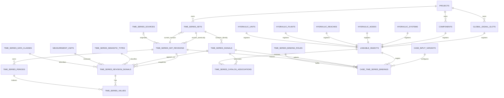

## Question

¿Cual es el modelo relacional exacto que convierte señales individuales,
tipos semanticos y objetos heterogeneos en entidades de primera clase sin
romper la revision atomica por set?

Debe decidir y justificar:

- identidad y relaciones de set, señal y revision;
- catalogo persistente de tipos semanticos frente al `signal_key` actual;
- separacion entre tipo semantico, clase de datos, unidad, origen y alcance;
- forma del registro padre de objetos vinculables y sus subtipos existentes;
- entidades para asociaciones de catalogo y bindings ejecutables;
- claves, FK, restricciones de unicidad, estados y metadata minima;
- representacion de señales globales sin inventar IDs polimorficos debiles;
- que columnas actuales se conservan, deprecian o pasan a ser compatibilidad.

La respuesta debe incluir un diagrama de entidades y el DDL conceptual
suficiente para que los tickets posteriores no vuelvan a decidir identidades.

## Resolucion

Resuelto el 2026-08-30 con la autorizacion del usuario de adoptar la
recomendacion propuesta para todas las decisiones de este ticket.

### Decision

Se conserva la semantica ya aceptada de version y revision:

- Una fila de `time_series_sets` es una **version seleccionable** de un paquete
  (`version_number` y `version_label`); no se agrega otra tabla de versiones.
- `time_series_signals` contiene la **identidad estable y buscable** de cada
  senal dentro de esa version del set. Una senal no pertenece a un objeto.
- `time_series_set_revisions` es una **fotografia completa, atomica e
  inmutable** del contenido del set. El contenido vigente se selecciona con
  `time_series_sets.current_revision_id`.
- Una revision fija su metadata ejecutable, membresia de senales, clasificacion
  semantica, unidades, periodos y valores. No es solamente un log de cambios.
- Una asociacion de catalogo apunta a la identidad estable de la senal y al
  registro padre de un objeto vinculable. Por ello sigue a la revision vigente.
- Un binding ejecutable apunta a la senal, al objeto, al rol y a una revision
  exacta con su hash. El binding no cambia silenciosamente cuando cambia el
  contenido vigente.
- Los objetos heterogeneos se normalizan mediante `linkable_objects`, una union
  cerrada con una FK tipada y real por subtipo. No se aceptan pares libres
  `entity_type`/`entity_id`.
- Las senales sin entidad fisica usan un `global_signal_slot` real (inicialmente
  `system`) y entran por la misma FK de objeto. No usan `NULL`, IDs ficticios ni
  un proyecto como destino implicito.

No se cambia la frontera atomica del set: editar un valor, reclasificar una
senal, cambiar una unidad, agregar o retirar una senal, o reemplazar el archivo
crea una revision completa nueva del set.

### Dimensiones separadas

Las siguientes dimensiones no se codifican unas dentro de otras:

| Dimension | Fuente canonica | Ejemplo |
| --- | --- | --- |
| Identidad de la senal | `time_series_signals.series_key` | `load_l1` |
| Tipo semantico | `time_series_semantic_types.semantic_key` | `load_demand` |
| Clase de datos | `time_series_data_classes.data_class_key` | `real`, `forecast` |
| Unidad | `measurement_units.unit_key` | `mw`, `usd_per_mwh` |
| Rol funcional | `time_series_binding_roles.role_key` | `load_demand` |
| Origen | `time_series_sources` enlazada desde la revision | CSV, API, manual |
| Visibilidad | `time_series_sets.visibility_scope` | `project`, `global` |
| Objeto asociado | `linkable_objects.id` | carga, nodo hidraulico, `system` |

`series_key` resuelve una ambiguedad del modelo actual: dos senales pueden
tener el mismo tipo semantico dentro del mismo set sin compartir identidad.
Por ejemplo, `load_l1` y `load_l2` pueden ser ambas `load_demand`.

### Diagrama de entidades



La vista del catalogo global nace de
`time_series_sets.current_revision_id -> time_series_revision_signals`; una
fila visible corresponde a una senal individual, no a un set completo.

### DDL conceptual canonico

El DDL usa tipos conceptuales. En PostgreSQL, JSON es `JSONB`, timestamps son
`TIMESTAMPTZ` y los IDs son `BIGINT`; el adaptador SQLite conserva JSON y
timestamps como `TEXT` y usa su PK autoincremental equivalente.

#### Catalogos de clasificacion

```sql
CREATE TABLE measurement_units (
    id                  BIGINT PRIMARY KEY,
    unit_key            TEXT NOT NULL UNIQUE,
    symbol              TEXT NOT NULL,
    physical_dimension  TEXT NOT NULL,
    status              TEXT NOT NULL CHECK (status IN ('active', 'archived'))
);

CREATE TABLE time_series_data_classes (
    id                  BIGINT PRIMARY KEY,
    data_class_key      TEXT NOT NULL UNIQUE,
    display_name        TEXT NOT NULL,
    status              TEXT NOT NULL CHECK (status IN ('active', 'archived'))
);

CREATE TABLE time_series_semantic_types (
    id                  BIGINT PRIMARY KEY,
    semantic_key        TEXT NOT NULL UNIQUE,
    display_name        TEXT NOT NULL,
    description         TEXT NOT NULL DEFAULT '',
    canonical_unit_id   BIGINT NOT NULL REFERENCES measurement_units(id),
    value_kind          TEXT NOT NULL DEFAULT 'numeric',
    default_aggregation TEXT NOT NULL,
    validation_rules_json JSON NOT NULL DEFAULT '{}',
    is_system           BOOLEAN NOT NULL DEFAULT FALSE,
    status              TEXT NOT NULL CHECK (status IN ('active', 'archived')),
    created_at          TIMESTAMP NOT NULL,
    updated_at          TIMESTAMP NOT NULL,
    created_by          TEXT NOT NULL,
    updated_by          TEXT NOT NULL
);

CREATE TABLE time_series_binding_roles (
    id                  BIGINT PRIMARY KEY,
    role_key            TEXT NOT NULL UNIQUE,
    semantic_type_id    BIGINT NOT NULL REFERENCES time_series_semantic_types(id),
    display_name        TEXT NOT NULL,
    is_system           BOOLEAN NOT NULL DEFAULT TRUE,
    status              TEXT NOT NULL CHECK (status IN ('active', 'archived'))
);
```

Los tipos canonicos tienen `is_system = TRUE`: se pueden archivar solo cuando
no esten en uso, pero su clave, unidad y contrato no se editan en sitio. Los
tipos personalizados usan la misma estructura y no contienen codigo ni
formulas ejecutables. El ticket “Contrato de compatibilidad entre tipos de
serie y objetos” definira las matrices que complementan estos catalogos, sin
cambiar sus identidades.

#### Set, senal y revision inmutable

```sql
CREATE TABLE time_series_sets (
    id                  BIGINT PRIMARY KEY,
    owner_project_id    BIGINT NOT NULL REFERENCES projects(id),
    name                TEXT NOT NULL,
    version_number      INTEGER NOT NULL CHECK (version_number > 0),
    version_label       TEXT NOT NULL,
    visibility_scope    TEXT NOT NULL DEFAULT 'project'
                        CHECK (visibility_scope IN ('project', 'global')),
    current_revision_id BIGINT NULL,
    status              TEXT NOT NULL DEFAULT 'draft'
                        CHECK (status IN ('draft', 'validated', 'archived')),
    description         TEXT NOT NULL DEFAULT '',
    created_at          TIMESTAMP NOT NULL,
    updated_at          TIMESTAMP NOT NULL,
    created_by          TEXT NOT NULL,
    updated_by          TEXT NOT NULL,
    UNIQUE (owner_project_id, name, version_number),
    UNIQUE (owner_project_id, name, version_label)
);

CREATE TABLE time_series_signals (
    id                  BIGINT PRIMARY KEY,
    time_series_set_id  BIGINT NOT NULL REFERENCES time_series_sets(id),
    series_key          TEXT NOT NULL,
    display_name        TEXT NOT NULL,
    description         TEXT NOT NULL DEFAULT '',
    status              TEXT NOT NULL DEFAULT 'active'
                        CHECK (status IN ('active', 'archived')),
    created_at          TIMESTAMP NOT NULL,
    created_by          TEXT NOT NULL,
    archived_at         TIMESTAMP NULL,
    archived_by         TEXT NULL,
    UNIQUE (time_series_set_id, series_key),
    UNIQUE (id, time_series_set_id)
);

CREATE TABLE time_series_set_revisions (
    id                  BIGINT PRIMARY KEY,
    time_series_set_id  BIGINT NOT NULL REFERENCES time_series_sets(id),
    revision_number     INTEGER NOT NULL CHECK (revision_number > 0),
    supersedes_revision_id BIGINT NULL REFERENCES time_series_set_revisions(id),
    time_series_source_id BIGINT NULL REFERENCES time_series_sources(id),
    data_class_id       BIGINT NOT NULL REFERENCES time_series_data_classes(id),
    timezone            TEXT NOT NULL,
    timestamp_convention TEXT NOT NULL DEFAULT 'period_start',
    content_hash        TEXT NOT NULL,
    state               TEXT NOT NULL DEFAULT 'building'
                        CHECK (state IN ('building', 'sealed')),
    validation_payload_json JSON NOT NULL DEFAULT '{}',
    change_summary      TEXT NOT NULL DEFAULT '',
    metadata_json       JSON NOT NULL DEFAULT '{}',
    created_at          TIMESTAMP NOT NULL,
    created_by          TEXT NOT NULL,
    UNIQUE (time_series_set_id, revision_number),
    UNIQUE (id, time_series_set_id)
);

CREATE TABLE time_series_revision_signals (
    set_revision_id     BIGINT NOT NULL,
    signal_id           BIGINT NOT NULL,
    time_series_set_id  BIGINT NOT NULL,
    semantic_type_id    BIGINT NOT NULL REFERENCES time_series_semantic_types(id),
    unit_id             BIGINT NOT NULL REFERENCES measurement_units(id),
    data_class_id       BIGINT NOT NULL REFERENCES time_series_data_classes(id),
    signal_role         TEXT NOT NULL CHECK (signal_role IN ('input', 'output', 'metadata')),
    aggregation         TEXT NOT NULL,
    ordinal             INTEGER NOT NULL,
    metadata_json       JSON NOT NULL DEFAULT '{}',
    PRIMARY KEY (set_revision_id, signal_id),
    FOREIGN KEY (set_revision_id, time_series_set_id)
        REFERENCES time_series_set_revisions(id, time_series_set_id),
    FOREIGN KEY (signal_id, time_series_set_id)
        REFERENCES time_series_signals(id, time_series_set_id),
    UNIQUE (set_revision_id, ordinal)
);

CREATE TABLE time_series_periods (
    id                  BIGINT PRIMARY KEY,
    set_revision_id     BIGINT NOT NULL REFERENCES time_series_set_revisions(id),
    period_index        INTEGER NOT NULL,
    timestamp_start     TIMESTAMP NOT NULL,
    timestamp_end       TIMESTAMP NOT NULL,
    duration_hours      DOUBLE PRECISION NOT NULL CHECK (duration_hours > 0),
    CHECK (timestamp_start < timestamp_end),
    UNIQUE (set_revision_id, period_index),
    UNIQUE (set_revision_id, timestamp_start),
    UNIQUE (id, set_revision_id)
);

CREATE TABLE time_series_values (
    set_revision_id     BIGINT NOT NULL,
    signal_id           BIGINT NOT NULL,
    time_series_period_id BIGINT NOT NULL,
    value_numeric       DOUBLE PRECISION NOT NULL,
    quality_flag        TEXT NULL,
    source_row_number   INTEGER NULL,
    metadata_json       JSON NOT NULL DEFAULT '{}',
    PRIMARY KEY (set_revision_id, signal_id, time_series_period_id),
    FOREIGN KEY (set_revision_id, signal_id)
        REFERENCES time_series_revision_signals(set_revision_id, signal_id),
    FOREIGN KEY (time_series_period_id, set_revision_id)
        REFERENCES time_series_periods(id, set_revision_id)
);
```

Despues de crear ambas tablas se agrega una FK compuesta para garantizar que
la revision vigente pertenezca al set:

```sql
FOREIGN KEY (current_revision_id, id)
    REFERENCES time_series_set_revisions(id, time_series_set_id)
```

Esta FK se instala mediante la estrategia de migracion propia de cada motor;
en SQLite puede requerir reconstruir la tabla. Un set nuevo puede tener
`current_revision_id = NULL` mientras no se haya sellado su primera revision.

#### Registro cerrado de objetos vinculables

`components` se materializa como tabla estable de proyecto porque hoy los
componentes electricos simples viven principalmente dentro del JSON del caso.
Los objetos hidraulicos ya tienen tablas estables.

```sql
CREATE TABLE components (
    id                  BIGINT PRIMARY KEY,
    project_id          BIGINT NOT NULL REFERENCES projects(id),
    component_key       TEXT NOT NULL,
    component_type      TEXT NOT NULL
                        CHECK (component_type IN
                          ('bus', 'grid', 'load', 'renewable', 'battery', 'hydro')),
    display_name        TEXT NOT NULL,
    external_reference  TEXT NULL,
    is_active           BOOLEAN NOT NULL DEFAULT TRUE,
    metadata_json       JSON NOT NULL DEFAULT '{}',
    created_at          TIMESTAMP NOT NULL,
    updated_at          TIMESTAMP NOT NULL,
    UNIQUE (project_id, component_key)
);

CREATE TABLE global_signal_slots (
    id                  BIGINT PRIMARY KEY,
    project_id          BIGINT NOT NULL REFERENCES projects(id),
    slot_key            TEXT NOT NULL,
    display_name        TEXT NOT NULL,
    UNIQUE (project_id, slot_key)
);

CREATE TABLE linkable_objects (
    id                  BIGINT PRIMARY KEY,
    project_id          BIGINT NOT NULL REFERENCES projects(id),
    object_kind         TEXT NOT NULL CHECK (object_kind IN (
                          'global', 'component', 'hydraulic_system',
                          'hydraulic_node', 'hydraulic_reach',
                          'hydraulic_plant', 'hydraulic_unit')),
    global_slot_id      BIGINT NULL UNIQUE REFERENCES global_signal_slots(id),
    component_id        BIGINT NULL UNIQUE REFERENCES components(id),
    hydraulic_system_id BIGINT NULL UNIQUE REFERENCES hydraulic_systems(id),
    hydraulic_node_id   BIGINT NULL UNIQUE REFERENCES hydraulic_nodes(id),
    hydraulic_reach_id  BIGINT NULL UNIQUE REFERENCES hydraulic_reaches(id),
    hydraulic_plant_id  BIGINT NULL UNIQUE REFERENCES hydraulic_plants(id),
    hydraulic_unit_id   BIGINT NULL UNIQUE REFERENCES hydraulic_units(id),
    status              TEXT NOT NULL DEFAULT 'active'
                        CHECK (status IN ('active', 'archived')),
    created_at          TIMESTAMP NOT NULL,
    created_by          TEXT NOT NULL,
    CHECK (
      (object_kind = 'global' AND global_slot_id IS NOT NULL
        AND component_id IS NULL AND hydraulic_system_id IS NULL
        AND hydraulic_node_id IS NULL AND hydraulic_reach_id IS NULL
        AND hydraulic_plant_id IS NULL AND hydraulic_unit_id IS NULL)
      OR
      (object_kind = 'component' AND component_id IS NOT NULL
        AND global_slot_id IS NULL AND hydraulic_system_id IS NULL
        AND hydraulic_node_id IS NULL AND hydraulic_reach_id IS NULL
        AND hydraulic_plant_id IS NULL AND hydraulic_unit_id IS NULL)
      OR
      (object_kind = 'hydraulic_system' AND hydraulic_system_id IS NOT NULL
        AND global_slot_id IS NULL AND component_id IS NULL
        AND hydraulic_node_id IS NULL AND hydraulic_reach_id IS NULL
        AND hydraulic_plant_id IS NULL AND hydraulic_unit_id IS NULL)
      OR
      (object_kind = 'hydraulic_node' AND hydraulic_node_id IS NOT NULL
        AND global_slot_id IS NULL AND component_id IS NULL
        AND hydraulic_system_id IS NULL AND hydraulic_reach_id IS NULL
        AND hydraulic_plant_id IS NULL AND hydraulic_unit_id IS NULL)
      OR
      (object_kind = 'hydraulic_reach' AND hydraulic_reach_id IS NOT NULL
        AND global_slot_id IS NULL AND component_id IS NULL
        AND hydraulic_system_id IS NULL AND hydraulic_node_id IS NULL
        AND hydraulic_plant_id IS NULL AND hydraulic_unit_id IS NULL)
      OR
      (object_kind = 'hydraulic_plant' AND hydraulic_plant_id IS NOT NULL
        AND global_slot_id IS NULL AND component_id IS NULL
        AND hydraulic_system_id IS NULL AND hydraulic_node_id IS NULL
        AND hydraulic_reach_id IS NULL AND hydraulic_unit_id IS NULL)
      OR
      (object_kind = 'hydraulic_unit' AND hydraulic_unit_id IS NOT NULL
        AND global_slot_id IS NULL AND component_id IS NULL
        AND hydraulic_system_id IS NULL AND hydraulic_node_id IS NULL
        AND hydraulic_reach_id IS NULL AND hydraulic_plant_id IS NULL)
    )
);
```

Las altas del padre y del subtipo son transaccionales. Triggers por motor (o
el mismo servicio de dominio en ambos motores) verifican que `project_id`
coincida con el proyecto del objeto real. El borrado fisico se restringe si el
objeto tiene asociaciones, bindings o historia; el retiro se expresa con
`status = 'archived'`.

El `global_signal_slot` inicial es una fila `slot_key = 'system'` por proyecto.
Representa el destino funcional sin entidad fisica para precio y otras senales
globales; no convierte al proyecto en objeto vinculable.

#### Asociaciones de catalogo y bindings ejecutables

```sql
CREATE TABLE time_series_catalog_associations (
    id                  BIGINT PRIMARY KEY,
    signal_id           BIGINT NOT NULL REFERENCES time_series_signals(id),
    linkable_object_id  BIGINT NOT NULL REFERENCES linkable_objects(id),
    status              TEXT NOT NULL DEFAULT 'active'
                        CHECK (status IN ('active', 'archived')),
    created_at          TIMESTAMP NOT NULL,
    created_by          TEXT NOT NULL,
    archived_at         TIMESTAMP NULL,
    archived_by         TEXT NULL,
    metadata_json       JSON NOT NULL DEFAULT '{}'
);

CREATE UNIQUE INDEX one_active_catalog_association
    ON time_series_catalog_associations(signal_id, linkable_object_id)
    WHERE status = 'active';

CREATE TABLE case_time_series_bindings (
    id                  BIGINT PRIMARY KEY,
    case_input_variant_id BIGINT NOT NULL REFERENCES case_input_variants(id),
    linkable_object_id  BIGINT NOT NULL REFERENCES linkable_objects(id),
    binding_role_id     BIGINT NOT NULL REFERENCES time_series_binding_roles(id),
    signal_id           BIGINT NOT NULL REFERENCES time_series_signals(id),
    set_revision_id     BIGINT NOT NULL REFERENCES time_series_set_revisions(id),
    bound_content_hash  TEXT NOT NULL,
    catalog_association_id BIGINT NULL
                        REFERENCES time_series_catalog_associations(id),
    required            BOOLEAN NOT NULL DEFAULT TRUE,
    status              TEXT NOT NULL DEFAULT 'active'
                        CHECK (status IN ('active', 'superseded', 'removed')),
    supersedes_binding_id BIGINT NULL REFERENCES case_time_series_bindings(id),
    validated_at        TIMESTAMP NULL,
    created_at          TIMESTAMP NOT NULL,
    updated_at          TIMESTAMP NOT NULL,
    created_by          TEXT NOT NULL,
    updated_by          TEXT NOT NULL,
    metadata_json       JSON NOT NULL DEFAULT '{}',
    FOREIGN KEY (set_revision_id, signal_id)
        REFERENCES time_series_revision_signals(set_revision_id, signal_id)
);

CREATE UNIQUE INDEX one_effective_binding_per_role
    ON case_time_series_bindings(
        case_input_variant_id, linkable_object_id, binding_role_id
    )
    WHERE status = 'active';
```

La asociacion es deliberadamente revision-agnostica. El binding conserva su
propio FK a senal, objeto y revision aun si la asociacion se archiva; la FK
opcional a `catalog_association_id` es solo procedencia de la seleccion.

Un objeto puede tener muchas asociaciones del mismo tipo semantico porque la
unicidad es por `signal_id + linkable_object_id`. Solo el binding efectivo se
limita a uno por variante, objeto y rol. Las transformaciones multi-entrada
deberan declarar roles distintos en su contrato, decision que corresponde al
ticket de ciclo de vida.

El hash duplicado en el binding se valida al crearlo contra
`time_series_set_revisions.content_hash`. Permite detectar corrupcion o una
migracion defectuosa sin convertir el hash en identidad. La revision queda
fijada por FK.

### Protocolo atomico de revision

Toda creacion o edicion sigue una sola transaccion:

1. Crear la revision con `state = 'building'` y el siguiente
   `revision_number`.
2. Reutilizar por `series_key` las identidades de senal existentes; crear
   identidades nuevas para claves nuevas. Nunca reciclar una identidad
   archivada para otro significado.
3. Insertar la fotografia en `time_series_revision_signals`,
   `time_series_periods` y `time_series_values`.
4. Validar integridad, tipos, unidad, horizonte y calcular un hash canonico que
   incluya timezone, metadata ejecutable, senales, periodos y valores.
5. Cambiar la revision a `sealed` y actualizar `current_revision_id` dentro de
   la misma transaccion. Solo una revision sellada puede ser vigente.

Triggers impiden `UPDATE` o `DELETE` de una revision sellada y de todos sus
hijos. Una correccion es copy-on-write: crea otra fotografia. La deduplicacion
fisica o particionamiento futuro no cambia este contrato logico.

Una senal que desaparece de una revision permanece como identidad historica,
pero no aparece en la vista vigente. Sus asociaciones se muestran como
incompatibles/ausentes y los bindings activos quedan stale; no se redirigen a
otra senal con el mismo tipo.

### Staleness e historia de bindings

`stale` es un estado derivado, no una bandera editable:

- el binding esta stale si su `set_revision_id` difiere de
  `time_series_sets.current_revision_id` para la senal elegida;
- tambien esta stale si la senal ya no pertenece a la revision vigente, el
  tipo/unidad vigente deja de cumplir el rol, el objeto deja de estar activo
  en el caso o cambian las dependencias de topologia/parametros;
- un binding stale permanece auditable pero bloquea una corrida hasta
  revalidarse o reemplazarse.

Reemplazar un binding inserta el nuevo registro activo y cambia el anterior a
`superseded` en la misma transaccion. Nunca se sobrescribe el par
senal/revision historico.

### Conservacion y deprecacion del esquema actual

| Superficie actual | Decision canonica |
| --- | --- |
| `time_series_sets.id`, propietario, nombre, version, estado y auditoria | Se conservan. `project_id` se entiende como `owner_project_id`. |
| `time_series_sets.data_kind` | Pasa a clase de datos de la revision y de cada senal; durante migracion queda como cache de compatibilidad. |
| `time_series_sets.timezone` | Pasa a la revision porque afecta la fotografia ejecutable. |
| `time_series_sets.content_hash` | La fuente canonica pasa a la revision; temporalmente puede reflejar el hash de `current_revision_id`. |
| `time_series_set_revisions` | Se conserva la identidad, pero deja de ser un log liviano y pasa a poseer la fotografia completa. |
| `superseded_revision_number` | Se reemplaza por `supersedes_revision_id` con FK real. |
| `time_series_signals.id` y `time_series_set_id` | Se conservan como identidad estable dentro del set. |
| `time_series_signals.signal_key` | Se divide en `series_key` estable y `semantic_type_id`; para datos existentes ambos se derivan inicialmente de `signal_key`. |
| `unit`, `signal_role`, `aggregation` de la senal | Pasan a `time_series_revision_signals` para quedar congelados por revision. |
| `entity_type` / `entity_key` de la senal | Se deprecian; se migran a `time_series_catalog_associations` y `linkable_objects`. |
| `time_series_periods.time_series_set_id` | Se reemplaza por `set_revision_id`. |
| `time_series_values.time_series_set_id` | Se elimina del modelo logico; la pertenencia queda garantizada por FKs compuestas a la revision. Una copia fisica solo podria reaparecer por rendimiento. |
| `case_time_series_bindings.signal_key`, `entity_type`, `entity_id`, `time_series_set_id` | Se reemplazan por FKs a rol, objeto, senal y revision. |
| `validation_dependencies` | Se conserva para topologia y parametros. La dependencia de contenido de serie queda expresada directamente por el binding a revision/hash. |
| `TIME_SERIES_SIGNAL_CATALOG` en Python | Deja de ser fuente de verdad; se convierte en seed/adaptador transitorio del catalogo persistente. |
| Tablas hidraulicas legacy y sus bindings | No se alteran en este ticket; el adaptador y la migracion bajo demanda siguen vigentes. |

### Excepciones de dominio verificadas

- `components` aun no existe en el esquema ejecutable: debe materializarse a
  partir de los objetos estables hoy embebidos en casos/drafts. Esto pertenece
  al ticket de migracion, no crea un nuevo tipo de objeto.
- `bus` puede existir en `components` por topologia, pero no se registra como
  vinculable en la primera entrega. Precio y otras senales sin activo usan el
  `global_signal_slot` `system`.
- El hidro simple sigue siendo `component:hydro`; una red hidraulica usa
  `hydraulic_system`, nodo, tramo, planta y unidad. No se fusionan ambas
  identidades.
- Proyecto, usuario, corrida, publicacion y consola no aparecen como ramas de
  `linkable_objects`.

No aparecieron subtipos adicionales que deban convertirse en tickets. La
niebla sobre excepciones del registro padre queda despejada por estas reglas.

### Consecuencias

El modelo agrega almacenamiento respecto del log de revisiones actual, pero
entrega reconstruccion directa, auditoria y bindings con FK a contenido
inmutable. Ademas elimina la integridad polimorfica debil sin forzar una
reescritura de las PK existentes de componentes e hidraulica. Agregar un nuevo
tipo de objeto exige una migracion explicita del registro cerrado, lo que es
intencional: evita que texto arbitrario se convierta en contrato de dominio.
