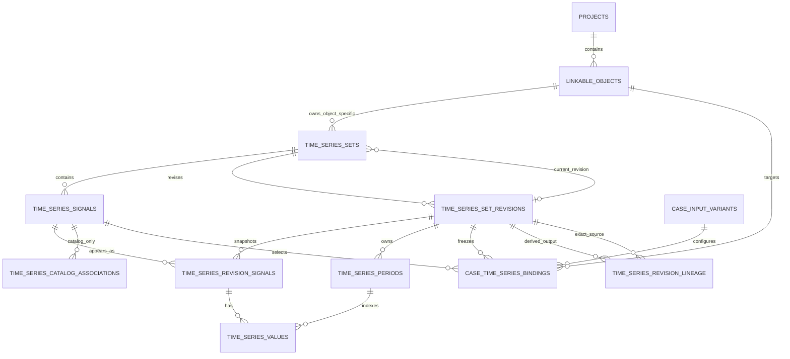

## Question

¿Cual es el modelo relacional y de dominio exacto para que un objeto ya creado
pueda poseer una serie especifica que no dependa de una serie generica ni sea
reutilizable por otros objetos?

La decision debe conservar como invariantes confirmados:

- el objeto real y su `linkable_object` existen antes de definir la serie;
- la serie especifica tiene un unico objeto propietario obligatorio y no crea
  una `time_series_catalog_association` ficticia;
- no aparece en el catalogo global ni puede seleccionarse para otro objeto;
- solo puede usarse en bindings cuyo objeto sea el propietario y cuyo rol,
  tipo semantico y unidad sean compatibles;
- sus valores conservan revision, hash, auditoria y snapshots historicos.

Debe decidir y justificar:

- si la identidad, revisiones, periodos y valores reutilizan las tablas
  canonicas con una clasificacion explicita de propiedad, o si requieren una
  raiz object-scoped separada que comparta las tablas inmutables de contenido;
- la FK obligatoria al objeto y las restricciones que impiden orfandad,
  reasignacion, uso cruzado entre proyectos o aparicion en consultas globales;
- cardinalidad por objeto y rol, nombres/claves, estado inicial sin datos y
  momento en que una serie queda apta para binding;
- como referencia un binding a una serie especifica sin pasar por una
  asociacion de catalogo y como se mantiene el linaje exacto de revision/hash;
- permisos y visibilidad desde el objeto, incluidas lectura de valores,
  actualizacion, archivado y comportamiento al archivar el objeto;
- semantica de copiar o promover una especifica a generica, o la decision
  explicita de dejar esa conversion fuera del primer corte sin perder linaje;
- que partes de las resoluciones "Modelo relacional canonico para series,
  tipos y objetos vinculables", "Ciclo de vida de asociaciones y bindings
  versionados", "Alcance global, permisos y promocion entre proyectos" y
  "Contrato de consulta y API del catalogo global" quedan complementadas o
  sustituidas para este segundo camino.

La resolucion debe incluir el diagrama y DDL conceptual suficientes para que
API, migracion, indices y criterios de aceptacion no vuelvan a decidir la
identidad ni la propiedad de una serie especifica.

## Resolucion

Resuelto el 2026-08-30 con la autorizacion del usuario de adoptar la
recomendacion propuesta para todas las decisiones y preguntas de este ticket.

### Decision

Una serie especifica de objeto **reutiliza la raiz canonica** de sets,
senales, revisiones, periodos y valores. No se crea una segunda jerarquia de
contenido ni una asociacion de catalogo ficticia.

- `time_series_sets.series_kind` distingue `catalog` de `object_specific`.
- Un set `object_specific` tiene un `owner_linkable_object_id` obligatorio,
  inmutable y del mismo `owner_project_id`.
- Cada set `object_specific` representa una sola definicion y contiene
  exactamente una identidad en `time_series_signals`. Esta restriccion evita
  que actualizar una serie propia revise accidentalmente otras series del
  objeto por compartir la frontera atomica del set.
- La definicion nace y se administra desde el objeto. No aparece en el
  catalogo global, no admite asociaciones de catalogo y no cambia de alcance.
- El objeto puede poseer muchas series especificas, incluso varias compatibles
  con el mismo rol. La seleccion ejecutable conserva la cardinalidad ya
  decidida de un binding activo por variante, objeto y rol.
- Un binding especifico usa la misma identidad estable de senal y fija la
  misma revision sellada y `content_hash` que un binding de catalogo, pero el
  objeto destino debe ser exactamente el propietario y
  `catalog_association_id` debe ser `NULL`.
- Actualizar valores es copy-on-write: crea y sella una revision completa
  nueva. Nunca sobrescribe periodos o valores sellados.

La alternativa de una raiz `object_time_series_*` separada se rechaza porque
duplicaria identidades y ciclos de revision, o forzaria referencias
polimorficas debiles desde bindings y snapshots. La clasificacion explicita
mantiene una sola forma de leer contenido y una frontera de propiedad fuerte.

### Diagrama de entidades



La rama `catalog_only` existe exclusivamente cuando el set de la senal tiene
`series_kind = 'catalog'`. Para `object_specific`, la propiedad sale del set y
el binding debe volver al mismo `linkable_object` sin atravesar esa rama.

### DDL conceptual de propiedad e identidad

Sobre el modelo canonico de "Modelo relacional canonico para series, tipos y
objetos vinculables" se agregan las siguientes columnas y restricciones:

```sql
ALTER TABLE linkable_objects
    ADD CONSTRAINT linkable_objects_id_project_uk
        UNIQUE (id, project_id);

ALTER TABLE time_series_sets
    ADD COLUMN series_kind TEXT NOT NULL DEFAULT 'catalog'
        CHECK (series_kind IN ('catalog', 'object_specific')),
    ADD COLUMN owner_linkable_object_id BIGINT NULL,
    ADD COLUMN object_series_key TEXT NULL,
    ADD COLUMN archived_at TIMESTAMP NULL,
    ADD COLUMN archived_by TEXT NULL,
    ADD COLUMN archived_reason_code TEXT NULL,
    ADD COLUMN archived_reason_text TEXT NULL,
    ADD CONSTRAINT time_series_set_owner_project_fk
        FOREIGN KEY (owner_linkable_object_id, owner_project_id)
        REFERENCES linkable_objects(id, project_id)
        ON DELETE RESTRICT,
    ADD CONSTRAINT time_series_set_kind_ck CHECK (
      (series_kind = 'catalog'
        AND owner_linkable_object_id IS NULL
        AND object_series_key IS NULL)
      OR
      (series_kind = 'object_specific'
        AND owner_linkable_object_id IS NOT NULL
        AND object_series_key IS NOT NULL
        AND visibility_scope = 'project'
        AND version_number = 1
        AND version_label = 'object'
        AND name = object_series_key)
    ),
    ADD CONSTRAINT time_series_set_kind_identity_uk
        UNIQUE (id, series_kind),
    ADD CONSTRAINT time_series_set_owner_identity_uk
        UNIQUE (id, owner_linkable_object_id);
```

Las dos restricciones de unicidad actuales por
`owner_project_id + name + version` se reemplazan por indices parciales. Asi
dos objetos del mismo proyecto pueden usar la misma clave local sin colisionar:

```sql
CREATE UNIQUE INDEX catalog_set_version_number_uk
    ON time_series_sets(owner_project_id, name, version_number)
    WHERE series_kind = 'catalog';

CREATE UNIQUE INDEX catalog_set_version_label_uk
    ON time_series_sets(owner_project_id, name, version_label)
    WHERE series_kind = 'catalog';

CREATE UNIQUE INDEX object_specific_series_key_uk
    ON time_series_sets(owner_linkable_object_id, object_series_key)
    WHERE series_kind = 'object_specific';
```

`object_series_key` es una clave tecnica inmutable, en minusculas y con forma
`[a-z][a-z0-9_]*`. Es unica durante toda la vida del objeto, incluso despues
de archivar la serie; una identidad retirada no se recicla. El nombre visible
y la descripcion de `time_series_signals` siguen siendo editables.

Para un set especifico, `version_number = 1` y `version_label = 'object'` son
compatibilidad estructural con la tabla comun, no una segunda dimension de
versionado visible. Las actualizaciones de definicion y contenido usan
revisiones inmutables. El `series_key` de su unica senal es igual a
`object_series_key`.

Una constraint trigger diferible, implementada para PostgreSQL y SQLite por
la estrategia del ticket de integridad, debe imponer en el commit:

```text
series_kind = object_specific
  => count(time_series_signals where time_series_set_id = set.id) = 1
  => only_signal.series_key = set.object_series_key
  => series_kind, owner_linkable_object_id y object_series_key no cambian
```

La FK compuesta impide orfandad y uso cruzado entre proyectos. `ON DELETE
RESTRICT` impide borrar fisicamente el objeto mientras exista la definicion o
su historia. No existe API para reasignar propietario ni para cambiar
`series_kind`.

### Estado inicial y aptitud para binding

Crear una definicion desde un objeto es una unica transaccion que:

1. verifica que el objeto y su `linkable_object` esten activos;
2. inserta el set `object_specific` con `status = 'draft'` y
   `current_revision_id = NULL`;
3. inserta su unica identidad de senal activa;
4. abre la revision 1 en estado `building` y registra en
   `time_series_revision_signals` el tipo semantico, clase, unidad,
   agregacion y proposito `input`, aunque aun no existan puntos;
5. registra actor, request e idempotency key de la creacion.

Una revision `building` no es seleccionable. Para representar correctamente
el estado sin datos, `content_hash` es `NULL` hasta sellar:

```sql
ALTER TABLE time_series_set_revisions
    ALTER COLUMN content_hash DROP NOT NULL,
    ADD CONSTRAINT revision_hash_state_ck CHECK (
      (state = 'building' AND content_hash IS NULL)
      OR
      (state = 'sealed' AND content_hash IS NOT NULL)
    );
```

Esto precisa la DDL del modelo canonico, que declaraba `content_hash NOT NULL`
aun para `building`. Los hijos de una revision en construccion se pueden
reemplazar dentro de la operacion de carga; desde el cambio a `sealed` son
inmutables.

La serie queda apta para un binding solamente cuando todos estos predicados
son verdaderos:

- set, senal, propietario, tipo, unidad y rol estan activos;
- existe `current_revision_id` y pertenece al set;
- la revision esta `sealed`, tiene hash canonico y contiene exactamente la
  senal declarada;
- existen periodos y un valor valido por periodo para la senal;
- la revision cumple contrato, cobertura, resolucion y validaciones de datos;
- `evaluate_compatibility(..., usage = execution)` acepta tipo, unidad, rol y
  tipo de objeto;
- objeto, variante y `owner_project_id` pertenecen al mismo proyecto.

Sellar la primera revision cambia el set a `validated` y establece
`current_revision_id` en la misma transaccion. Sellar una actualizacion crea
otra fotografia completa, mueve el puntero vigente y deja stale los bindings
actuales conforme al ciclo de vida ya decidido.

### Cardinalidad y nombres

- Un `linkable_object` puede poseer cero o muchas series especificas.
- La clave es unica por objeto, no por proyecto ni globalmente.
- Pueden existir varias series especificas compatibles con el mismo rol; son
  alternativas locales, no asociaciones de catalogo.
- La definicion no fija un unico rol. El tipo semantico y la unidad de la
  revision determinan los roles compatibles mediante la matriz positiva. Asi
  una misma senal puede satisfacer mas de un rol compatible, como el precio
  simetrico, sin inventar una tabla de asociaciones locales.
- Solo hay un binding efectivo por
  `case_input_variant_id + linkable_object_id + binding_role_id`, igual que
  para series de catalogo.

Cambiar `object_series_key`, propietario o significado semantico fundamental
no edita la identidad. Se crea otra definicion y, si corresponde, una revision
derivada con linaje. Cambiar nombre visible o descripcion no crea otra serie.

### Binding directo con integridad de propiedad

El binding comun incorpora la identidad del set y una procedencia tipada para
que la base de datos pueda comprobar el camino elegido:

```sql
ALTER TABLE case_time_series_bindings
    ADD COLUMN time_series_set_id BIGINT NOT NULL,
    ADD COLUMN source_kind TEXT NOT NULL
        CHECK (source_kind IN ('catalog', 'object_specific')),
    ADD COLUMN source_owner_linkable_object_id BIGINT NULL,
    ADD CONSTRAINT binding_signal_set_fk
        FOREIGN KEY (signal_id, time_series_set_id)
        REFERENCES time_series_signals(id, time_series_set_id),
    ADD CONSTRAINT binding_revision_set_fk
        FOREIGN KEY (set_revision_id, time_series_set_id)
        REFERENCES time_series_set_revisions(id, time_series_set_id),
    ADD CONSTRAINT binding_source_kind_fk
        FOREIGN KEY (time_series_set_id, source_kind)
        REFERENCES time_series_sets(id, series_kind),
    ADD CONSTRAINT binding_source_owner_fk
        FOREIGN KEY (
          time_series_set_id, source_owner_linkable_object_id
        ) REFERENCES time_series_sets(id, owner_linkable_object_id),
    ADD CONSTRAINT binding_source_path_ck CHECK (
      (source_kind = 'catalog'
        AND source_owner_linkable_object_id IS NULL)
      OR
      (source_kind = 'object_specific'
        AND source_owner_linkable_object_id IS NOT NULL
        AND source_owner_linkable_object_id = linkable_object_id
        AND catalog_association_id IS NULL)
    );
```

Las claves unicas compuestas ya decididas en `time_series_signals` y
`time_series_set_revisions` soportan las dos primeras FK. El FK a
`time_series_revision_signals(set_revision_id, signal_id)` y la comprobacion
del `bound_content_hash` se mantienen.

Para `object_specific`, el evaluador ejecuta primero la igualdad de propietario
y devuelve `TS_COMPAT_OBJECT_OWNER_MISMATCH` si no coincide. Luego aplica el
mismo contrato positivo de tipo, unidad, rol, estado, proyecto y variante. No
exige `association_allowed`; exige `execution_allowed`. Un ID de objeto ajeno,
aunque tenga el mismo tipo y proyecto, nunca es candidato valido.

El resto del ciclo de vida no cambia: crear, reemplazar, retirar, restaurar,
revalidar vigente o fijada, `bindings_revision`, ETags, idempotencia, ledger,
staleness y materializacion de `scenario_version` se aplican igual. El
snapshot conserva ademas `source_kind` y el propietario observado.

### Visibilidad, permisos y archivado

La separacion de lectura es estructural:

```sql
CREATE VIEW catalog_time_series_signals AS
SELECT sig.*
FROM time_series_signals sig
JOIN time_series_sets s ON s.id = sig.time_series_set_id
WHERE s.series_kind = 'catalog';

CREATE VIEW object_specific_time_series_signals AS
SELECT sig.*, s.owner_linkable_object_id, s.object_series_key
FROM time_series_signals sig
JOIN time_series_sets s ON s.id = sig.time_series_set_id
WHERE s.series_kind = 'object_specific';
```

El read model de `/api/time-series/inputs` consume exclusivamente la primera
vista. Buscar una senal especifica por su ID en las rutas globales responde
como recurso inexistente; no existe un filtro que permita incluirla. La
segunda vista solo se expone mediante el contexto del objeto propietario. El
ticket "API y carga de archivos desde series asociadas a objetos" fijara las
rutas y payloads sin cambiar esta frontera.

Permisos del primer corte:

| Accion sobre una serie especifica | `analyst` | `admin` | `external` |
| --- | --- | --- | --- |
| Listar metadata desde el objeto | proyecto autorizado | proyecto autorizado | nunca |
| Leer revision, preview o valores | proyecto autorizado | proyecto autorizado | nunca |
| Crear definicion y cargar valores | proyecto autorizado | proyecto autorizado | nunca |
| Publicar nueva revision | proyecto autorizado | proyecto autorizado | nunca |
| Archivar | proyecto autorizado | proyecto autorizado | nunca |
| Promover o reasignar | nunca | nunca | nunca |

En el modelo actual, `admin` y `analyst` internos tienen acceso a todos los
proyectos; una futura membresia se agrega al mismo autorizador. Todas las
rutas vuelven a comprobar actor, objeto y proyecto. Conocer un `signal_id` no
evita la autorizacion ni la navegacion por el propietario.

Archivar la serie es terminal para esa identidad: conserva revision vigente,
hashes, valores y eventos, pero bloquea nuevas cargas, bindings y corridas. No
hay borrado publico ni reactivacion; una sustituta usa otra clave e identidad.

Archivar el objeto **no hace cascade** ni reescribe cada serie. Produce un
estado efectivo `owner_archived`: sus series quedan visibles solo como
historia dentro del objeto archivado, no aceptan mutaciones ni bindings y los
bindings activos pasan a `invalid`. Los snapshots y corridas ya materializados
no cambian. Si el mismo objeto vuelve a estado activo, sus series no recuperan
validez ejecutable en silencio: deben revalidarse y los bindings siguen el
flujo fail-closed. La FK `RESTRICT` impide borrar fisicamente el objeto.

Creacion, carga, sellado, reemplazo de revision y archivado conservan actor,
request, instante, fuente e idempotencia en la auditoria canonica de sets y
revisiones. Los bindings y sus validaciones siguen usando
`time_series_link_events` y `time_series_link_validations`; nunca se sintetiza
una asociacion para obtener auditoria.

### Copia o promocion hacia el catalogo

No existe conversion ni promocion `object_specific -> catalog` en el primer
corte. Cambiar `series_kind`, quitar el propietario o publicar directamente la
misma identidad alteraria el significado de bindings existentes y queda
prohibido incluso para `admin`.

Una incorporacion futura al catalogo sera siempre una **derivacion por copia**:

1. crea un set `catalog` nuevo, inicialmente de alcance `project`;
2. crea nuevas identidades de senal y una revision sellada nueva;
3. copia o transforma desde una revision fuente especifica y verifica el hash;
4. registra linaje exacto de senal, revision y propietario fuente;
5. no copia asociaciones ni bindings;
6. solo despues puede usar el flujo administrativo ordinario de promocion a
   `global`.

El contrato de linaje queda fijado, aunque la accion no se exponga en el primer
corte:

```sql
CREATE TABLE time_series_revision_lineage (
    derived_set_revision_id BIGINT NOT NULL,
    derived_signal_id       BIGINT NOT NULL,
    source_set_revision_id  BIGINT NOT NULL,
    source_signal_id        BIGINT NOT NULL,
    lineage_kind            TEXT NOT NULL CHECK (lineage_kind IN (
                              'object_specific_catalog_copy',
                              'allowlisted_transformation')),
    source_content_hash     TEXT NOT NULL,
    source_owner_linkable_object_id BIGINT NULL
                              REFERENCES linkable_objects(id),
    transformation_id       BIGINT NULL
                              REFERENCES time_series_transformations(id),
    created_at              TIMESTAMP NOT NULL,
    created_by              TEXT NOT NULL,
    reason_code             TEXT NOT NULL,
    reason_text             TEXT NULL,
    PRIMARY KEY (
      derived_set_revision_id, derived_signal_id,
      source_set_revision_id, source_signal_id
    ),
    FOREIGN KEY (derived_set_revision_id, derived_signal_id)
      REFERENCES time_series_revision_signals(set_revision_id, signal_id),
    FOREIGN KEY (source_set_revision_id, source_signal_id)
      REFERENCES time_series_revision_signals(set_revision_id, signal_id)
);
```

Para `object_specific_catalog_copy`, el propietario fuente es obligatorio y
debe coincidir con el propietario inmutable del set fuente. Para una
transformacion allowlisted puede ser `NULL`. El hash duplicado se valida contra
la revision fuente y sirve como evidencia, no como identidad.

### Relacion con las decisiones anteriores

- **Modelo relacional canonico para series, tipos y objetos vinculables** se
  conserva y se complementa con `series_kind`, propiedad por FK, una sola
  senal por set especifico y procedencia tipada en bindings. Se precisa que el
  hash de una revision `building` es nulo hasta sellar.
- **Contrato de compatibilidad entre tipos de serie y objetos** se conserva.
  La ruta especifica agrega la igualdad propietario-destino antes del mismo
  evaluador y usa solamente reglas con `execution_allowed`.
- **Ciclo de vida de asociaciones y bindings versionados** se conserva para
  bindings, revisiones fijadas, staleness, historia y snapshots. Su ciclo de
  asociaciones no aplica a series especificas y nunca se imita con una fila
  artificial.
- **Alcance global, permisos y promocion entre proyectos** se limita: una
  serie especifica siempre es `project`, su proyecto deriva del propietario y
  no participa en promocion/despromocion. El acceso sigue siendo solo interno.
- **Contrato de consulta y API del catalogo global** se precisa: `/inputs` y
  su detalle contienen solo `catalog`; la administracion de series especificas
  es un recurso anidado bajo el objeto. El ticket de API posterior definira el
  transporte concreto.

### Consecuencias y traspasos

El modelo mantiene un solo almacen de contenido y un solo contrato ejecutable,
pero hace imposible que una serie local se filtre al catalogo o se use para
otro objeto. El costo es imponer un set de una sola senal para este camino y
agregar columnas de procedencia al binding; a cambio, cada serie puede
actualizarse y archivarse sin acoplar el ciclo de otra.

No aparecieron preguntas nuevas fuera del mapa. Las rutas de definicion,
upload, reemplazo y payloads de archivo pasan a "API y carga de archivos desde
series asociadas a objetos". Backfill y dual-read pasan a "Migracion y
coexistencia con el modelo actual"; indices, constraint triggers y locks por
motor pasan a "Rendimiento, indices e integridad transaccional"; y los casos
de no fuga, propiedad, estado sin datos y staleness pasan a "Corte de entrega
y criterios de aceptacion".
